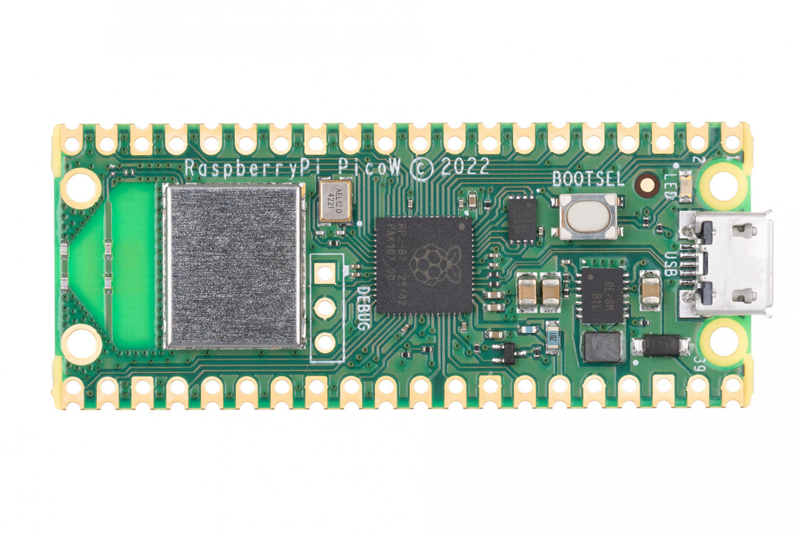
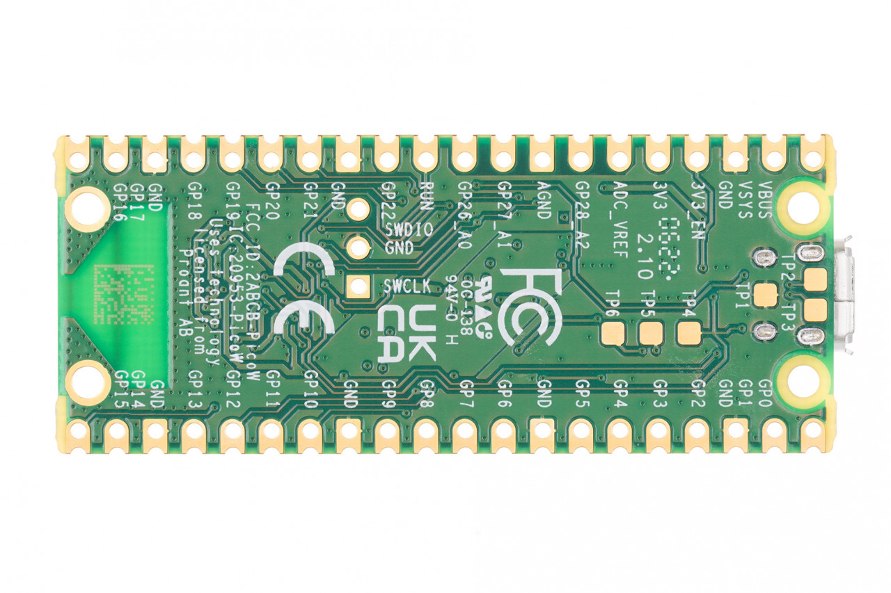
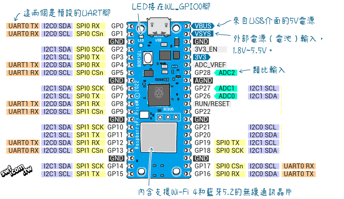

# Raspberry Pico_W

## 1. 硬體設備
### 1-1 主要設備:
Raspberry pico_W

### 1-2 pin腳圖

> 圖片出處 - https://swf.com.tw/?p=1858

### 1-3 VSYS
- min 1.8V,外部電源輸入
- max 5.5V,外部電源輸入

### 1-4 VBUS 5V(+10%,-10%)來自於USB的電壓

### 1-5 工作電壓 3.3V

### 1-6 輸出電壓 3.3V

## 2. 參考網站

### 2-1 [官方說明文件 pico W](https://www.raspberrypi.com/documentation/microcontrollers/raspberry-pi-pico.html#raspberry-pi-pico-w19)

### 2-2 [官方Getting Start](https://www.raspberrypi.com/documentation/microcontrollers/micropython.html)

### 2-3 [microPython for Rp2](https://docs.micropython.org/en/latest/rp2/general.html)

### 2-4 [pico Examples](https://github.com/raspberrypi/pico-micropython-examples/tree/master)

### 2-5 [picozeor官網](https://picozero.readthedocs.io/en/latest/)

## 3. 套件購買網址
- ### [pico主板](https://piepie.com.tw/product/raspberry-pi-pico-wh?hilite=pico)

- ### [工具套件](https://piepie.com.tw/product/gpio-game-console-starter-kit)
 
### 3-1 [上課相關零件](./周邊零件/README.md)

## 4. [MQTT Server](./mqtt/)

## 5. 一般操作
### 5-1 內建硬體

#### 5-1-1 [計時器](./一般操作/0_1計時器/)

#### 5-1-2 [實時時鐘(RTC)](./一般操作/0_2實時時鐘(Real_Time_Clock))

#### 5-1-3 [重新啟動](./一般操作/0_3重新啟動(WTD))

#### 5-1-4 [內建LED](./一般操作/0_4內建LED)

#### 5-1-5 [內建溫度感測器(ADC)](./一般操作/0_5內建溫度感測器(ADC))

#### 5-1-6 [中斷_interrupt_IRQ](./一般操作/0_6中斷_interrupt_IRQ)

#### 5-1-7 [執行緒使用](./一般操作/0_7執行緒使用)

#### 5-1-8 [連線WiFi](./連線WiFi)

#### 45-1-9 [連線WiFi-使用module-必用](./連線WiFi/module方式)

#### 5-1-10 [成為WebServer_並且建立控制網頁](./當作WebServer)

### 5-2 外接硬體

#### 5-2-1 [按鈕-下拉電阻](./一般操作/1_1_0按鈕和LED/)

#### 5-2-2 [PWM控制LED](./一般操作/1_1_2_PWM控制LED)

#### 5-2-3 [可變電阻控制LED](./一般操作/1_1_3_可變電阻控制LED)

#### 5-2-4 [按鈕-LED-蜂鳴器](./一般操作/2_1按鈕_LED_蜂鳴器) 

#### 5-2-5 [防盜器-人體紅外線感應模組](./一般操作/2_2防盜器)

#### 5-2-6 [傾斜開關-上接電阻](./一般操作/2_3傾斜滾珠開關)

#### 5-2-7 [雙軸xy搖桿組](./一般操作/2_4雙軸xy搖桿組)

#### 5-2-8 [HC-SR04超音波測距模組](./一般操作/2_5超音波感測器)

#### 5-2-9 [光敏電阻](./一般操作/2_6光敏電阻)

## 6. 雲端服務

### 6-1 make.com服務

#### 6-1-1 [使用GET傳送資料給](./使用make/)
#### 6-1-2 [超過警告溫度傳送line訊息](./使用make/超過警告溫度傳送line訊息/)

### 6-2 Blynk.Console 服務
#### 6-2-1 [Blynk.Console 說明](./使用Blynk_Console/)

#### 6-2-2 範例
##### 6-2-2-1 [控制LED](./使用Blynk_Console/1控制LED/)
##### 6-2-2-2 [光敏電阻_超音波感測器](./使用Blynk_Console/2光敏電阻_超音波感測器)

## 6-3 MQTT Bloker 雲端服務
### 6-3-1 Adafruit IO
#### 6-3-1-1 [Adafruit IO 說明](https://core-electronics.com.au/guides/getting-started-with-mqtt-on-raspberry-pi-pico-w-connect-to-the-internet-of-things/#adafruit-io)

### 6-3-2 [HiveMQ](https://www.hivemq.com/mqtt/public-mqtt-broker/)

## 7. 實際案例
#### 7-1. [光敏電阻_超音波感測器](./project1/)
- 建立Web API(fastAPI)
- 雲端資料庫(redis)
- 建立Web Server(streamlit)

