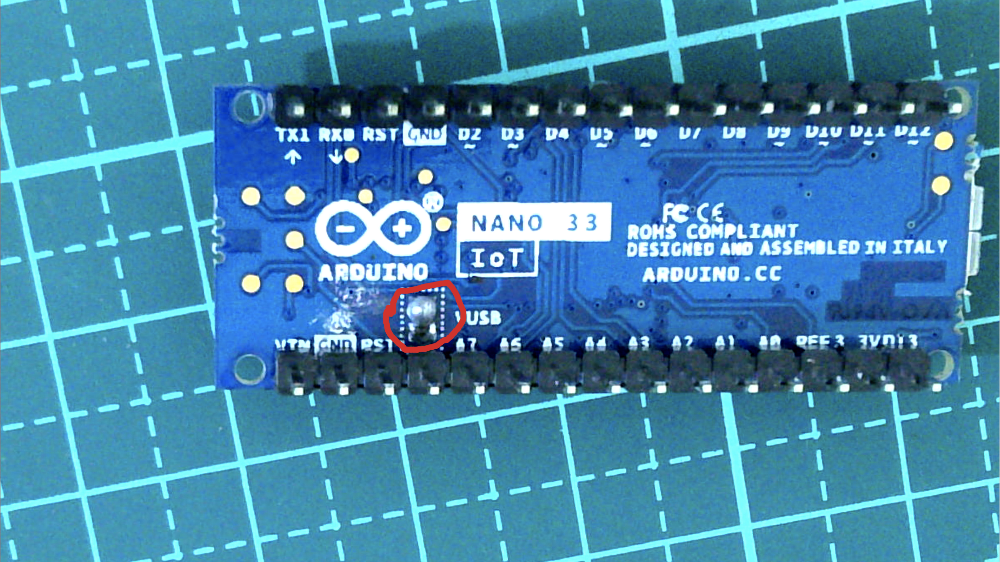
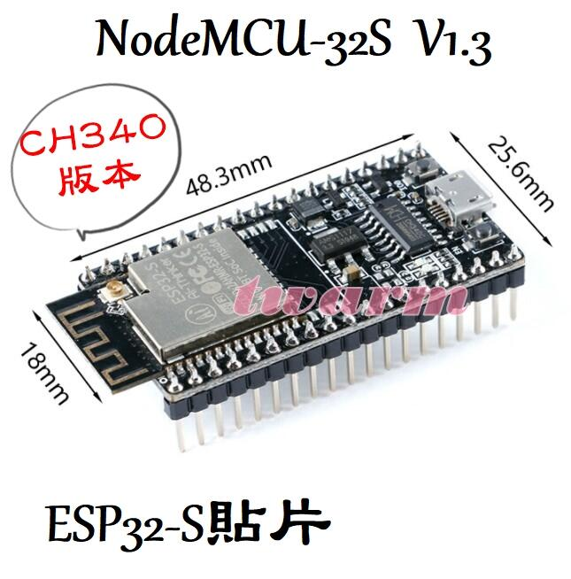
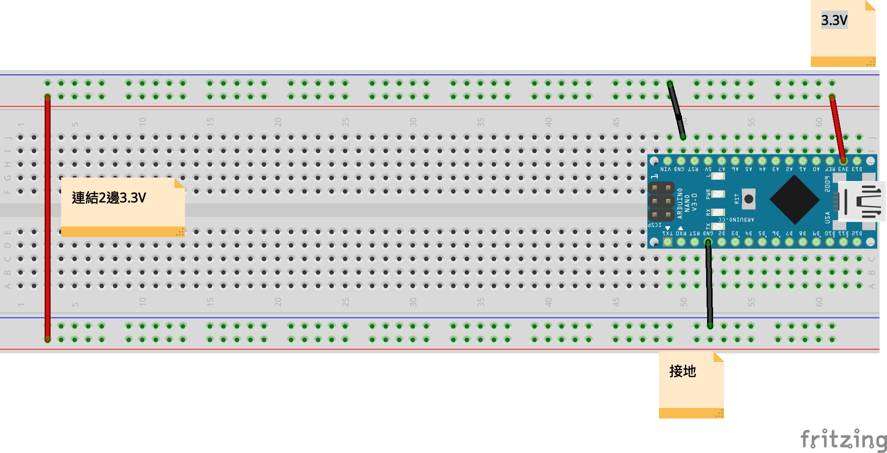
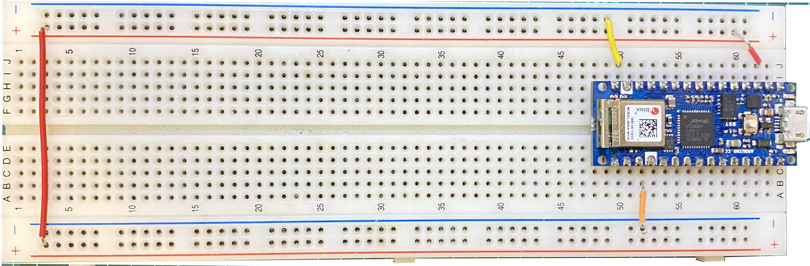
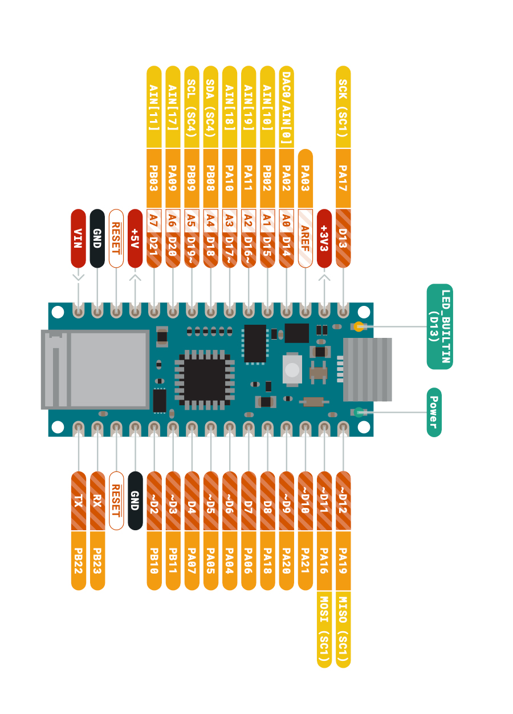
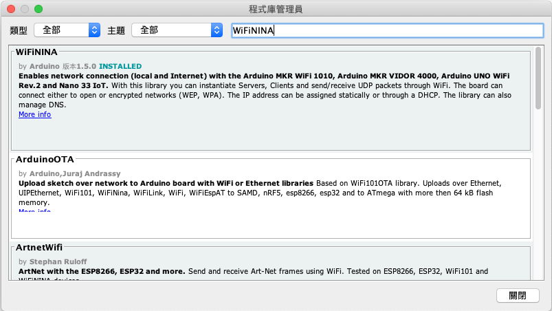
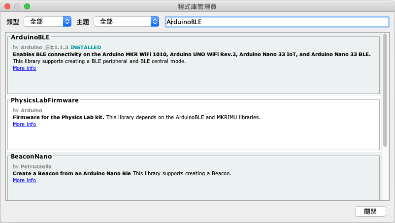
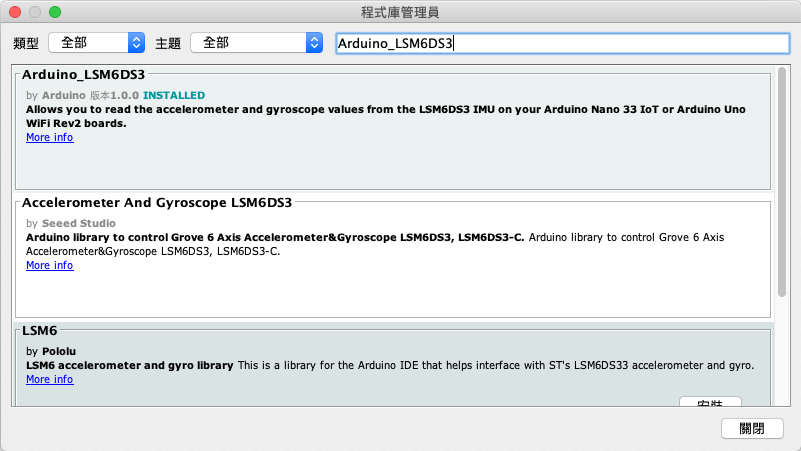
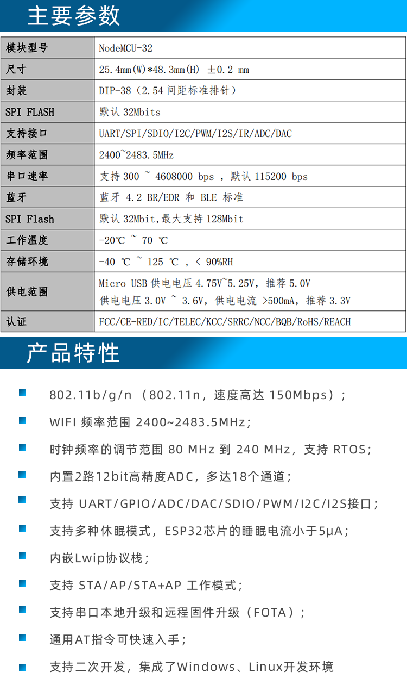
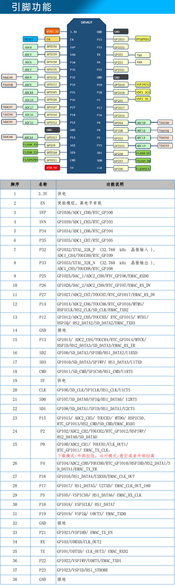

# 智慧家庭
## 硬體設備
### 主要設備:
Arduino Nano 33 IoT

Arduino Nano 33 Iot(透過USB提供5V電壓)

[Arduino Nano 33 Iot 永和廠商](https://www.ruten.com.tw/item/show?21402143721715#info)

### 替代主要設備:
 #### NodeMCU-32S V1.3 (CH340版本) Lua WiFi物聯網開發板 ESP32-S
 
 
 [ESP32-永和廠商](https://www.ruten.com.tw/item/show?21310149011328)
 
### [周邊零件](./周邊零件/README.md)
## 一般操作
0_0. [電腦傳送資料給Arduino](./一般操作/0_0由電腦傳送資料給Arduino/)

0_1. [計時器](./一般操作/0_1計時器/)

1_0. [按鈕](./一般操作/1_0無使用上拉電阻/)

1_1. [上拉電阻](./一般操作/1_1上拉電阻/)

1_2. [光敏電阻](./一般操作/1_2光敏電阻/)

1_3. [可變電阻和RGB_LED](./一般操作/1_3可變電阻和RGB_LED/)

2_0. [bit操控Led](./一般操作/2_0bitLed/)

2_1. [七段顯示器](./一般操作/2_1七段顯示器/)

2_2. [七段顯示器和74HC595](./一般操作/2_2七段顯示器和74HC595/)

2_3. [Switch Button](./一般操作/2_3switchButton/)

3_0. [中斷](一般操作/3_0interrupt/中斷測試/)

3_1. [LCM1602_溫度_溼度_蜂鳴器](./一般操作/3_1LCM1602_溫度/)

3_2. [超音波感測器](./一般操作/3_2超音波感測器/)

3_3. [RFID](./一般操作/3_3MFRC522/)

4. [陀螺儀感測](https://github.com/roberthsu2003/smartHome/tree/master/%E4%B8%80%E8%88%AC%E6%93%8D%E4%BD%9C/4%E9%99%80%E8%9E%BA%E5%84%80%E6%84%9F%E6%B8%AC)

5. [xyz軸感測](https://github.com/roberthsu2003/smartHome/tree/master/%E4%B8%80%E8%88%AC%E6%93%8D%E4%BD%9C/5xyz%E8%BB%B8%E6%84%9F%E6%B8%AC)

## Blynk網路服務
### [Blynk說明](./使用Blynk)
1. [控制LED](./使用Blynk/1控制LED/)

2. [顯示可變電阻值](./使用Blynk/2顯示可變電阻值/)

3. [顯示迷你磁簧開關值](./使用Blynk/3顯示迷你磁簧開關值/)
	- 使用virtual pin 傳送資料 -> WidgetLed class

4. [顯示按鈕狀態](./使用Blynk/4顯示按鈕狀態/)
	- 使用virtual pin 傳送資料 -> Blynk.virtualWrite(V4, HIGH)

5. [控制RGBLED](./使用Blynk/5控制RGBLED/)

## Blynk.Console 服務
### [Blynk.Console 說明](./使用Blynk_Console/)
1. [控制LED](./使用Blynk_Console/1控制LED/)

2. [顯示可變電阻值](./使用Blynk_Console/2顯示可變電阻值/)

3. [控制RGBLED](./使用Blynk_Console/3控制RGBLED/)

4. [按鈕_7段顯示器_74hc595](./使用Blynk_Console/4按鈕_7段顯示器_74hc595)

5. [nano33-io版 濕度_發出警告](./使用Blynk_Console/5溫濕度_發出警告/)
	- 圖表顯示，當超過指定溫度或溼度發出通知

5. [esp32版 溫濕度_發出警告](./使用Blynk_Console/5溫濕度_發出警告_esp32s)
	- 圖表顯示，當超過指定溫度或溼度發出通知

## 及時資料庫
1. [網頁顯示LED狀態](https://github.com/roberthsu2003/smartHome/tree/master/%E5%8F%8A%E6%99%82%E8%B3%87%E6%96%99%E5%BA%AB/1led_control)

2. [網頁監控觸控裝置](https://github.com/roberthsu2003/smartHome/tree/master/%E5%8F%8A%E6%99%82%E8%B3%87%E6%96%99%E5%BA%AB/2touch_sensor)

3. [網頁監控環境溫溼度](https://github.com/roberthsu2003/smartHome/tree/master/%E5%8F%8A%E6%99%82%E8%B3%87%E6%96%99%E5%BA%AB/3dht11) 

## LihgtBlue手機藍牙app
1. [手機藍牙控制LED](https://github.com/roberthsu2003/smartHome/tree/master/%E4%BD%BF%E7%94%A8%E8%97%8D%E7%89%99/1led_control)

## IFTTT服務
1. [Arduino-nano-33發送溫溼度訊息給line群組](./使用IFTTT/1dht11-nano33iot/)

2.[NodeMCU-32S V1.3 (CH340版本)發送溫溼度訊息給line群組](./使用IFTTT/1dht11-esp32/)

## ThingSpeak 服務
1. [收集資料，繪制圖表](https://github.com/roberthsu2003/smartHome/tree/master/%E4%BD%BF%E7%94%A8ThingSpeak)

## Arduino當作WebServer
1.[Web Service](https://github.com/roberthsu2003/smartHome/tree/master/%E7%95%B6%E4%BD%9CWebServer)

## arduino nano 33 iot使用說明

#### 跳線線路圖

#### 跳線麵包板

#### pin腳

#### 開發板管理員

#### 程式庫管理員
- wifi  

- 藍牙   

- 陀螺儀和加速度計(LSM6DS3)  

#### arduino naon 33 iot 說明文件
https://content.arduino.cc/assets/Pinout-NANO33IoT_latest.pdf

## NodeMCU-32S V1.3 (CH340版本) Lua WiFi物聯網開發板 ESP32-S 使用說明

## 安裝CH340版本 driver

安裝網址(https://www.taiwaniot.com.tw/技術文件/如何安裝ch340晶片程式/)

## ESP32 arduino 安裝方式

安裝網址(https://makerpro.cc/2020/06/how-to-install-and-configure-esp32-development-environment/)
