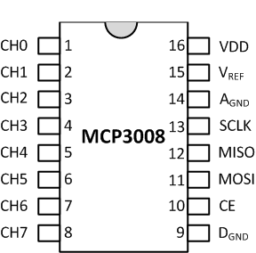
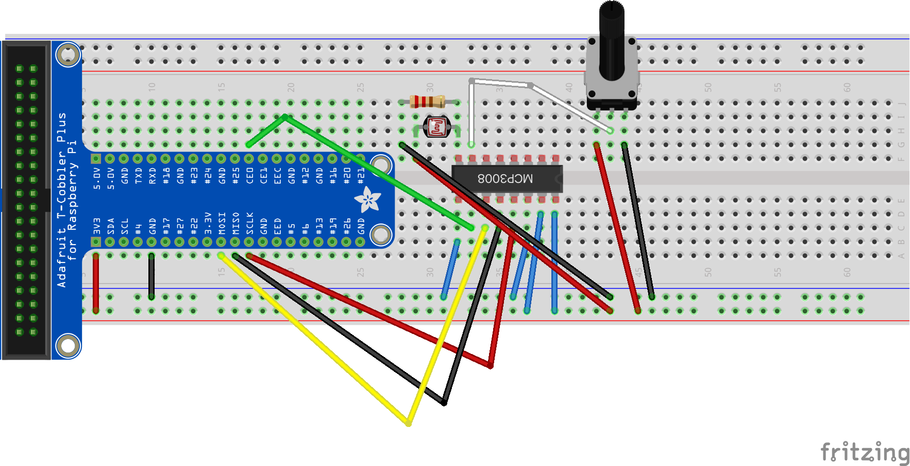
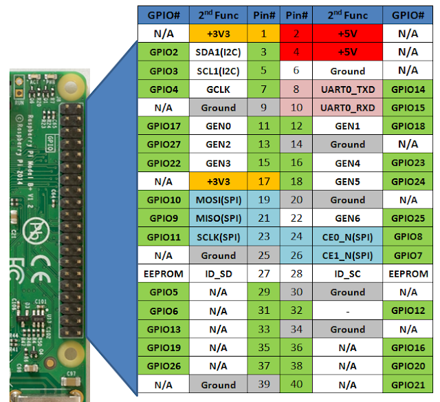
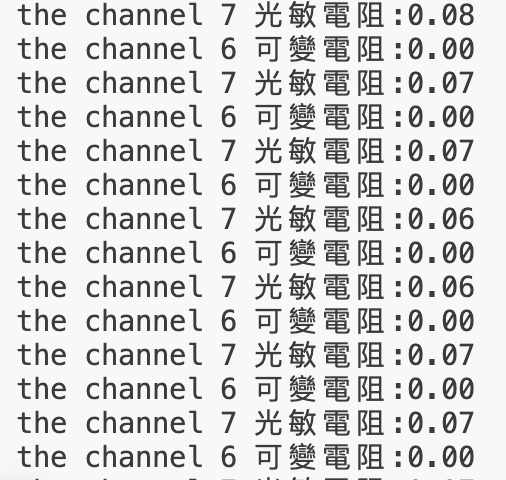

# MCP3008_光敏電阻_可變電阻

## 1. MCP3008


## 2. 線路圖


## 3. 40pin


## 4. gpiozero控制

### 4.1 GPIOZERO的控制(測試用)
- [gpiozero MCP3008說明]()

```python
import gpiozero as zero
from time import sleep

if __name__ == "__main__":
    mcp3008_7 = zero.MCP3008(7);
    mcp3008_6 = zero.MCP3008(6);
    while True:
        print("the channel 7 光敏電阻:{:.2f}".format(mcp3008_7.value));
        print("the channel 6 可變電阻:{:.2f}".format(mcp3008_6.value))
        sleep(1)
```




### 4.2 本地端,MQTT,REDIS
#### 4.2.1 前置作業
- **啟動MQTT Server**
- **啟動REDIS Server**

#### 4.2.2 建立發佈和接收的py檔
- **mcp3008.py負責發佈**
- **receive.py負責訂閱**

##### 4.2.2.1  receive.py
- **遇到mosquitto loop_forever()的問題**

```
#問題
Mosquitto (Paho MQTT) 客戶端函式庫中的 loop_forever() 是一個阻塞呼叫，這表示它會無限期地執行，直到客戶端中斷連線才會返回。如果您需要同時執行其他任務，這使得它不適合在主線程中執行。但是，您可以在單獨的執行緒中執行 loop_forever()。

#解決方法
import threading
import paho.mqtt.client as mqtt

# Define the MQTT event callbacks
def on_connect(client, userdata, flags, rc):
    print("Connected with result code " + str(rc))
    client.subscribe("your/topic")

def on_message(client, userdata, msg):
    print(f"Received message: {msg.topic} -> {msg.payload.decode('utf-8')}")

# Create an MQTT client instance
client = mqtt.Client()

# Assign event callbacks
client.on_connect = on_connect
client.on_message = on_message

# Connect to the broker
client.connect("mqtt.eclipse.org", 1883, 60)

# Define a function to run the loop_forever() in a thread
def mqtt_thread():
    client.loop_forever()

# Create and start the thread
thread = threading.Thread(target=mqtt_thread)
thread.start()

# Your main program can continue running here
# For example, handling other tasks, inputs, etc.
try:
    while True:
        pass  # Simulate other work being done
except KeyboardInterrupt:
    print("Disconnecting...")
    client.disconnect()
    thread.join()
    print("MQTT client stopped.")
    
#說明
1.	threading.Thread(target=mqtt_thread): A new thread is created, running the mqtt_thread function.
	2.	client.loop_forever(): This is executed in the separate thread, allowing the main program to continue running.
	3.	client.disconnect(): The client disconnects cleanly when the program is stopped (e.g., by pressing Ctrl+C).
```


