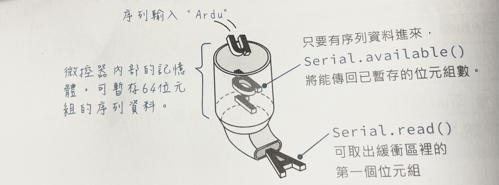

# 由電腦傳送資料給Arduino
## 學習電腦透過序列埠傳送資料給Arduino

## 了解char和字元陣列

### 了解Arduino內的暫存器(buffer), 先進先出


### 傳送過來的是由char ASCII 轉換的數字

```c++
//example1
void setup(){  
  Serial.begin(9600);
  while (!Serial);
  Serial.println("歡迎來到Arduino");
}

void loop(){
  //Serial.available()會算出目前在buffer內有多少byte的資料
  if(Serial.available()){
    //Serial.read()會讀取第一個byte內的資料,讀取完畢後,buffer內的資料就被刪除。
    //傳送來的資料是char
    Serial.println(Serial.read());    
  }
}
```

### 傳送為字元
- 可改為語法為switch...case語法

```c++
//example2
#define LED 13
char val;
void setup(){
  pinMode(LED,OUTPUT);
  Serial.begin(9600);
  while (!Serial);
  Serial.println("歡迎來到Arduino");
}

void loop(){
  //Serial.available()會算出目前在buffer內有多少byte的資料
  if(Serial.available()){
    //Serial.read()會讀取第一個byte內的資料,讀取完畢後,buffer內的資料就被刪除。
    //傳送來的資料是char
    val = Serial.read();    
    if(val == '1'){
      digitalWrite(LED,HIGH);
      Serial.println("LED ON");
    }else if(val='0'){
      digitalWrite(LED,LOW);
      Serial.println("LED OFF");
    }
  }
}

```

### 傳送整數

```c++
long val;

void setup(){  
  Serial.begin(9600);
  while (!Serial);
  Serial.println("歡迎來到Arduino");
}

void loop(){
  //Serial.available()會算出目前在buffer內有多少byte的資料
  if(Serial.available()){
    //Serial.read()會讀取第一個byte內的資料,讀取完畢後,buffer內的資料就被刪除。
    //傳送來的資料是char
    val = Serial.parseInt(SKIP_ALL);//參數代表排除非數字字元和負數字元
    Serial.println(val);      
  }
}
```

### 將電腦傳送來的字串(255,0,0)轉換為R,G,B3個整數

```
/*--------------------------------
 *使用者,可以在arudino編輯器的序列埠管理員
 *輸入3個數值,格式如下: 255,255,0
 *rgb參數必需傳入3個int元素的陣列
 *
----------------------------- */
void inputMultipleValue(int* rgb){
  if(Serial.available() > 0){
    String stringBuffer = Serial.readString();    
    int stringLength = stringBuffer.length();
    String rString = "";     
    int j = 0;
     
    for(int i=0; i<stringLength; i++){
      
      if(stringBuffer[i] != ',' ){ 
        rString += stringBuffer[i];       
      }else{
        rgb[j] = rString.toInt();
        j++;
        rString = "";
      }

      if(i == stringLength-1){
        rgb[j] = rString.toInt();
        j++;
         rString = "";
      } 
      
      
    }

    
    
  }
}

```


