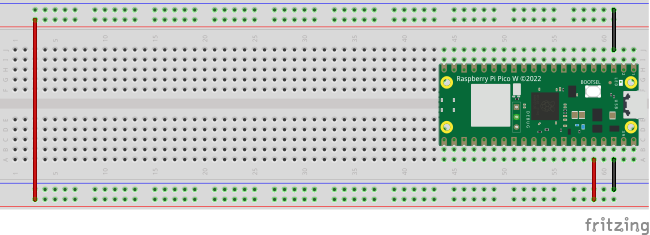

## Pico 有自帶計時器

```
From machine import Timer
```

### 線路圖



### 執行一次

```
timer = Timer(period=5000, mode=Timer.ONE_SHOT, callback=lambda t:print(1))
```

### 持續執行

```
timer = Timer(period=1000, mode=Timer.PERIODIC, callback=lambda t:print(2))
```


### 執行10次,然行停止執行

```
#執行10次,然後停止執行
def run10(t):
    global i
    i += 1
    if i==10:
        t.deinit()
    print(i)
    
i=1
timer = Timer(period=1000, mode=Timer.PERIODIC, callback=lambda t:run10(t))
timer = Timer(period=1000, mode=Timer.PERIODIC, callback=lambda t:print('一直執行'))
```