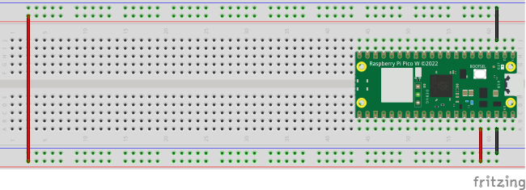

## Pico 有自帶實時時鐘


```
From machine import RTC
```

### 線路圖



### 取得目前日期

```
from machine import RTC

#取得目前日期
rtc = RTC()
print(rtc.datetime())

-------------------
(2023, 12, 15, 4, 13, 32, 19, 0)
2023年12月15日星期五,13點,32分,19秒
```

### 自訂日期

```
from machine import RTC
rtc = RTC()
rtc.datetime((2017,8,23,2,12,48,0,0))
print(rtc.datetime())

-------------
(2017, 8, 23, 2, 12, 48, 1, 0)
```

