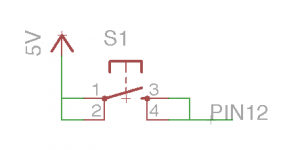
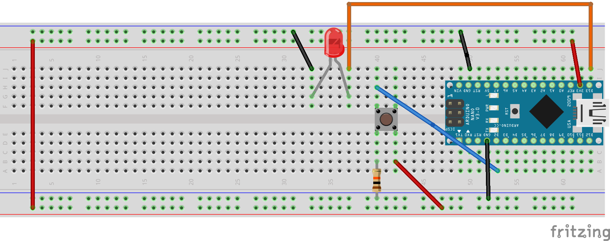

# 沒有使用上拉電阻的按鈕操作
## 學習Button
- ### 按鈕沒有使用上拉電阻,PIN12接收訊號的說明圖



### 線路圖


### 實體線路圖


```C++
#define btn 2
#define led 13

void setup() {
  // put your setup code here, to run once:
  Serial.begin(9600);
  pinMode(btn, INPUT);
  pinMode(led, OUTPUT);
}

void loop() {
  // put your main code here, to run repeatedly:
  int sensorVal = digitalRead(btn);
  if(sensorVal == HIGH)
    digitalWrite(led,HIGH);
  else
    digitalWrite(led,LOW);
}
```

