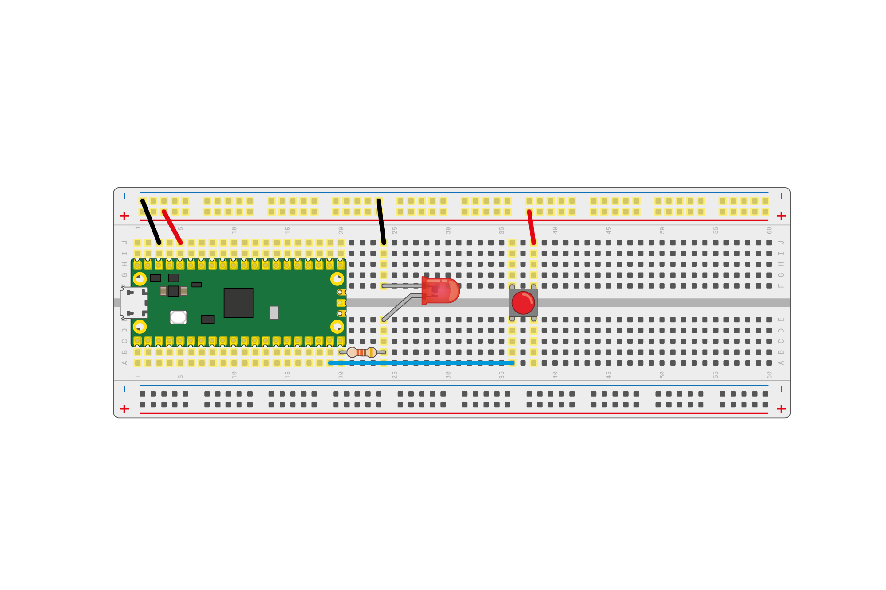

# 按鈕_LED

## 上拉電阻(Pin.PULL_UP)
- ### 按鈕使用上拉電阻,代表GPIO14,內有電阻,並且發出3.3V電壓,另一端接地


## 下拉電阻(Pin.PULL_Down)
- ### 按鈕使用下拉電阻,代表GPIO14,內有電阻,並且接地.另一端接電壓

### 線路圖


```
from machine import Pin
import time

red_led = Pin(15,mode=Pin.OUT)
btn = Pin(14,mode=Pin.PULL_DOWN)
is_press = False
led_status = False
#switch button
#解決彈跳

while True:
    if btn.value():
        time.sleep_ms(50)
        if btn.value():
            is_press = True
    elif is_press:
        time.sleep_ms(50)
        if btn.value() == False:
            print('release')
            led_status = not led_status        
            red_led.value(led_status)        
            is_press = False
    
    

```


