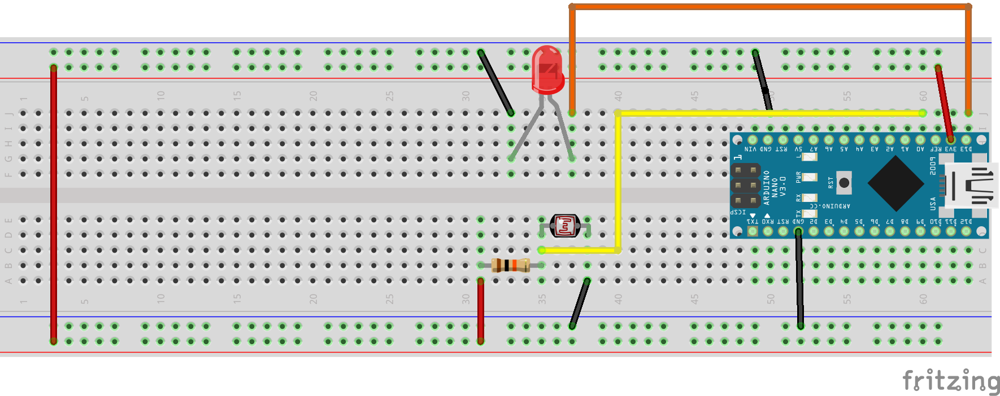
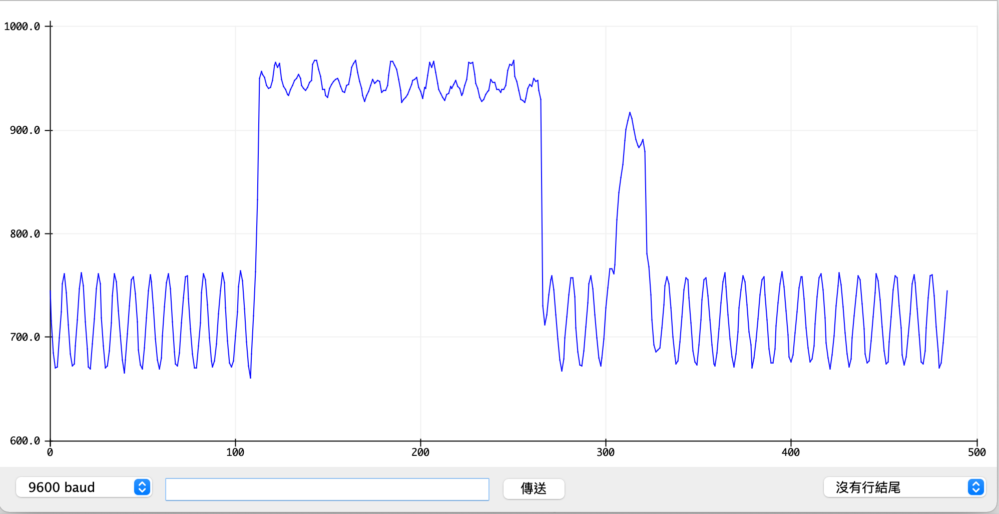

# 光敏電阻
## 學習如何使用光敏電阻

- ### 分壓電路[網站模擬計算](https://www.digikey.tw/zh/resources/conversion-calculators/conversion-calculator-voltage-divider)


### 線路圖


### 實體線路圖


### 序列繪圖家


### bitLed展示
[](https://youtu.be/eSxhEp0DquI)


```C++
#define cds A0
#define led 13

void setup() {
  // put your setup code here, to run once:
  Serial.begin(9600);
  pinMode(led, OUTPUT);
}

void loop() {
  // put your main code here, to run repeatedly:
  int sensorVal = analogRead(cds);
  Serial.println(sensorVal);
  if(sensorVal > 800){
    digitalWrite(led,HIGH);
  }else{
    digitalWrite(led,LOW);
  }
  delay(100);
}
```

