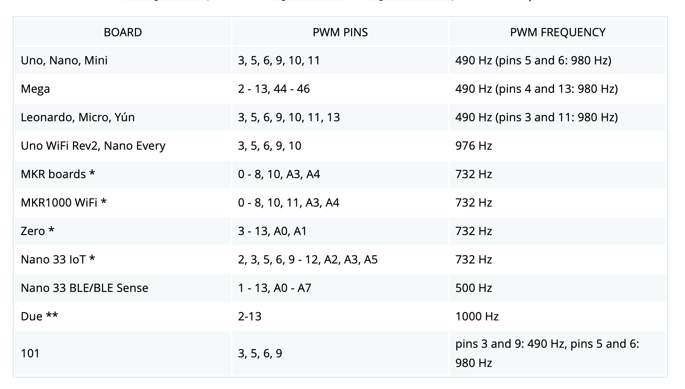
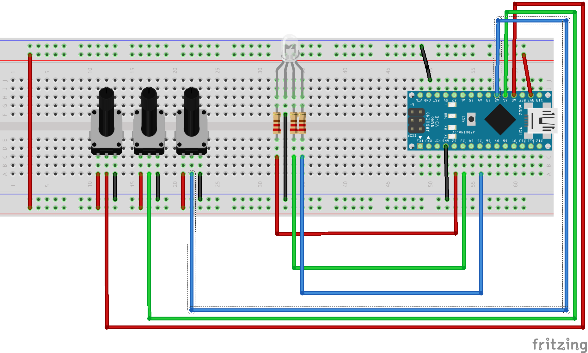

# 可變電阻和RGBLED
## 學習PWM輸出和類比輸入
## PWM pin



### 線路圖


### 實體線路圖


### 可變電阻和RGBLED展示
[](https://youtu.be/jgHRjJ615eQ)


```C++
#define I_RED_PIN A0
#define I_GREEN_PIN A1
#define I_BLUE_PIN A2
#define O_RED_PIN 2
#define O_GREEN_PIN 3
#define O_BLUE_PIN 5

byte rPin;
byte gPin;
byte bPin;

void setup() {
  // put your setup code here, to run once:
  Serial.begin(9600);
  pinMode(O_RED_PIN,OUTPUT);
  pinMode(O_GREEN_PIN,OUTPUT);
  pinMode(O_BLUE_PIN,OUTPUT);
}

void loop() {
  // put your main code here, to run repeatedly:
  readSensor();
  outputSensor();
  delay(100);
}

void readSensor(){
  int r = analogRead(I_RED_PIN);
  rPin = map(r,0,1023,0,255);
  Serial.println(rPin);
  int g = analogRead(I_GREEN_PIN);
  gPin = map(g,0,1023,0,255);
  Serial.println(gPin);
  int b = analogRead(I_BLUE_PIN);
  bPin = map(b,0,1023,0,255);
  Serial.println(bPin);
}

void outputSensor(){
  analogWrite(O_RED_PIN,rPin);
  analogWrite(O_GREEN_PIN,gPin);
  analogWrite(O_BLUE_PIN,bPin);
}

```

