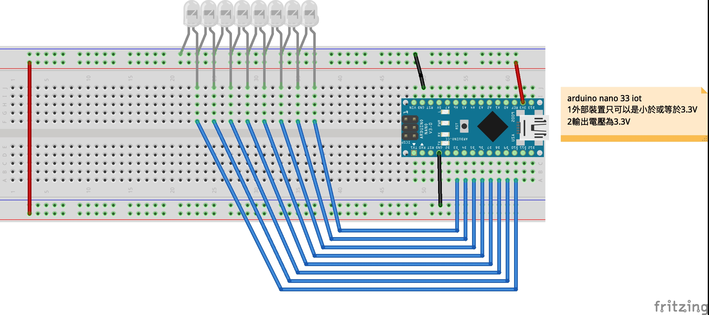
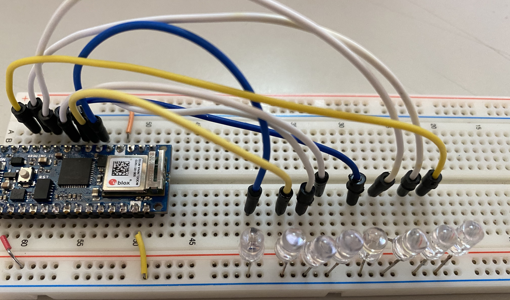

# bitLed
## 學習如何操控2進位0b
### 線路圖


### 接線成品


### bitLed展示
[](https://youtu.be/hkFwj3PkxXk)

```C++
byte maxValue = 255;
byte currentValue = 0;
byte pins[] = {3, 4, 5, 6, 7, 8, 9, 10};
byte count = sizeof(pins) / sizeof(pins[0]);
void setup() {
  Serial.begin(9600);
  for(int i=0;i<=count;i++){
    pinMode(pins[i],OUTPUT);
  }
  
}

void loop() {
  Serial.println(currentValue);
  for(int i=0;i<=count;i++){
    bool state = bitRead(currentValue,i);
    digitalWrite(pins[i],state);
  }
  delay(250);
  currentValue > maxValue ? 0 : currentValue++ ;
}

```

