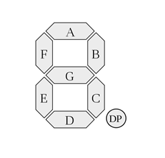
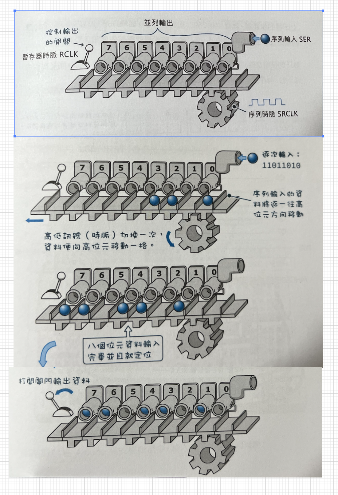
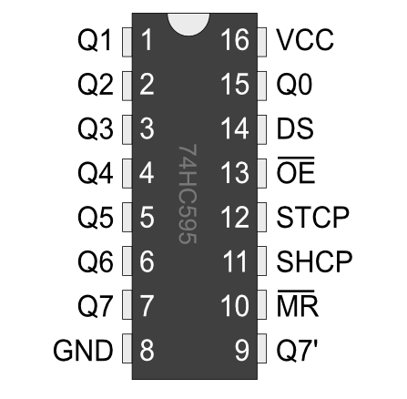
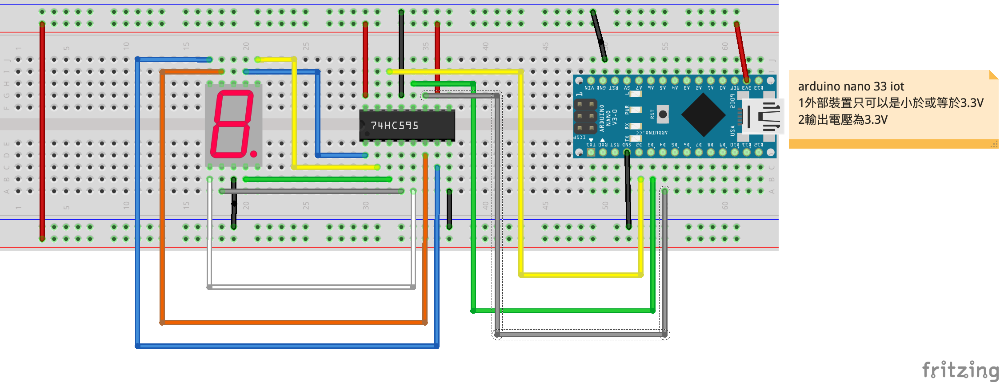

# 7段顯示器
## 學習如何操控7段顯示器
- 七段顯示器分成共陽極和共陰極兩種，不管是哪一種，內部構造都是由 8 個 LED 發光二極體所組成，其中七個是筆劃，另外一個是小數點，如下圖所示，依順時針方向分別為 a, b, c, d, e, f, g 以及小數點 dp (decimal point):


- 要產生數字，方法是點亮指定的 LED。例如要產生數字 0，便點亮 a, b, c, d, e, f 等節段；要產生數字 1，便點亮 b, c 等節段；要產生數字 2，便點亮 a, b, d, e, g 等節段，依此類推。以共陰極而言，0 到 9 這十個阿拉伯數字與各節段的對應表如下：

| 顯示數字 | dp | a | b | c | d | e | f | g |
|:--|:--|:--|:--|:--|:--|:--|:--|:--|
| 0 | 0 | 1 | 1 | 1 | 1 | 1 | 1 | 0 | 
| 1 | 0 | 0 | 1 | 1 | 0 | 0 | 0 | 0 |  
| 2 | 0 | 1 | 1 | 0 | 1 | 1 | 0 | 1 |  
| 3 | 0 | 1 | 1 | 1 | 1 | 0 | 0 | 1 |  
| 4 | 0 | 0 | 1 | 1 | 0 | 0 | 1 | 1 |  
| 5 | 0 | 1 | 0 | 1 | 1 | 0 | 1 | 1 |  
| 6 | 0 | 1 | 0 | 1 | 1 | 1 | 1 | 1 | 
| 7 | 0 | 1 | 1 | 1 | 0 | 0 | 0 | 0 |
| 8 | 0 | 1 | 1 | 1 | 1 | 1 | 1 | 1 |
| 9 | 0 | 1 | 1 | 1 | 1 | 0 | 1 | 1 | 

### 74HC595簡介
74HC595是一顆移位暫存器 (Shift Register)，使用這顆晶片，你只需要Arduino的三個接腳，就可以同時控制八個輸出。74HC595是可以串聯多顆來得到更多輸出的腳位，如果串聯2顆就能控制16顆LED燈，以此類推。用單顆74HC595進行練習。

74HC595 是一個8位元位移暫存器 (shift register)，「暫存器」相當於記憶體，代表它最多能保存8位元資料，「位移」則代表其內部資料可序列移動。

我們可以將它想像成工廠的生產線，物品從一個叫做"SER"（代表'serial,「序列」之意） 的管道依序進入生產線，進入之後，下方的齒輪將轉動一格•讓生產線上的所有物品都往左移動一格。




#### 74HC595有16個腳位，每個腳位的名稱如下：



下表為 74HC595 與七段顯示器的腳位對應表：

| 74HC595腳位 | 七段顯示器腳位 | 位元順序 |
|:--|:--|:--|
| Q0  | dp | 7 |
| Q1 | a | 6 |
| Q2 | b | 5 |
| Q3 | c | 4 |
| Q4 | d | 3 |
| Q5 | e | 2 |
| Q6 | f | 1 |
| Q7| g | 0 |


### 線路圖


### 接線成品


### 7段顯示器和74HC595展示
[](https://youtu.be/nAbwn0z-ZNA)

```C++
#define dataPin 2
#define latchPin 3
#define clockPin 4

/*
 * numbers[10]內儲存的顯示數值依序是0,1,2,3,4,5,6,7,8,9
 * B01111110代表的是要顯示數值，
 * 最後的0代表的是g要輸出0
 * 倒數第2個值是1,是f要輸出1
 */
byte numbers[10] = {B01111110,B00110000,B01101101,B01111001,B00110011,B01011011,B01011111,B01110000,B01111111,B01111011};
byte i = 0;

void setup() {
  pinMode(latchPin,OUTPUT);
  pinMode(clockPin,OUTPUT);
  pinMode(dataPin,OUTPUT);
}

void loop() {
  digitalWrite(latchPin,LOW); //關閉閘門
  //以序列方式傳進74595
  shiftOut(dataPin,clockPin,LSBFIRST,numbers[i]);
  digitalWrite(latchPin,HIGH); //開啟閘門

  delay(1000);
  i++;
  if(i == 10){
    i = 0;
  }
}
```

