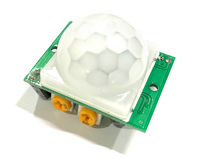
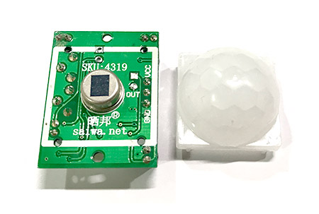
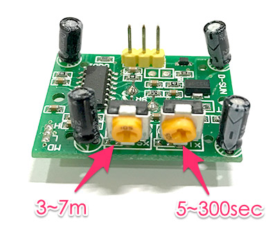
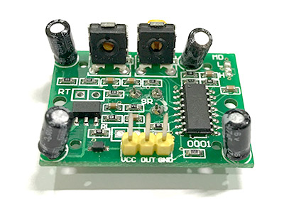
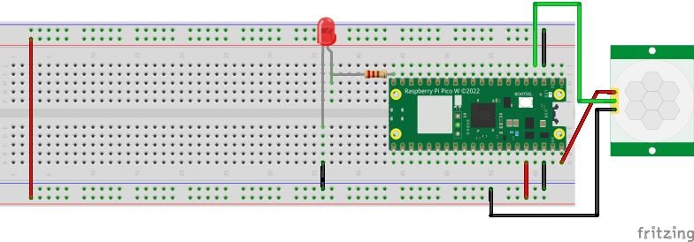

# 防盜器
- 實際做出一個有感應到人體紅外線就亮燈的裝置，這種裝置很常見的就是住家的騎樓，常常晚上走路經過別人家門口，就會有一盞燈亮起

## HC-SR501人體紅外線感應模組



### 把上面半球的白色蓋子打開，可以發現裡面有一個接收器，而半圓蓋子的作用在於折射人體紅外線，讓原本的偵測角度可以擴大



#### - 標示 SX ( Sensitivity ) 的旋鈕是偵測的靈敏度，靈敏度以偵測距離 ( high ) 計算，範圍 3~7 公尺，順時針旋轉靈敏度越高

#### - 標示 TX ( Time Delay ) 的旋鈕是偵測到訊號之後，下一次再繼續偵測的延遲時間，時間範圍是 5~300 秒，順時針旋轉延遲時間越長。




#### 另外一側的三個針腳，分別是 VCC ( 5V )、OUT ( 訊號腳 ) 和 GND。



> 資料出處 - https://tutorials.webduino.io/zh-tw/docs/socket/sensor/pir.html

## 線路圖



## 範例
- 延遲時間設為最小
- 偵測距離設為最小
- 每一秒偵測HC-SR501
- 取得5筆資料,其中有一筆為1,則代表有人

```
from machine import Pin
from machine import Timer
import time

led = Pin(15,Pin.OUT)
sr501 = Pin(2,Pin.IN)

sensors:list[int] = [] #收集5秒資訊
def check_people(t:Timer):
    global sensors
    sensor_state = sr501.value()
    print(sensor_state)
    length:int = len(sensors)
    if length >= 5: #大於=於5筆       
        if sum(sensors) > 0: #大於1,代表有人
            led.value(1)
            print("總合大於1")
        else:
            led.value(0)
        
        sensors = [] #清空重新計算
    else:        
        sensors.append(sensor_state)
    

time1 = Timer() 
time1.init(period=1000, mode=Timer.PERIODIC, callback=check_people)
```
