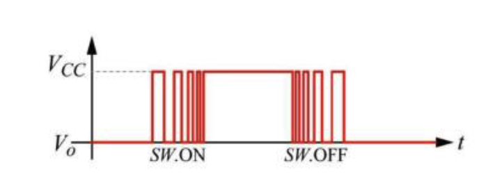
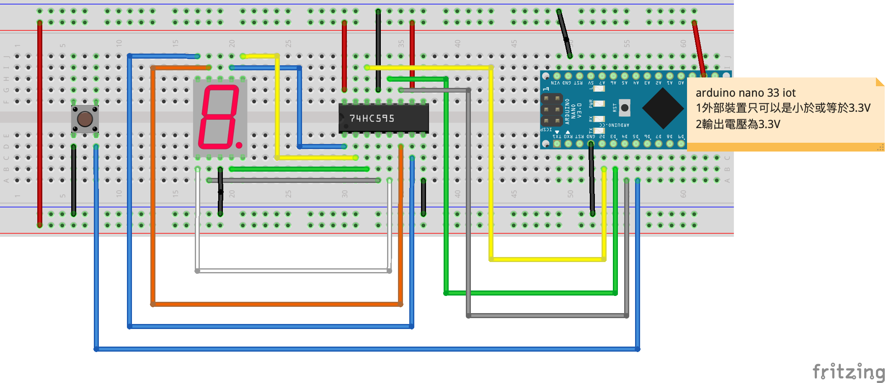

# Switch Button

- ### 解決彈跳問題
按鈕是一個機械動作，在你按下按鈕那零點幾秒內，Arduino實際上是收到很多HIGH和LOW的信號，這種在HIGH和LOW之間跳動的現像我們稱之為彈跳。
即使你沒按下按鈕，引腳12也是會持續收到彈跳信號。



### 線路圖


### 接線成品


### 7段顯示器和74HC595和switch Button展示
[](https://youtu.be/JmcEfhzedUQ)

```C++
#define dataPin 2
#define latchPin 3
#define clockPin 4
#define button 5

/*
   numbers[10]內儲存的顯示數值依序是0,1,2,3,4,5,6,7,8,9
   B01111110代表的是要顯示數值，
   最後的0代表的是g要輸出0
   倒數第2個值是1,是f要輸出1
*/
byte numbers[10] = {B01111110, B00110000, B01101101, B01111001, B00110011, B01011011, B01011111, B01110000, B01111111, B01111011};
unsigned long switchCount = 0; //計算按下和放開的次數
bool buttonState;
byte i = 0; //要顯示數字

void setup() {
  pinMode(latchPin, OUTPUT);
  pinMode(clockPin, OUTPUT);
  pinMode(dataPin, OUTPUT);
  pinMode(button, INPUT_PULLUP);
  buttonState = digitalRead(button); //一開始button的狀態
  sevenSegmentLed(i);
}

void loop() {
  if (digitalRead(button) != buttonState) { //當下button 狀態有改變時
    delay(30); //解決彈跳
    if (digitalRead(button) != buttonState) { //再次確認是否不一樣
      buttonState = digitalRead(button);
      switchCount += 1;
      i = switchCount / 2;//小數會被排除
      
      if (i == 10) { //如果要顯示的數字是10時
        switchCount = 0;
        i = 0;
      }
      sevenSegmentLed(i);
    }
  }

}

void sevenSegmentLed(byte n) {
  digitalWrite(latchPin, LOW); //關閉閘門
  //以序列方式傳進74595
  shiftOut(dataPin, clockPin, LSBFIRST, numbers[n]);
  digitalWrite(latchPin, HIGH); //開啟閘門
}

```

