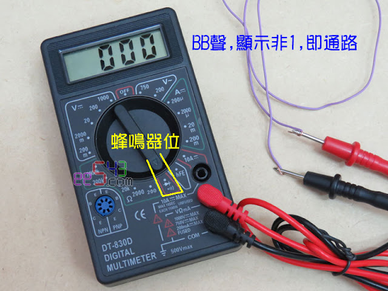
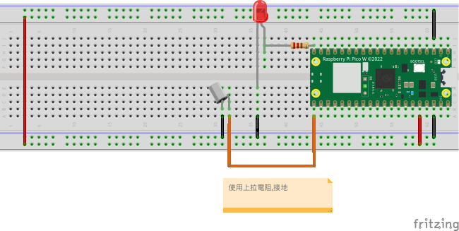

# 傾斜(滾珠)開關(tilt switch)

如果您想要檢測某個物體何時移動、傾斜或搖晃，而且不想要使用複雜的加速度計，那麼傾斜開關傳感器可能是最便宜的選擇。

## 說明:
傾斜開關傳感器更像是一個可以檢測基本運動、方向或傾斜度的開關。

這些開關的設計方式使得足夠的傾斜度可以建立或斷開電氣連接。這樣的信號既可以用作指示器，也可以用於打開或關閉某些東西。

它們體積小、價格便宜、易於使用且永不磨損。它們的簡單性使它們在玩具、小工具、機器人和其他功能取決於傾斜度的設備中廣受歡迎。

這就是為什麼它們有時被稱為「窮人的加速度計」。

### 工作原理:

鋼球傾斜傳感器通常由一個金屬管和一個在其中滾動的小金屬球組成。空腔的一端有兩個導電元件（極）。傳感器的設計方式使得足夠的傾斜水平允許球滾動，建立或斷開電路連接。

當傳感器直立時，球接觸兩極並建立電路連接。當傳感器傾斜時，球會從桿子上滾下來，連接就會斷開。

### 測試傾斜傳感器

- 直立,通路,蜂鳴器響。
- 傾斜,斷路,蜂鳴器停。

### 線路圖

