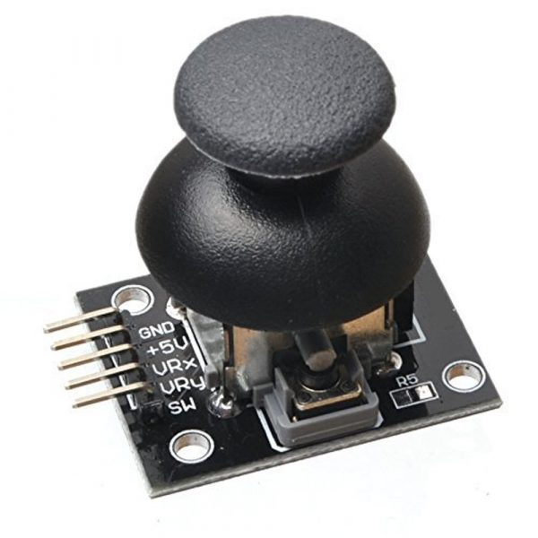
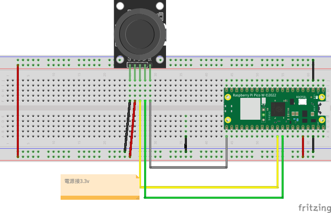

# 雙軸xy搖桿組

雙軸按鍵搖桿傳感器模塊由採用PS2搖桿電位器製作，具有(X,Y)2軸模擬輸出，(Z)1路按鈕數字輸出



## 說明:
1. 輸入電壓範圍：直流3.3V 至5V

2. 輸出信號：模塊特設二路模擬輸出和一路數字輸出接口，輸出值分別對應（X，Y）雙軸偏移量，其類型為模擬量；按鍵表示用戶是否在Z軸上按下，其類型為數字開關量。

### 工作原理:

十字搖桿為一個雙向的10K電阻器，隨著搖桿方向不同，抽頭的阻值隨著變化。本模塊使用5V供電，原始狀態下X,Y讀出電壓為2.5V左右，當隨箭頭方向按下，讀出電壓值隨著增加，最大到5V；箭頭相反方向按下，讀出電壓值減少，最小為0V。


### 線路圖




### 範例
- 硬體不要隋便微調
- 目前只可以測x軸和switch
- 電源接3.3V

```
from machine import Pin,ADC
import time


x = ADC(Pin(26))
y = ADC(Pin(27))
switch = Pin(16, Pin.IN)

while True:    
    xValue= x.read_u16()
    yValue = y.read_u16()
    switchValue = switch.value()
    print(f'xValue={xValue}')
    print(f'yValue={yValue}')
    print(f'switchValue={switchValue}')
    time.sleep(1)
    
```

