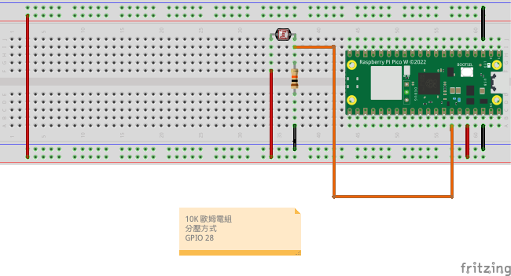

# 光敏電阻
## 學習如何使用光敏電阻

- ### 分壓電路[網站模擬計算](https://www.digikey.tw/zh/resources/conversion-calculators/conversion-calculator-voltage-divider)


### 線路圖



```Micro python

from machine import ADC,Pin
import utime

adc_light = ADC(Pin(28))

while True:
    light_value = adc_light.read_u16()
    print(light_value)
    utime.sleep_ms(500)

```

