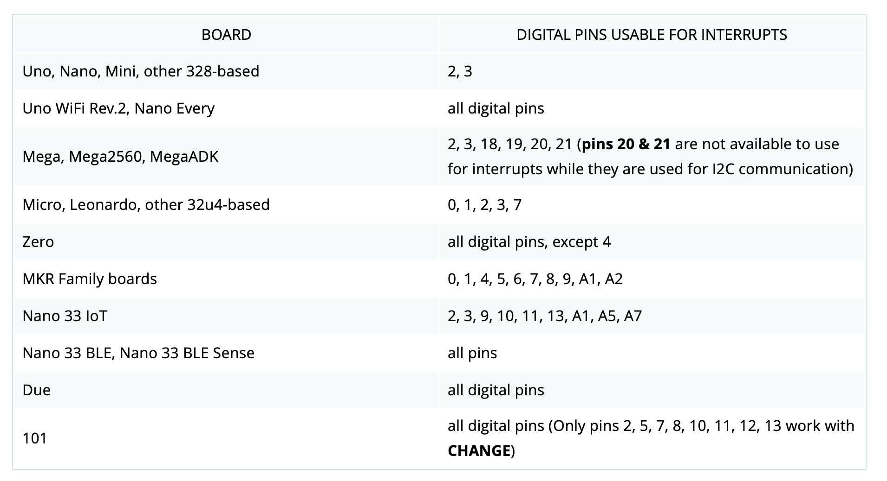
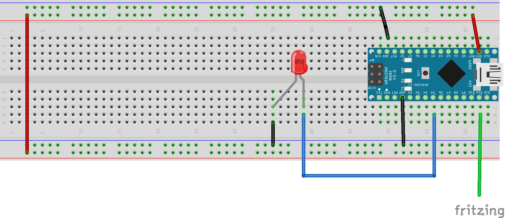
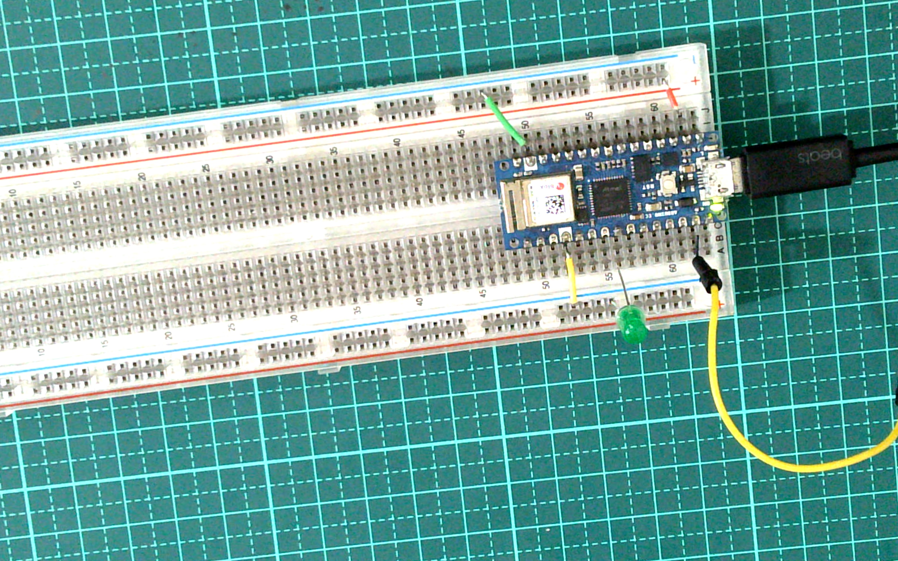

# Interrupt中斷
## 為何使用中斷
微控器要偵測周邊狀態的變化，I/O的處理方式如下:
1. #### Polling (輪詢法) :
微控器主動檢查輸入腳的狀態變化, 亦即在 loop() 主迴圈中不斷地檢查輸入腳, 若發現有變化就處理, 耗費系統資源較多.

2. #### Interrupt (中斷法) :
微控器不須在主迴圈檢查周邊設備狀態, 而是被動因應周邊中斷的觸發, 將目前的狀態存入堆疊, 暫停現在執行中的程序去處理中斷事件, 控制權移轉到中斷處理函數, 處理完再從堆疊取回被中斷程序繼續執行原先的程序, 因此所耗費之系統資源少. 

3.arduino nano 33 iot 中斷的腳位



## 註冊中斷函式

### attachInterrupt(digitalPinToInterrupt(pin), ISR, mode);

1. #### digitalPinToInterrupt(腳位)
2. #### ISR函式-中斷服務函式(interrupt Service Rountine)
	- 程式本體應該要簡單，通常都在5行以內
	- 中斷處理函式無法接受參數輸入，也不能傳回值
	- 不要在 ISR 內使用與時間有關的函式如 millis(), micro(), 與 delay(), 因為這些函數也是依賴中斷功能去計數或計時 (delay 是依賴 millis, millis 是依賴計時器), 在 ISR 內呼叫它們毫無作用 (micro 只是剛開始有效). 只有 delayMicroseconds() 因為不使用計數器可在 ISR 內正常運作. 如果在 ISR 內必須使用時間延遲功能, 必須自行撰寫時間延遲函數. 
	- 在 ISR 執行期間, 序列埠輸出如 Serial.print() 可能會遺失一些資料, 因為新版 Arduino IDE 使用中斷來做序列埠輸出入, 故不要在 ISR 內使用序列埠指令
	- 但當一個中斷發生時預設其他中斷會被忽略 (因為中斷功能會被禁能), 直到目前的中斷結束為止. 若要讓其他中斷恢復有效, 必須呼叫 interrupts() 函數來致能. 
3. #### mode
	- FALLING(下降)
	- RISING(上昇)
	- CHANGE(改變)
	- LOW(低電位)
	- HIGH(高電位)


### 線路圖


### 實體線路圖


### 中斷測試

[](https://youtu.be/BmgeS6yzSOg)


```C++
#define LIGHT_PIN 5
#define WIRE_PIN 11

volatile bool state = LOW;

void setup() {
  pinMode(LIGHT_PIN, OUTPUT);
  pinMode(WIRE_PIN,INPUT_PULLUP);
  attachInterrupt(digitalPinToInterrupt(WIRE_PIN),blinkme,CHANGE) ;
}

void blinkme() {
  state = !state;
  digitalWrite(LIGHT_PIN, state); // Display the state 
  Serial.println("HELLO!"); 
}

void loop(){
}

```

