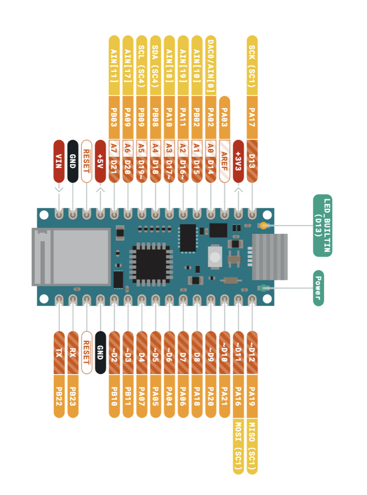
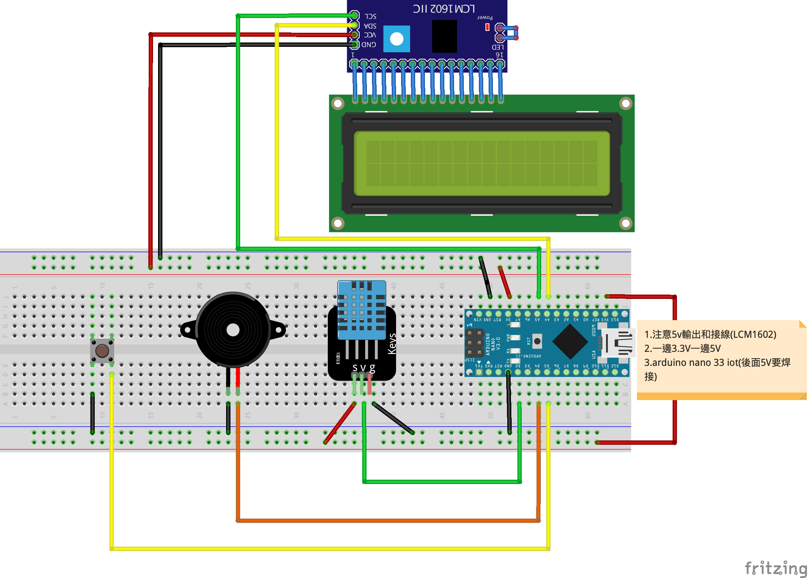

# LCM1602_LM35溫度感測

- ### LCM1602至程式庫管理員下載LiquidCrystal_I2C


- ### compiler時有警告,可以忽略。
- ### 接線時使用3.3V，文字會不清礎。可以使用5V，但Arduino nano iot 33要有焊接5V的端點，才可以從USB傳送5V的電壓

- ### 有源蜂鳴器
	- 有源蜂鳴器是內建了一組固定的頻率，只要接通電源，就會發出固定的音調。

- ### 無源蜂源器
	- 無源蜂源器則不同，我們必須透過程式，告訴它頻率，我們才能得到所需的音調，但我們就可以利用它來播放簡單的旋律了！

- ### DHT11 至程式庫管理員下載DHT11 library


### arduino nano 33 iot




### 線路圖


### 接線成品


```C++/
/*
lcm1602_DHT11.ino
*/

#include "DHT.h"
#include <Wire.h> 
#include <LiquidCrystal_I2C.h>

#define DHTPIN 2 
#define BUZZER 4    

#define DHTTYPE DHT11   // DHT 11
//#define DHTTYPE DHT22   // DHT 22  (AM2302), AM2321
//#define DHTTYPE DHT21   // DHT 21 (AM2301)

LiquidCrystal_I2C lcd(0x27,20,4);  // set the LCD address to 0x27 for a 16 chars and 2 line display
DHT dht(DHTPIN, DHTTYPE);

void setup() {  
  Serial.begin(9600);
  pinMode(DHTPIN, INPUT);
  pinMode(BUZZER, OUTPUT);
  //dht要初始化
  dht.begin();
  //lcd要初始化
  lcd.init();
}

void loop() {
  //DHT11速度慢，隔2秒讀一次
  delay(2000);

  //響一聲
  tone(BUZZER, 4978, 500);
  
  
  // Reading temperature or humidity takes about 250 milliseconds!
  // Sensor readings may also be up to 2 seconds 'old' (its a very slow sensor)
  float h = dht.readHumidity();
  // Read temperature as Celsius (the default)
  float t = dht.readTemperature();
  // Read temperature as Fahrenheit (isFahrenheit = true)
  float f = dht.readTemperature(true);

  // Check if any reads failed and exit early (to try again).
  if (isnan(h) || isnan(t) || isnan(f)) {
    Serial.println(F("Failed to read from DHT sensor!"));
    return;
  }

  // Compute heat index in Fahrenheit (the default)
  float hif = dht.computeHeatIndex(f, h);
  // Compute heat index in Celsius (isFahreheit = false)
  float hic = dht.computeHeatIndex(t, h, false);

  Serial.print(F("Humidity: "));
  Serial.print(h);
  Serial.print(F("%  Temperature: "));
  Serial.print(t);
  Serial.print(F("°C "));
  Serial.print(f);
  Serial.print(F("°F  Heat index: "));
  Serial.print(hic);
  Serial.print(F("°C "));
  Serial.print(hif);
  Serial.println(F("°F"));

  lcd.backlight();
  lcd.setCursor(0,0);
  lcd.print("H:"+String(f)+"%");
  lcd.setCursor(0,1);
  lcd.print("T:"+String(t)+"C");
}
```

---

### lcm1602_DHT11_Button_Buller
- ino檔
- releaseButton.h
- 按下按鈕開始，並發出聲音，再次按下，關閉並發出聲音，測溫度，如果超過溫度，發出警告，間隔一分鐘後，才會再發出聲音

```
/*
lcm1602_DHT11_Button_Buller
ino檔
*/

#include "releaseButton.h"
#include <sound.h>
#include <DHT.h>
#include <Wire.h> 
#include <LiquidCrystal_I2C.h>
#include <SimpleTimer.h>

#define BUTTON 5
#define BUZZER 4
#define DHTTYPE DHT11
#define DHTPIN 2

DHT dht(DHTPIN, DHTTYPE);
LiquidCrystal_I2C lcd(0x27,20,2);
SimpleTimer timer;
SimpleTimer timer60;


unsigned int stateChangeCount = 0;
bool isOpen = false;
Sound sound(BUZZER);
int timerId;


void setup() {
  Serial.begin(9600);
  pinMode(BUTTON,INPUT_PULLUP);
  pinMode(BUZZER,OUTPUT);
  dht.begin();
  lcd.init();
  lcd.backlight();
  lcd.setCursor(5,0);
  lcd.print("CLOSE!!");
  lcd.setCursor(2,1);
  lcd.print("Hollo! Arduino!");

  timerId = timer.setInterval(2000, workOfSecond);
  timer.disable(timerId);  
}

void loop() {
  timer.run();
  timer60.run();
  stateChangeCount += button_release(BUTTON);
  bool switchState = displayNum(stateChangeCount,1);
  //偵測switchState是1或0
  if(switchState){
    //1
    buttonOpen();
  }else{
    //0
    buttonClose();
  }
}

void buttonOpen(){
  if(isOpen == false){ //只會執行一次
    isOpen = true;
    Serial.println("開");
    sound.phone();
    timer.enable(timerId);    
  }  
}

void buttonClose(){
  if(isOpen == true){
    isOpen = false;
    Serial.println("關");
    lcd.clear();
    lcd.setCursor(5,0);
    lcd.print("CLOSE!!");     
    sound.phone();
    timer.disable(timerId);
  }  
}

void workOfSecond(){
  float h = dht.readHumidity();
    float t = dht.readTemperature();
    if (isnan(h) || isnan(t)) {
    Serial.println("測試失敗");
      return;
    }
    Serial.print(F("Humidity: "));
    Serial.print(h);
    Serial.print(F("%  Temperature: "));
    Serial.print(t);
    Serial.println(F("°C "));
    lcd.clear();
    lcd.setCursor(0,0);
    lcd.print("H:"+String(h)+" %");
    lcd.setCursor(0,1);
    lcd.print("T:"+String(t)+" C");
    //溫度超過24度發出警告
    if(t > 24.0){
      alert();
    }
}


int timerId60;
bool alertState = false;

void alert(){  //發出警告後60秒內不會再發出警告
    if(alertState == false){
        timerId60 = timer60.setInterval(1000*60,caculateTime);  
        alertState = true;
        Serial.println("alert");
        sound.melodySound();
    }
        
}

void caculateTime(){
  Serial.println("計時");
  timer60.disable(timerId60);
  alertState = false;
}


```


```c++
/*
buttonRelease.h
*/

#ifndef __RELEASEBUTTON_H__
#define __RELEASEBUTTON_H__


int button_release(int buttonPin) { //傳出按鈕改變的次數
  pinMode(buttonPin, INPUT_PULLUP);
  static bool buttonState = digitalRead(buttonPin);
  bool currentButtonState = digitalRead(buttonPin);
  if (currentButtonState != buttonState) {
    delay(50); //解決彈跳
    if (currentButtonState != buttonState) {
      buttonState = currentButtonState;
      return 1;
    }
  }
  return 0;
}

int displayNum(int stateCount,int maxNum){ //stateCount是按鈕狀態改變的次數,maxNum是0~maxNum
    int i = stateCount / 2; 
    return i % (maxNum+1);    
}

#endif
```