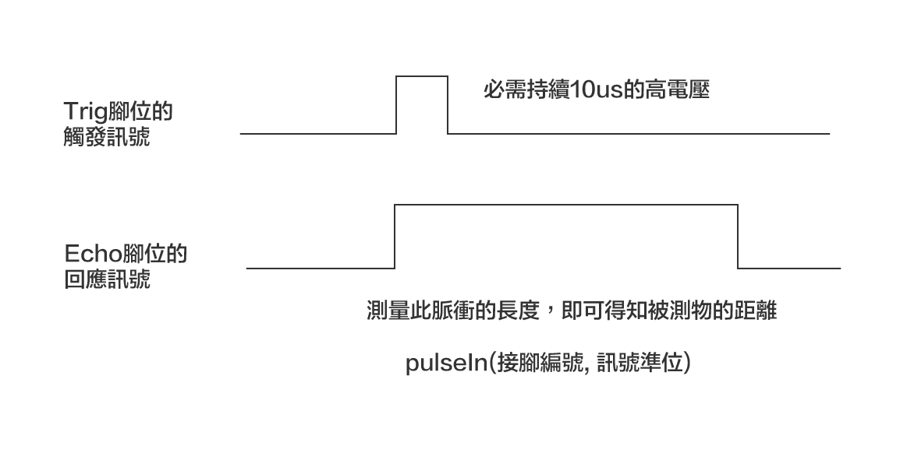
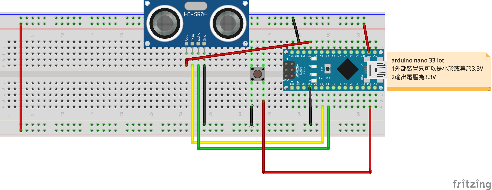
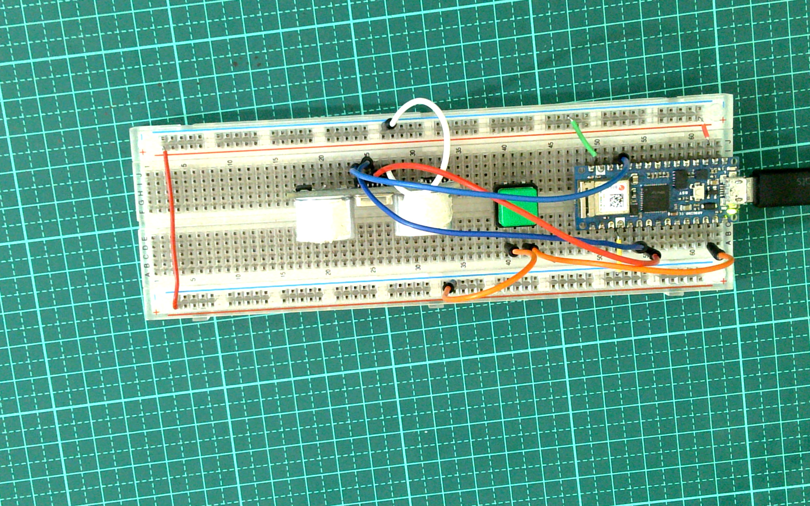

# HC-SR04超音波測距模組

- ### 模組工作原理

	- 採用I/O觸發測距，給至少為10us的高電位信號
	- 模組自動發送 8個 40KHZ的方波，自動檢測是否有信號返回
	- 有信號返回，通過I/O輸出一高電位，高電位持續的時間就是超聲波從發射到返回的時間
	- 測試距離 =（高電位時間 x 聲速（340M / S））/ 2
	- 1公分大約58.1us




- ### 支術規格
	- 電源：DC5V/2mA
	- 輸出電位( 1/ 0)：5V/ 0V
	- 精度：3mm
	- 距離範圍：2 ~ 450cm
	- 有效的角度：<15℃
	- 觸發輸入信號：10uS TTL pulse
	- ECHO輸出信號： Input TTL lever signal and the range in proportion
	- 接線方式：VCC、trig (控制端)、echo (接收端)、GND


- ### Arduino nano 33 iot 必需使用5V電壓才能作用HC-SR04


### 線路圖


### 接線成品


### 防異物入侵
[](https://youtu.be/nm4_FHjcfsw)


```C++
//按下按鈕，建立預設距離
#define BUTTON_PIN 11
#define TRIG_PIN 3
#define ECHO_PIN 4 
#define US 58

unsigned long cm;
volatile int defaultDistance=0;

void setup() {  
  Serial.begin(9600);
  pinMode(TRIG_PIN, OUTPUT);
  pinMode(ECHO_PIN, INPUT);  
  pinMode(BUTTON_PIN,INPUT_PULLUP);
  attachInterrupt(digitalPinToInterrupt(BUTTON_PIN),buttonPress,LOW) ;
}

void buttonPress(){
  defaultDistance = ping()/US;
  Serial.println("預設"+String(cm)+"cm");
}

unsigned long ping(){
  digitalWrite(TRIG_PIN,HIGH);
  delayMicroseconds(10);
  digitalWrite(TRIG_PIN,LOW);
  return pulseIn(ECHO_PIN, HIGH);
}

void loop() {
  cm = ping()/US;
  Serial.println(String(cm)+"cm");
  if(cm > defaultDistance+3 || cm < defaultDistance-3){
    Serial.println("有異物入侵");
  }
  delay(1000);
}
```

### switch button 一開始關，按一下開，按一下關

> main.ino

```c++
#include "releaseButton.h"
#include "sr104.h"
#include <SimpleTimer.h>
#define BUTTON 11
#define TRIG_PIN 3
#define ECHO_PIN 4


unsigned int stateChangeCount = 0;
bool runOnce = false;
SimpleTimer timer;
int timerid;

void setup() {
  // put your setup code here, to run once:
  Serial.begin(9600);
  pinMode(BUTTON,INPUT_PULLUP);
  pinMode(TRIG_PIN,OUTPUT);
  pinMode(ECHO_PIN,INPUT);
  timerid = timer.setInterval(1000,oneSecond);
  timer.disable(timerid);
}

void loop() {
  timer.run();
  stateChangeCount += button_release(BUTTON);  
  bool switchState = displayNum(stateChangeCount,1);//得到0或1,0為關閉,1為開啟
  if(switchState){
    //開啟
    buttonOpen();
  }else{
    //關閉
    buttonClose();
  }
}

void buttonOpen(){
  if(runOnce == false){ //只會執行一次
    runOnce = true;   
    timer.enable(timerid);
    Serial.println("開啟");  
  }
}

void buttonClose(){
  if(runOnce == true){ //只會執行一次
    runOnce = false;
    timer.disable(timerid);
    Serial.println("關閉");
  } 
}

void oneSecond(){
   int distance = getDistanceCM(TRIG_PIN,ECHO_PIN);
   Serial.println(distance);
}
```

--- 

> releaseButton.h

```c++
#ifndef __RELEASEBUTTON_H__
#define __RELEASEBUTTON_H__


int button_release(int buttonPin) { //傳出按鈕改變的次數
  pinMode(buttonPin, INPUT_PULLUP);
  static bool buttonState = digitalRead(buttonPin);
  bool currentButtonState = digitalRead(buttonPin);
  if (currentButtonState != buttonState) {
    delay(50); //解決彈跳
    if (currentButtonState != buttonState) {
      buttonState = currentButtonState;
      return 1;
    }
  }
  return 0;
}

int displayNum(int stateCount,int maxNum){ //stateCount是按鈕狀態改變的次數,maxNum是0~maxNum
    int i = stateCount / 2; 
    return i % (maxNum+1);    
}

#endif
```

---

> sr104.h

```c++
#ifndef __SR104_H__
#define __SR104_H__
#define USECOND 58

#include <arduino.h>

int getDistanceCM(byte trigPin, byte echoPin){
  pinMode(trigPin,OUTPUT);
  pinMode(echoPin,INPUT);  
  digitalWrite(trigPin,HIGH);
  delayMicroseconds(10);
  digitalWrite(trigPin,LOW);
  unsigned long backTime = pulseIn(echoPin,HIGH);
  int distance = backTime / USECOND;
  return distance;
}

#endif
```
