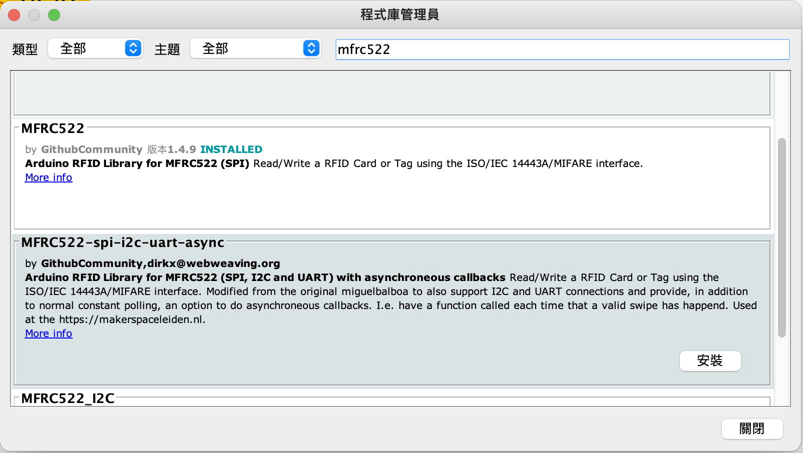
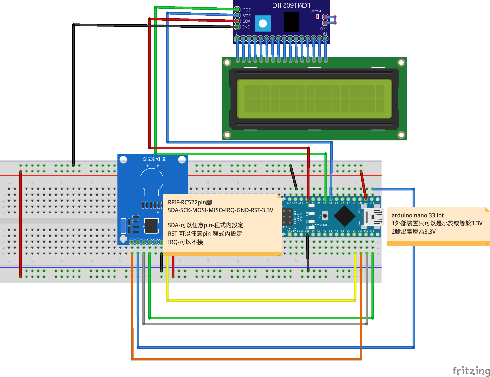

# MFRC522

- ### 什麼是RFID？
“RFID表示射頻識別，[…]RFID的作用與信用卡或者ATM卡背面的條碼或磁條相同；它為物體提供了唯一的識別字。而且，就像必須掃描條碼或詞條才能獲取資訊一樣，RFID裝置必須經過掃描才能獲取相關的識別資訊。”摘自 ©Technovelgy，一個記錄科學技術與科幻創意的網站。


### 安裝程式庫



### arduino nano iot 33


### 線路圖



```C++
/*
 * *mfrc522_1
 * *讀取卡片UID，從監控視窗查看
 */
#include <SPI.h>
#include <MFRC522.h>


#define RST_PIN         9          
#define SS_PIN          10  //就是模組上的SDA接腳,可以任意pin腳


MFRC522 mfrc522;   // 建立MFRC522實體


void setup() {
  while(!Serial);
  Serial.begin(9600); 

  SPI.begin();  // 初始化SPI介面
  

  mfrc522.PCD_Init(SS_PIN, RST_PIN); // 初始化MFRC522卡
  Serial.print(F("Reader "));
  Serial.print(F(": "));
  mfrc522.PCD_DumpVersionToSerial(); // 顯示讀卡設備的版本
  
}


void loop() {
  // 檢查是不是一張新的卡
  if (mfrc522.PICC_IsNewCardPresent() && mfrc522.PICC_ReadCardSerial()) {
      // 顯示卡片內容
      Serial.print(F("Card UID:"));
      dump_byte_array(mfrc522.uid.uidByte, mfrc522.uid.size); // 顯示卡片的UID
      Serial.println();
      Serial.print(F("PICC type: "));
      MFRC522::PICC_Type piccType = mfrc522.PICC_GetType(mfrc522.uid.sak);
      Serial.println(mfrc522.PICC_GetTypeName(piccType));  //顯示卡片的類型
      mfrc522.PICC_HaltA();  // 卡片進入停止模式
    }
}

/**
 * 這個副程式把讀取到的UID，用16進位顯示出來
 */
void dump_byte_array(byte *buffer, byte bufferSize) {
  
  for (byte i = 0; i < bufferSize; i++) {
    Serial.print(buffer[i] < 0x10 ? " 0" : " ");
    Serial.print(buffer[i], HEX);        
   }
      
}
```


```c++
/*
 * *mfrc_522_2.ino
 * *判斷卡片UID是否通過，從LCD和監控視窗查看
 */
#include <SPI.h>
#include <Wire.h>
#include <MFRC522.h>
#include <LiquidCrystal_I2C.h>

#define RST_PIN         9          
#define SS_PIN          A0  //就是模組上的SDA接腳


MFRC522 mfrc522;   // 建立MFRC522實體
LiquidCrystal_I2C lcd(0x27,20,4);  // set the LCD address to 0x27 for a 16 chars and 2 line display
char *reference;

byte uid[]={0x49, 0xE5, 0xA0, 0xC1};  //這是我們指定的卡片UID，可由讀取UID的程式取得特定卡片的UID，再修改這行


void setup()
{
  while(!Serial);
  Serial.begin(9600);
  //lcd要初始化
  lcd.init();   
  SPI.begin();   
  mfrc522.PCD_Init(SS_PIN, RST_PIN); // 初始化MFRC522卡
  Serial.print(F("Reader "));
  Serial.print(F(": "));
  mfrc522.PCD_DumpVersionToSerial(); // 顯示讀卡設備的版本
}

void loop() {
  //Serial.print("reading...");
  // 檢查是不是偵測到新的卡
  if (mfrc522.PICC_IsNewCardPresent() && mfrc522.PICC_ReadCardSerial()) {
      // 顯示卡片的UID
      Serial.print(F("Card UID:"));
      dump_byte_array(mfrc522.uid.uidByte, mfrc522.uid.size); // 顯示卡片的UID
      Serial.println();
      Serial.print(F("PICC type: "));
      MFRC522::PICC_Type piccType = mfrc522.PICC_GetType(mfrc522.uid.sak);
      Serial.println(mfrc522.PICC_GetTypeName(piccType));  //顯示卡片的類型
      
      //把取得的UID，拿來比對我們指定好的UID
      bool they_match = true; // 初始值是假設為真 
      for ( int i = 0; i < 4; i++ ) { // 卡片UID為4段，分別做比對
        if ( uid[i] != mfrc522.uid.uidByte[i] ) { 
          they_match = false; // 如果任何一個比對不正確，they_match就為false，然後就結束比對
          break; 
        }
      }
      
      //在監控視窗中顯示比對的結果
      lcd.backlight();
      if(they_match){
        lcd.setCursor(0,0);
        lcd.print(F("Access Granted!"));
        Serial.print(F("Access Granted!"));
        
      }else{
        lcd.setCursor(0,0);
        lcd.print(F("Access Denied!"));
        Serial.print(F("Access Denied!"));
      }
      mfrc522.PICC_HaltA();  // 卡片進入停止模式
    }
}

/**
 * 這個副程式把讀取到的UID，用16進位顯示出來
 */
void dump_byte_array(byte *buffer, byte bufferSize) {
  for (byte i = 0; i < bufferSize; i++) {
    Serial.print(buffer[i] < 0x10 ? " 0" : " ");
    Serial.print(buffer[i], HEX);
  }
}
```

