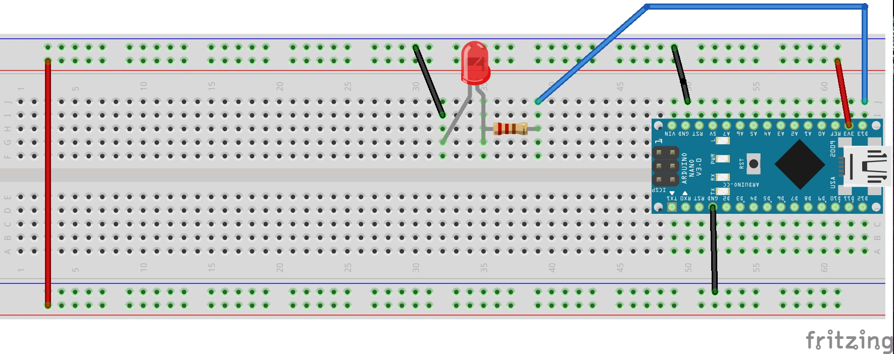

# 陀螺儀
- 陀螺儀，用來感測與維持方向的裝置。
- 陀螺儀多用於導航、定位等系統。
## 學習如何利用Arduino內的LSM6DS3晶片，和操控該晶片的內建陀螺儀
### 線路圖


### 接線成品


### 陀螺儀應用影片
[](https://youtu.be/0CXmMm5olYQ)

### 偵測Arduino被移動就亮燈  

```C++
/*
 * 偵測Arduino被移動，只要被移動就亮燈
 */
/*
  Arduino LSM6DS3 - Simple Gyroscope

  This example reads the gyroscope values from the LSM6DS3
  sensor and continuously prints them to the Serial Monitor
  or Serial Plotter.

  The circuit:
  - Arduino Uno WiFi Rev 2 or Arduino Nano 33 IoT

  created 10 Jul 2019
  by Riccardo Rizzo

  This example code is in the public domain.

*/

#include <Arduino_LSM6DS3.h>
#define ledPin 13

float preZ=0;
void setup() {
  pinMode(ledPin, OUTPUT);
  Serial.begin(9600);
  if (!IMU.begin()) {
    Serial.println("初始化陀螺儀失敗!");
    while (1);
  }

  Serial.print("Gyroscope sample rate = ");
  Serial.print(IMU.gyroscopeSampleRate());
  Serial.println(" Hz");
  Serial.println();
  Serial.println("Gyroscope in degrees/second(角速度)");
  Serial.println("X\tY\tZ");
}

void loop() {
  
  
  /*
   //測試x,y,z的角速度
  float x, y, z;
  if (IMU.gyroscopeAvailable()) {
    IMU.readGyroscope(x, y, z);
    Serial.println("測試角速度")
    Serial.print(x);
    Serial.print('\t');
    Serial.print(y);
    Serial.print('\t');
    Serial.println(z);
  }
  */
  float x, y, z;
  
  if(IMU.gyroscopeAvailable()){
    IMU.readGyroscope(x, y, z);
    Serial.print("z-preZ:");
    Serial.println(z-preZ);
   
    if (z-preZ < -1){
      Serial.println("YES");
      ledOnOff();
    }else{
      Serial.println("NO");
    }
    preZ = z;
  }
    
}

void ledOnOff(){
  digitalWrite(ledPin,HIGH);
  delay(500);
  digitalWrite(ledPin,LOW);
}

```

