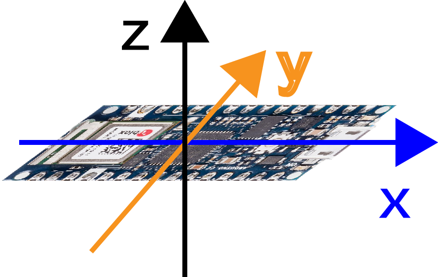
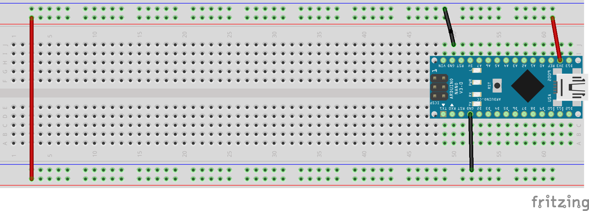

# 加速度計(accelerometer)
- 又稱加速計、加速針、加速度感測器、重力加速度感測器等等
- 加速規的應用之一是測量重力，特別是使用於重量測定法的加速規上，這樣的裝置稱為重力計。
- 觀察加速度感測器所量測出加速度感測值x、y、z的變化
## 學習如何利用Arduino內的LSM6DS3晶片，和操控該晶片的內建加速度計

### 線路圖


### 加速度計應用影片
[](https://youtu.be/A9281ewCfgc)

### 偵測Arduino目前原地位置的狀態 

```C++
//觀察x,y,z軸的變化
/*
  Arduino LSM6DS3 - Simple Accelerometer

  This example reads the acceleration values from the LSM6DS3
  sensor and continuously prints them to the Serial Monitor
  or Serial Plotter.

  The circuit:
  - Arduino Uno WiFi Rev 2 or Arduino Nano 33 IoT

  created 10 Jul 2019
  by Riccardo Rizzo

  This example code is in the public domain.
*/

#include <Arduino_LSM6DS3.h>

void setup() {
  Serial.begin(9600);
  

  if (!IMU.begin()) {
    Serial.println("Failed to initialize IMU!");

    while (1);
  }

  Serial.print("Accelerometer sample rate = ");
  Serial.print(IMU.accelerationSampleRate());
  Serial.println(" Hz");
  Serial.println();
  Serial.println("Acceleration in G's");
  Serial.println("X\tY\tZ");
}

void loop() {
  float x, y, z;
  
  if (IMU.accelerationAvailable()) {
    IMU.readAcceleration(x, y, z);
    Serial.print(x);
    Serial.print('\t');
    Serial.print(y);
    Serial.print('\t');
    Serial.println(z);
  }
  if(abs(x)<0.1 && abs(y)<0.1){
    if(z>0.9){
      Serial.println("平放");
    }else if(z<-0.9){
      Serial.println("反平放");
    }    
  }

  if(abs(y)<0.1 && abs(z)<0.1){
    if(x>0.9){
      Serial.println("立放");
    }else if(x<-0.9){
      Serial.println("反立放");
    }
  }

  if(abs(x)<0.1 && abs(z)<0.1){
    if(y>0.9){
      Serial.println("側放");
    }else if(y<-0.9){
      Serial.println("反側放");
    }
  }
  delay(1000);
}
```

