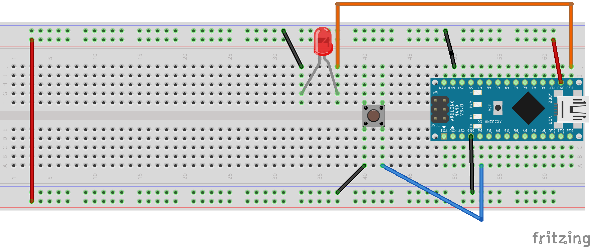
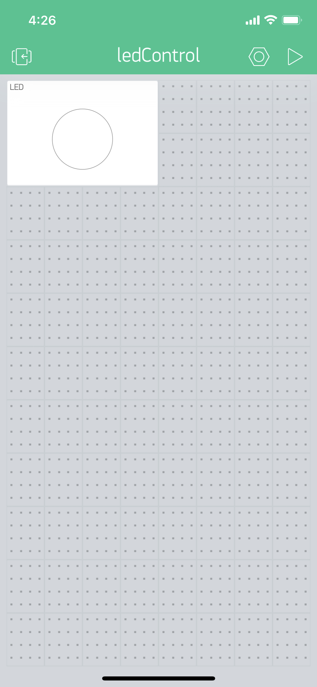
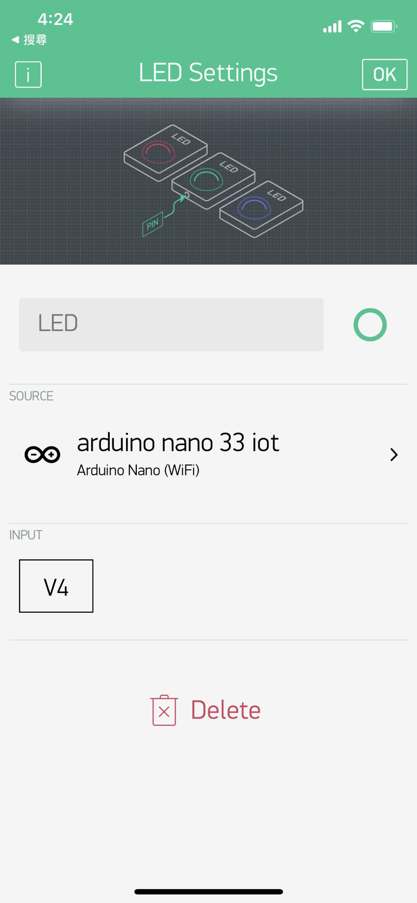

# Button和Blynk
- ### 學習讓Arduino Button和Blynk手機App連線,使用Blynk.virtualWrite(V4, HIGH)傳送虛擬pin腳的訊號出去，由device 傳送給 App 訊號
### 線路圖


### 實體線路圖


### Blynk App內設定專案
### App內,板子的設定必需設定為Arduino nano(因為腳位和Arduino nano 33 iot相同)
### 使用DISPlAY內的Led
### [Blynk widget 說明頁](https://docs.blynk.io/en/blynk.apps/widgets)


### Blynk App專案畫面 




### 顯示按鈕狀態
[](https://youtu.be/kZoDxhlnTZ8)


```C++
/*************************************************************
  Download latest Blynk library here:
    https://github.com/blynkkk/blynk-library/releases/latest

  Blynk is a platform with iOS and Android apps to control
  Arduino, Raspberry Pi and the likes over the Internet.
  You can easily build graphic interfaces for all your````
  projects by simply dragging and dropping widgets.

    Downloads, docs, tutorials: http://www.blynk.cc
    Sketch generator:           http://examples.blynk.cc
    Blynk community:            http://community.blynk.cc
    Follow us:                  http://www.fb.com/blynkapp
                                http://twitter.com/blynk_app

  Blynk library is licensed under MIT license
  This example code is in public domain.

 *************************************************************
  This example shows how to use Arduino MKR 1010
  to connect your project to Blynk.

  Note: This requires WiFiNINA library
    from http://librarymanager/all#WiFiNINA

  Feel free to apply it to any other example. It's simple!
 *************************************************************/

/* Comment this out to disable prints and save space */
#include <SPI.h>
#include <WiFiNINA.h>
#include <BlynkSimpleWiFiNINA.h>
#include "data.h"

#define btn 2
#define led 13
// You should get Auth Token in the Blynk App.
// Go to the Project Settings (nut icon).
char auth[] = AUTH;

// Your WiFi credentials.
// Set password to "" for open networks.
char ssid[] = SSID;
char pass[] = PASS;

BlynkTimer timer;


void setup()
{
  // Debug console
  Serial.begin(9600);
  pinMode(btn, INPUT_PULLUP);
  pinMode(led, OUTPUT);
  Blynk.begin(auth, ssid, pass);
  timer.setInterval(100, myTimerEvent);
}

void loop()
{
  Blynk.run();
  timer.run();

}

void myTimerEvent() {
  int sensorVal = digitalRead(btn);
  if(sensorVal == LOW){
    digitalWrite(led,HIGH);
    Blynk.virtualWrite(V4,255);
    
  }else{
    digitalWrite(led,LOW);
    Blynk.virtualWrite(V4,0);
    
  }
}
```


