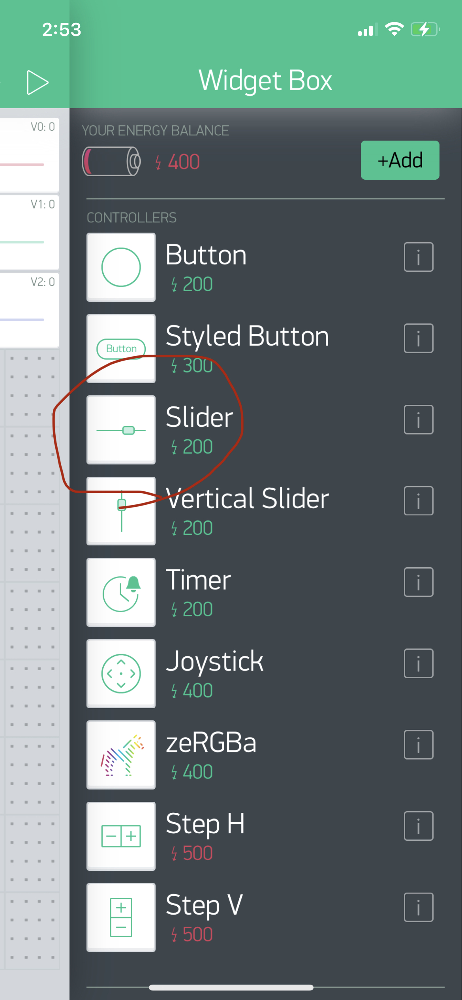
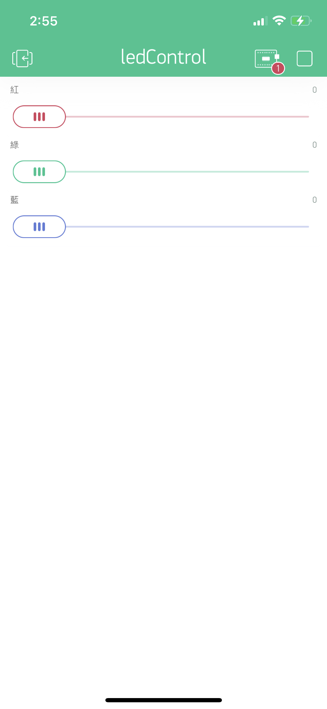

# 控制RGBLED
- ### 學習如何使用V0,V1,V2控制Arduino 的RGBLED
[說明如何註冊接收手機訊號](https://docs.blynk.io/en/getting-started/using-virtual-pins-to-control-physical-devices#the-blynk_write-vpin-function)

- ### 線路圖


### Blynk App內設定專案
### App內,板子的設定必需設定為Arduino nano(因為腳位和Arduino nano 33 iot相同)

### 使用CONTROLLER內的Slider


### Blynk App專案畫面 


### 控制RGBLED
[](https://youtu.be/Rp4pIS_umRo)


```C++
/*************************************************************
  Download latest Blynk library here:
    https://github.com/blynkkk/blynk-library/releases/latest

  Blynk is a platform with iOS and Android apps to control
  Arduino, Raspberry Pi and the likes over the Internet.
  You can easily build graphic interfaces for all your````
  projects by simply dragging and dropping widgets.

    Downloads, docs, tutorials: http://www.blynk.cc
    Sketch generator:           http://examples.blynk.cc
    Blynk community:            http://community.blynk.cc
    Follow us:                  http://www.fb.com/blynkapp
                                http://twitter.com/blynk_app

  Blynk library is licensed under MIT license
  This example code is in public domain.

 *************************************************************
  This example shows how to use Arduino MKR 1010
  to connect your project to Blynk.

  Note: This requires WiFiNINA library
    from http://librarymanager/all#WiFiNINA

  Feel free to apply it to any other example. It's simple!
 *************************************************************/

/* Comment this out to disable prints and save space */
#include <SPI.h>
#include <WiFiNINA.h>
#include <BlynkSimpleWiFiNINA.h>
#include "data.h"

#define O_RED_PIN 2
#define O_GREEN_PIN 3
#define O_BLUE_PIN 5

// You should get Auth Token in the Blynk App.
// Go to the Project Settings (nut icon).
char auth[] = AUTH;

// Your WiFi credentials.
// Set password to "" for open networks.
char ssid[] = SSID;
char pass[] = PASS;

void setup()
{
  // Debug console
  Serial.begin(9600);
  pinMode(O_RED_PIN, OUTPUT);
  pinMode(O_GREEN_PIN, OUTPUT);
  pinMode(O_BLUE_PIN, OUTPUT);  
  Blynk.begin(auth, ssid, pass); 
}

void loop()
{
  Blynk.run();
}

BLYNK_WRITE(V0){
  byte rValue = param.asInt();
  Serial.println(rValue);
  analogWrite(O_RED_PIN,rValue);
}

BLYNK_WRITE(V1){
  byte gValue = param.asInt();
  Serial.println(gValue);
  analogWrite(O_GREEN_PIN,gValue);
}

BLYNK_WRITE(V2){
 byte bValue = param.asInt();
 Serial.println(bValue);
 analogWrite(O_BLUE_PIN,bValue);
}

```


