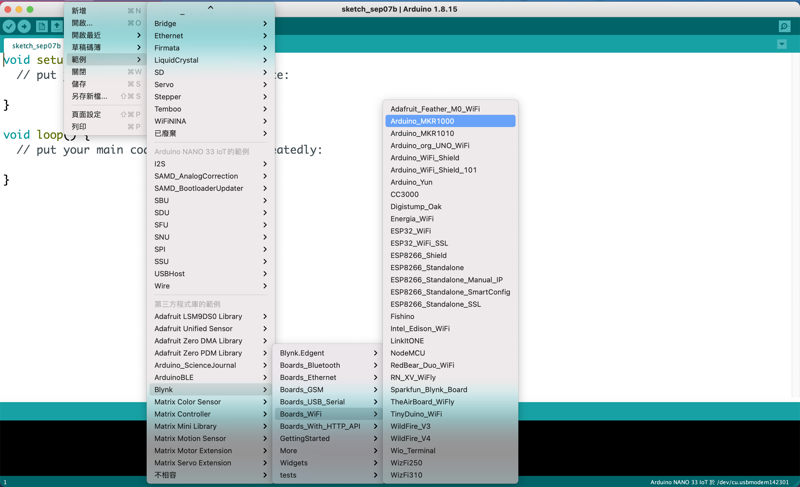

## Blynk 手機版
### 1. 安裝手機版 Blynk App classic (iOS 或 Android)
### 2. ioT支援的硬體:
- ESP32
- ESP8266
- Arduino MKR WiFi 1010
- NodeMCU
- Arduino (any modle)
- Raspberry PI

	[所有支援的硬體](https://docs.blynk.io/en/blynk.edgent/supported-boards)
	
### 3. [安裝Arduino Blynk Library](https://github.com/blynkkk/blynk-library)

### 4. 使用Blynk Library 內的Arduino_MKR-1010範例
檔案 -> 範例 -> Blynk -> Boards_WiFi -> Arduino_MKR-1010

