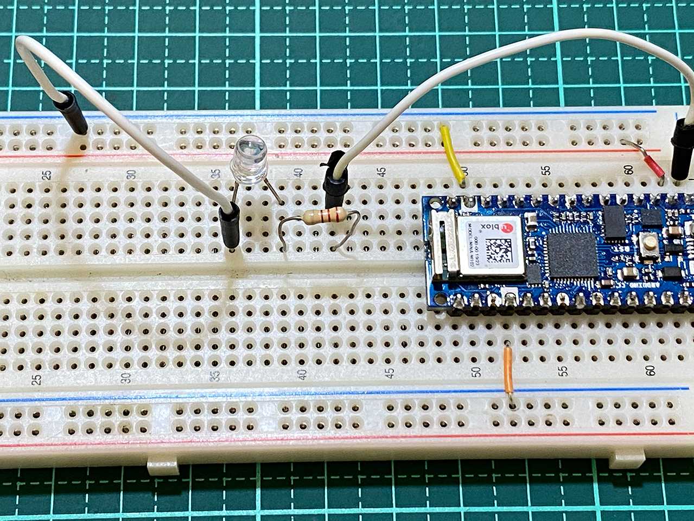
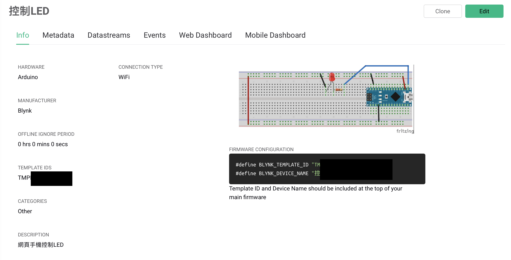
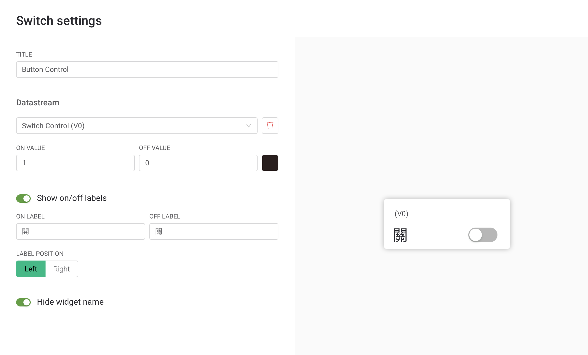

# LEDControl和Blynk
## 學習讓Arduino和Blynk手機App連線
### 線路圖


### 實體線路圖


### Blynk.Console Template 設定





### Blynk.Console Device 設定


### Blynk App內設定專案


### Blynk.Console LED控制影片
[](https://youtu.be/MkD5o0SpPLg)


```C++

#define BLYNK_PRINT Serial
#include "data.h"

#include <SPI.h>
#include <WiFiNINA.h>
#include <BlynkSimpleWiFiNINA.h> //這個library下載位置https://github.com/blynkkk/blynk-library


// You should get Auth Token in the Blynk App.
// Go to the Project Settings (nut icon).
char auth[] = BLYNK_AUTH_TOKEN;

// Your WiFi credentials.
// Set password to "" for open networks.
char ssid[] = ID;
char pass[] = PASS;


void setup()
{
  // Debug console
  Serial.begin(9600);
  Blynk.begin(auth, ssid, pass);
 
  pinMode(13,OUTPUT);
}

void loop()
{
  Blynk.run();
}

BLYNK_WRITE(V0)
{
 int V0Value = param.asInt();
 Serial.println(V0Value);
 digitalWrite(13,V0Value);
}
```

