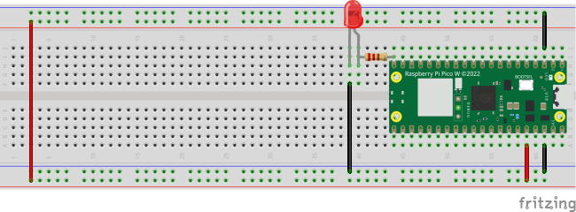

# LEDControl和Blynk

## 影片展示
[](https://youtu.be/aAXGrstXzn0)

## 學習讓 pico_W 和 Blynk
### 線路圖


### 流程

#### 1. 建立Template
#### 2. 建立Device
- 因為使用的是RESTful的連線,最重要是是token的密碼

#### 3.使用VSCode thunder client 測試
#### 4. 程式

- [RESTful的說明](https://docs.blynk.io/en/blynk.cloud/device-https-api)

```micro python
BLYNK_AUTH_TOKEN = "自已的token"

from tools import connect,reconnect
import urequests as requests
from machine import Timer,Pin
import time


# urequests官方網址
# https://makeblock-micropython-api.readthedocs.io/en/latest/public_library/Third-party-libraries/urequests.html

led = Pin(15,Pin.OUT)
connect()

def callback1(t:Timer):
    
    #不要使用https呼叫,沒有傳出值
    url = f'http://blynk.cloud/external/api/get?token={BLYNK_AUTH_TOKEN}&V0'
    try:        
        response = requests.get(url)
        print("text")
        print("送出資料")
    except:
        reconnect()
    else:
        print("server接收") #但要檢查status_code,是否回應成功        
        if response.status_code == 200:
            print("成功傳送,status_code==200")
            value:int = int(response.text)
            print(value)
            led.value(value)
        else:
            print("server回應有問題")
            print(f'status_code:{response.status_code}')
           
        
        response.close()
        
time1 = Timer()
time1.init(period=2000,callback=callback1)


```

### tools.py

```
import network
import urequests as requests
import time
import rp2
from machine import WDT

rp2.country('TW')


#ssid = 'Robert_iPhone'
#password = '0926656000'

ssid = 'robertHome'
password = '0926656000'

wlan = network.WLAN(network.STA_IF)
wlan.active(True)
wlan.connect(ssid, password)
wlan.config(pm = 0xa11140)

def connect():  

    #等待連線或失敗
    #status=0,1,2正在連線
    #status=3連線成功
    #<1,>=3失敗的連線
    max_wait = 10    

    while max_wait > 0:
        status = wlan.status()
        if status < 0 or status >= 3:
            break
        max_wait -= 1
        print("等待連線")
        time.sleep(1)

    #處理錯誤
    if wlan.status() != 3:
        print('連線失敗,重新開機')
        #raise RuntimeError('連線失敗')
        wdt = WDT(timeout=2000)
        wdt.feed()
    else:
        print('連線成功')
        status = wlan.ifconfig()
        print(f'ip={status[0]}') 
        
        
def reconnect():
    if wlan.status() == 3: #還在連線,只是傳送的server無回應
        print(f"無法連線({wlan.status()})")
        return
    else:
        print("嘗試重新連線")
        wlan.disconnect()
        wlan.connect(ssid, password)
        connect()        
```


#### 5.建立手機APP


