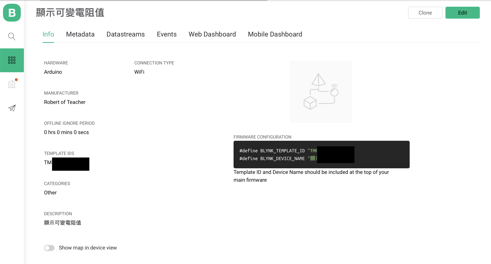
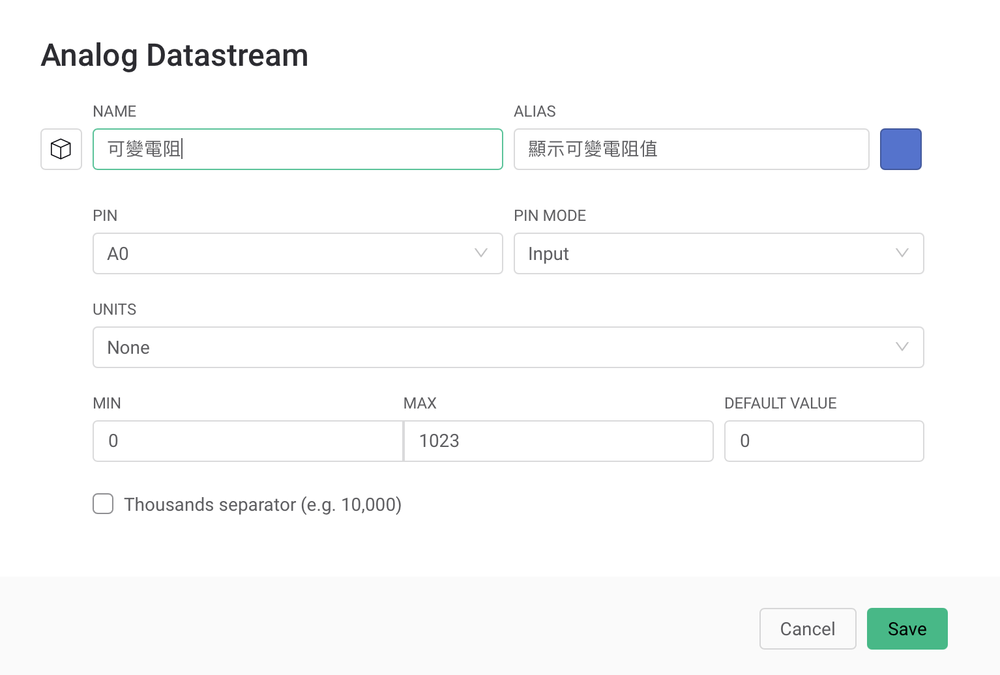
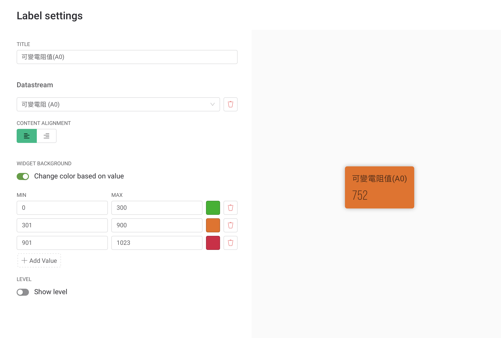
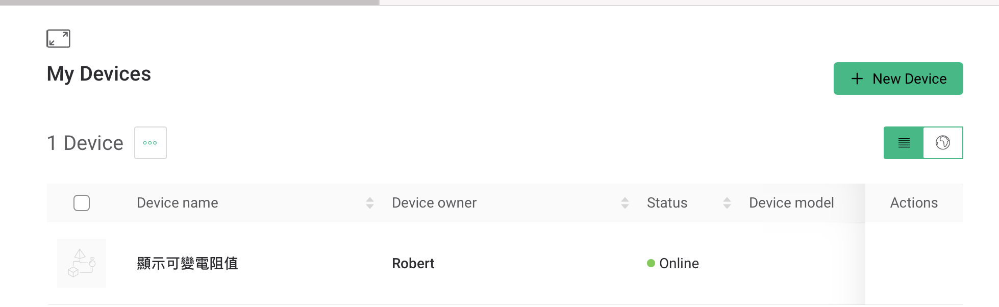
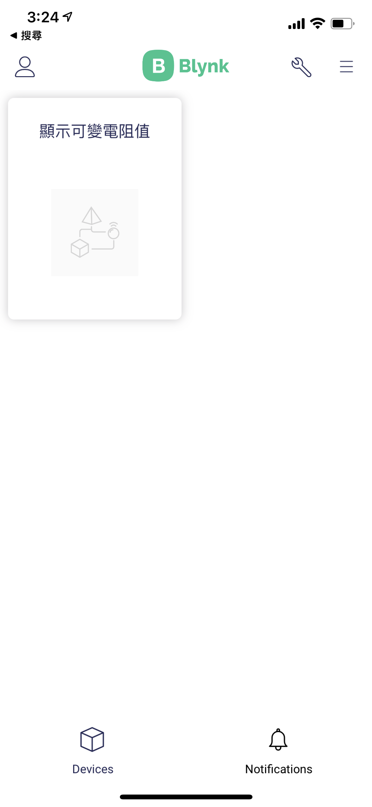

# 可變電阻和Blynk.Console
## 學習讓Arduino_可變電阻和手機，網頁整合
### 線路圖


### 實體線路圖


### Blynk.Console
#### Template info設定



#### Template Datastreams 設定



#### Template Web Dashboard 設定



#### Device 設定
1. 刪除原來的
2. 建立新的Device



### Blynk App內設定專案

1.會依據Blynk內的Device,建立Device



2.在Device內建立UI畫面


### Blynk_可變電阻影片
[](https://youtu.be/fGtkoiCtA9Q)


```C++
#define BLYNK_PRINT Serial
#include "data.h"
#include <SPI.h>
#include <WiFiNINA.h>
#include <BlynkSimpleWiFiNINA.h>


// You should get Auth Token in the Blynk App.
// Go to the Project Settings (nut icon).
char auth[] = BLYNK_AUTH_TOKEN;

// Your WiFi credentials.
// Set password to "" for open networks.
char ssid[] = ID;
char pass[] = PASS;

void setup()
{
  // Debug console
  Serial.begin(9600);

  Blynk.begin(auth, ssid, pass);
  
}

void loop()
{
  Blynk.run();
}
```

