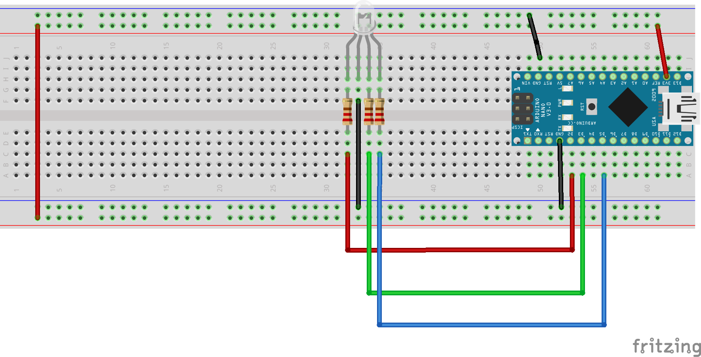
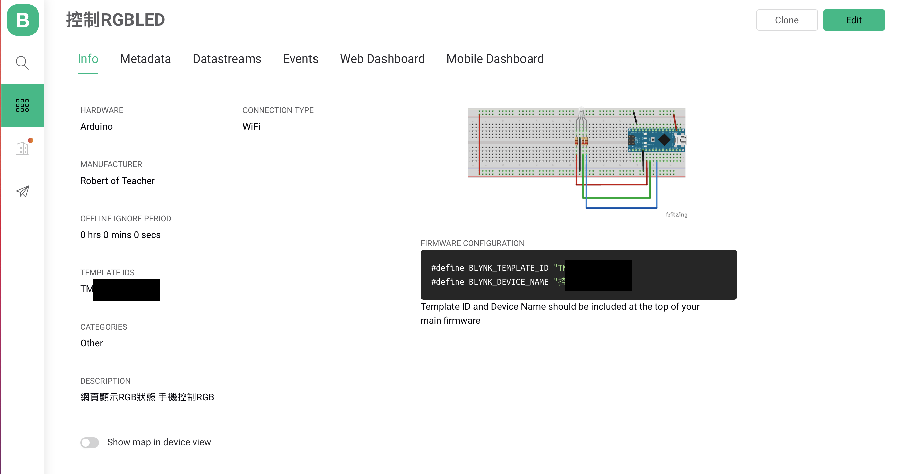
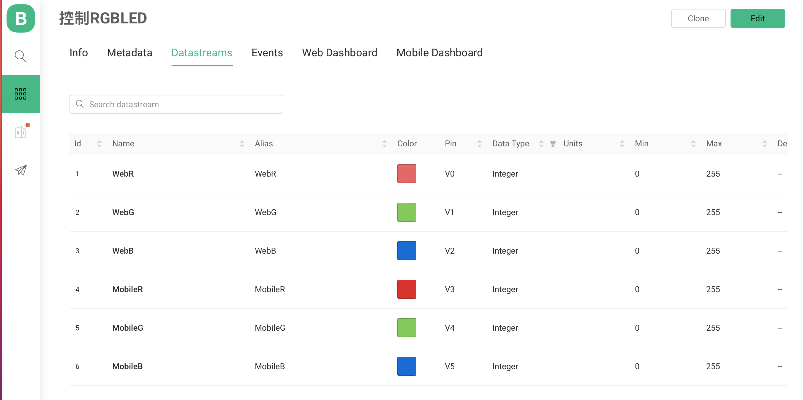
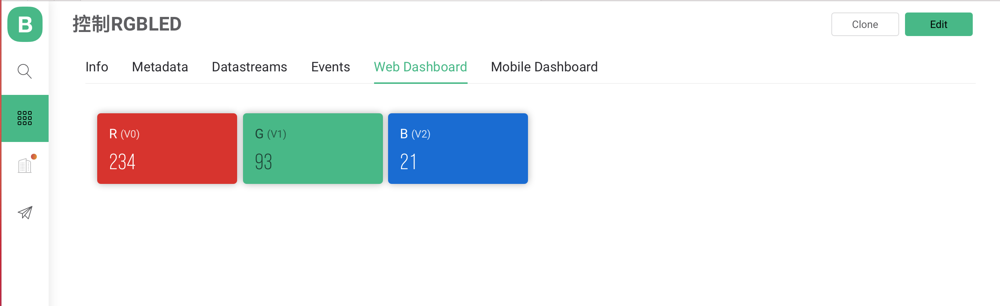
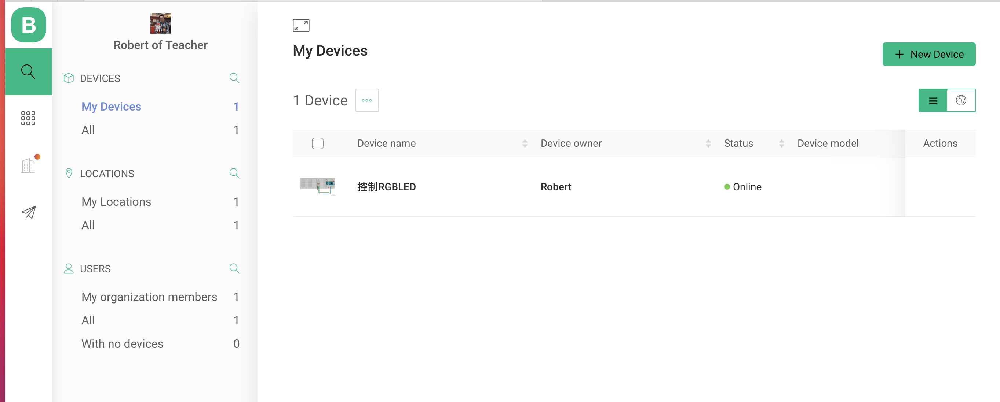
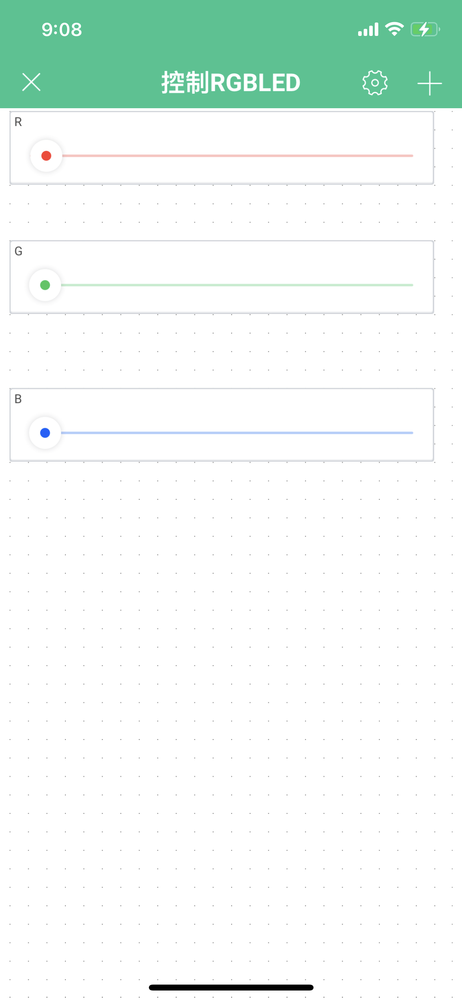

# Blynk.Console RGBLED網頁顯示RGB狀態,手機控制RGB
- ### 學習如何使用V0,V1,V2,V3,V4,V5控制Arduino 的RGBLED
[說明如何註冊接收手機訊號](https://docs.blynk.io/en/getting-started/using-virtual-pins-to-control-physical-devices#the-blynk_write-vpin-function)

- ### 線路圖



# Template設定
1. info 



2. Datastreams設定



3. Web Dashboard 設定



# Device設定



### Blynk App內設定專案


### 控制RGBLED
[](https://youtu.be/_nGFADE27_Y)


```C++
#define BLYNK_PRINT Serial
#include "data.h"
#include <SPI.h>
#include <WiFiNINA.h>
#include <BlynkSimpleWiFiNINA.h>


#define O_RED_PIN 2
#define O_GREEN_PIN 3
#define O_BLUE_PIN 5

BlynkTimer timer;
char auth[] = BLYNK_AUTH_TOKEN;
char ssid[] = ID;
char pass[] = PASS;
byte rValue = 0;
byte gValue = 0;
byte bValue = 0;

void setup()
{
  // Debug console
  Serial.begin(9600);
  pinMode(O_RED_PIN, OUTPUT);
  pinMode(O_GREEN_PIN, OUTPUT);
  pinMode(O_BLUE_PIN, OUTPUT);  
  Blynk.begin(auth, ssid, pass);
  timer.setInterval(100, myTimerEvent); 
}

void loop()
{
  Blynk.run();
  timer.run();
}

BLYNK_WRITE(V3){
  rValue = param.asInt();
  Serial.println(rValue);
  analogWrite(O_RED_PIN,rValue);
}

BLYNK_WRITE(V4){
  gValue = param.asInt();
  Serial.println(gValue);
  analogWrite(O_GREEN_PIN,gValue);
}

BLYNK_WRITE(V5){
 bValue = param.asInt();
 Serial.println(bValue);
 analogWrite(O_BLUE_PIN,bValue);
}

void myTimerEvent() {    
    Blynk.virtualWrite(V0,rValue);   
    Blynk.virtualWrite(V1,gValue);
    Blynk.virtualWrite(V2,bValue);  
}
```


