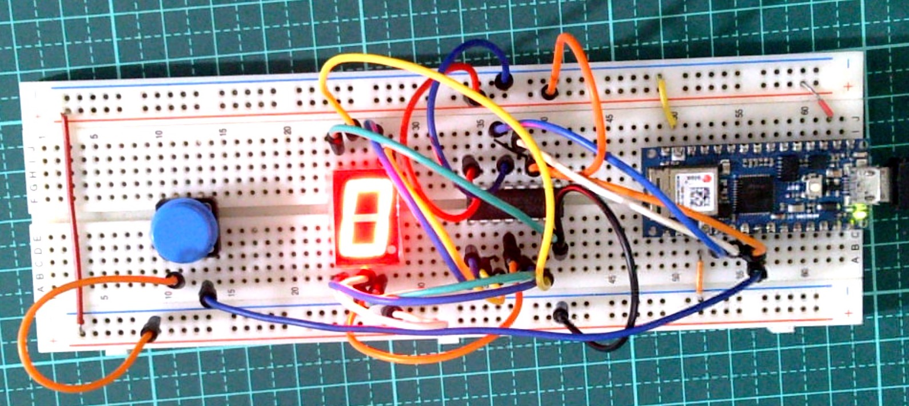

# Switch Button

- ### 解決彈跳問題
按鈕是一個機械動作，在你按下按鈕那零點幾秒內，Arduino實際上是收到很多HIGH和LOW的信號，這種在HIGH和LOW之間跳動的現像我們稱之為彈跳。
即使你沒按下按鈕，引腳12也是會持續收到彈跳信號。


### 線路圖


### 接線成品


### 7段顯示器和74HC595和switch Button展示
[](https://youtu.be/JmcEfhzedUQ)

```C++
/*
	1.沒有和Blynk連結
*/
#define dataPin 2
#define latchPin 3
#define clockPin 4
#define button 5

/*
   numbers[10]內儲存的顯示數值依序是0,1,2,3,4,5,6,7,8,9
   B01111110代表的是要顯示數值，
   最後的0代表的是g要輸出0
   倒數第2個值是1,是f要輸出1
*/
byte numbers[10] = {B01111110, B00110000, B01101101, B01111001, B00110011, B01011011, B01011111, B01110000, B01111111, B01111011};
unsigned long switchCount = 0; //計算按下和放開的次數
bool buttonState;
byte i = 0; //要顯示數字

void setup() {
  pinMode(latchPin, OUTPUT);
  pinMode(clockPin, OUTPUT);
  pinMode(dataPin, OUTPUT);
  pinMode(button, INPUT_PULLUP);
  buttonState = digitalRead(button); //一開始button的狀態
  sevenSegmentLed(i);
}

void loop() {
  if (digitalRead(button) != buttonState) { //當下button 狀態有改變時
    delay(30); //解決彈跳
    if (digitalRead(button) != buttonState) { //再次確認是否不一樣
      buttonState = digitalRead(button);
      switchCount += 1;
      i = switchCount / 2;//小數會被排除
      
      if (i == 10) { //如果要顯示的數字是10時
        switchCount = 0;
        i = 0;
      }
      sevenSegmentLed(i);
    }
  }

}

void sevenSegmentLed(byte n) {
  digitalWrite(latchPin, LOW); //關閉閘門
  //以序列方式傳進74595
  shiftOut(dataPin, clockPin, LSBFIRST, numbers[n]);
  digitalWrite(latchPin, HIGH); //開啟閘門
}

```

---

- 連結Blynk
- 將解決彈跳變為資源檔
- 將CH74595和7段顯示器寫為資源檔

```c++
/*
主檔案
*/
#define BLYNK_PRINT Serial
#include "secret.h"
#include "ch595.h"
#include "releaseButton.h"
#include <SPI.h>
#include <WiFiNINA.h>
#include <BlynkSimpleWiFiNINA.h>
#define dataPin 2
#define latchPin 3
#define clockPin 4
#define button 5
int count = 0; //計算按鈕狀態改變的次數
int displayNumberState;
int displayNumber;

BlynkTimer timer;
char auth[] = BLYNK_AUTH_TOKEN;
char ssid[] = ID;
char pass[] = PASS;

void setup() {
  Serial.begin(9600); 
  displayNumberState = displayNum(count,9);
  setNumberCH595(0,latchPin,dataPin,clockPin);
  Blynk.begin(auth, ssid, pass);
  timer.setInterval(1000, myTimerEvent);
}

void loop() { 
    Blynk.run();
    timer.run();   
    count += button_release(button);    
    displayNumber = displayNum(count,9);
    if(displayNumber != displayNumberState){
       displayNumberState = displayNumber;
       setNumberCH595(displayNumber,latchPin,dataPin,clockPin);
       Serial.println(displayNumber);  
    }
    
}

void myTimerEvent(){
  Blynk.virtualWrite(V0,displayNumber);
}
```


```c++
/*
ch595.h
將CH74595和7段顯示器寫為資源檔
*/

#ifndef __CH595_H__
#define __CH595_H__
/*
 * setNumber(顯示的數字,latchPin,dataPin,clockPin)
*/
#include <arduino.h>
void setNumberCH595(byte n,byte latch,byte data,byte c){  
  pinMode(data, OUTPUT);
  pinMode(latch, OUTPUT);
  pinMode(c, OUTPUT);
  byte numbers[10] = {B01111110,B00110000,B01101101,B01111001,B00110011,B01011011,B01011111,B01110000,B01111111,B01111011};
  digitalWrite(latch,LOW);
  shiftOut(data,c,LSBFIRST,numbers[n]);
  digitalWrite(latch,HIGH);
}

#endif
```

```c++
/*
releaseButton.h
將解決彈跳變為資源檔
*/

#ifndef __RELEASEBUTTON_H__
#define __RELEASEBUTTON_H__

int button_release(int buttonPin) { //傳出按鈕改變的次數
  pinMode(buttonPin, INPUT_PULLUP);
  static bool buttonState = digitalRead(buttonPin);
  bool currentButtonState = digitalRead(buttonPin);
  if (currentButtonState != buttonState) {
    delay(50); //解決彈跳
    if (currentButtonState != buttonState) {
      buttonState = currentButtonState;
      return 1;
    }
  }
  return 0;
}

int displayNum(int stateCount,int maxNum){ //stateCount是按鈕狀態改變的次數,maxNum是0~maxNum
    int i = stateCount / 2; 
    return i % (maxNum+1);    
}

#endif
```

```c++
/*
將帳號密碼成為資訊檔
secret.h
*/

#define BLYNK_TEMPLATE_ID "xxxxxxxx"
#define BLYNK_DEVICE_NAME "xxxxxxx"
#define BLYNK_AUTH_TOKEN "xxxxxxxx"

#define ID "xxxxxxxxx"
#define PASS "xxxxxxxx"

```


