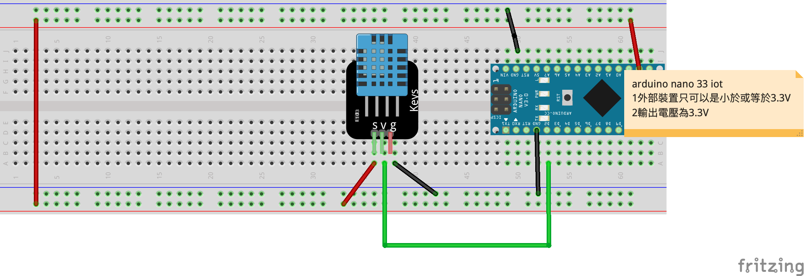
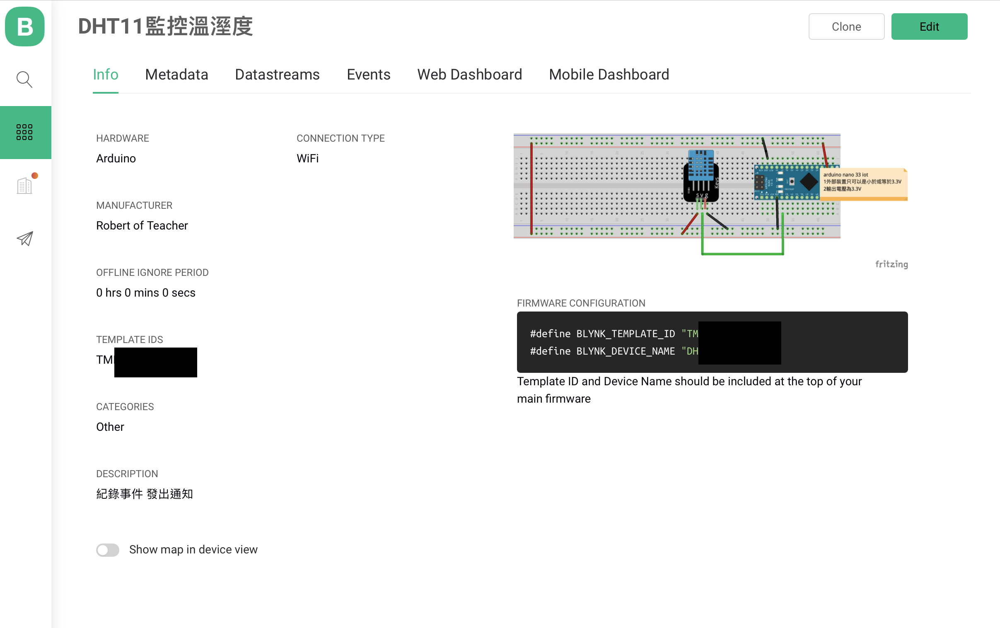
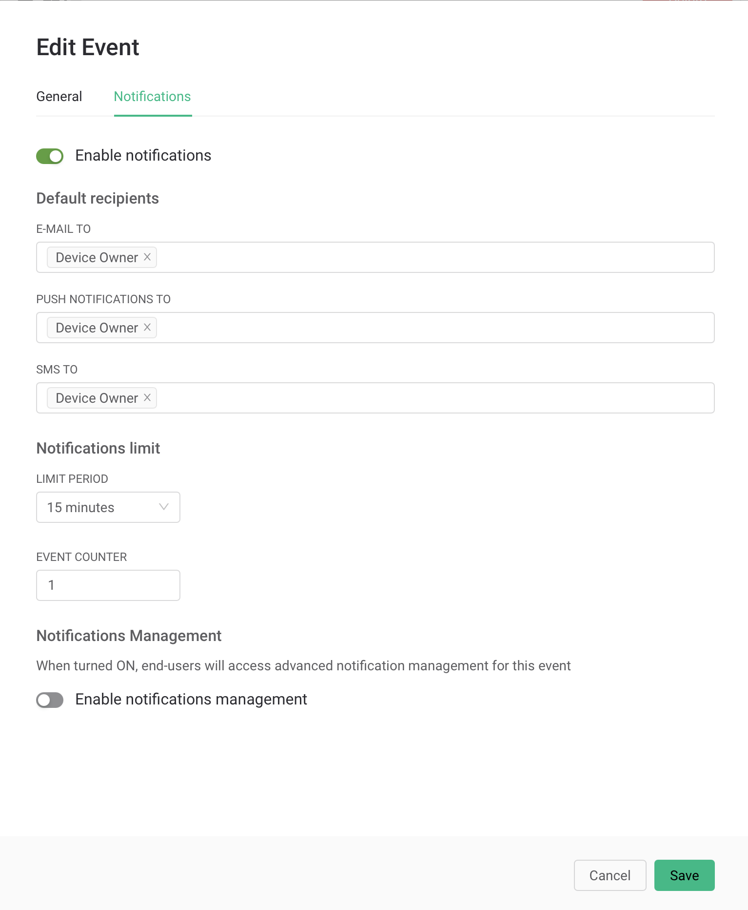

# LM35溫度感測
- 學習Blynk.Console的Event和Notification

## Blynk.Console Event 

[原廠說明](https://docs.blynk.io/en/getting-started/events-tutorial)

- 可以追蹤和記錄當裝置發生指定狀態

## Blynk.Console Notification

[原廠說明](https://docs.blynk.io/en/getting-started/notification-management)

- 當發生特別指定狀態時，可以及時發送Email, Push Notification, SMS


### - DHT11 至程式庫管理員下載DHT11 library


### 線路圖


### Blynk.Console Template設定

 - #### info



- ### Datastreams


- ### Events


- ### Events->Notification



- ### Web Dashboard


### 結果(網頁顯示圖表)


### 結果(手機顯示數據)


### 展示(圖表顯示)

[](https://youtu.be/cxEfopiZayY)


```C++
#define BLYNK_PRINT Serial
#include "data.h"
#include <SPI.h>
#include <WiFiNINA.h>
#include <BlynkSimpleWiFiNINA.h>
#include "DHT.h"


#define DHTPIN 2 

#define DHTTYPE DHT11   // DHT 11

BlynkTimer timer;
char auth[] = BLYNK_AUTH_TOKEN;
char ssid[] = ID;
char pass[] = PASS;

DHT dht(DHTPIN, DHTTYPE);

void setup() {  
  Serial.begin(9600);
  pinMode(DHTPIN, INPUT); 
  //dht要初始化
  dht.begin();
  Blynk.begin(auth, ssid, pass);
  //DHT11速度慢，隔2秒讀一次
  timer.setInterval(2000, myTimerEvent);
  
}

void loop() {
   Blynk.run();
   timer.run();  
}

void myTimerEvent() {    
    // Reading temperature or humidity takes about 250 milliseconds!
  // Sensor readings may also be up to 2 seconds 'old' (its a very slow sensor)
  float h = dht.readHumidity();
  // Read temperature as Celsius (the default)
  float t = dht.readTemperature();
  // Read temperature as Fahrenheit (isFahrenheit = true)
  float f = dht.readTemperature(true);

  // Check if any reads failed and exit early (to try again).
  if (isnan(h) || isnan(t) || isnan(f)) {
    Serial.println(F("Failed to read from DHT sensor!"));
    return;
  }

  // Compute heat index in Fahrenheit (the default)
  float hif = dht.computeHeatIndex(f, h);
  // Compute heat index in Celsius (isFahreheit = false)
  float hic = dht.computeHeatIndex(t, h, false);

  Serial.print(F("Humidity: "));
  Serial.print(h);
  Serial.print(F("%  Temperature: "));
  Serial.print(t);
  Serial.print(F("°C "));
  Serial.print(f);
  Serial.print(F("°F  Heat index: "));
  Serial.print(hic);
  Serial.print(F("°C "));
  Serial.print(hif);
  Serial.println(F("°F"));
  Blynk.virtualWrite(V0,f);
  Blynk.virtualWrite(V1,t);
  Blynk.virtualWrite(V2,h);

  //如果溫度超過40C發送Log
  if(t >= 40){
    Blynk.logEvent("overhot","攝氏超過40度");
  }

  if(h >= 90){
    Blynk.logEvent("overwet","溼度超過90度");
  }
  
}
```

