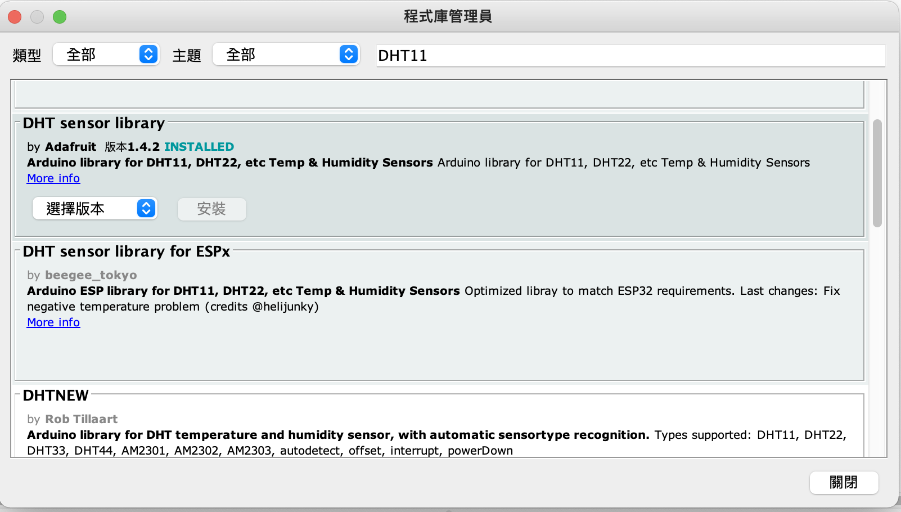
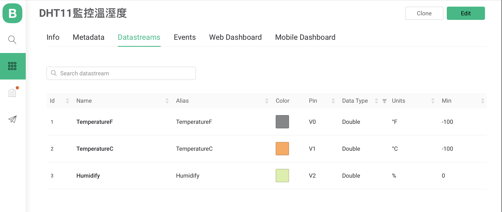
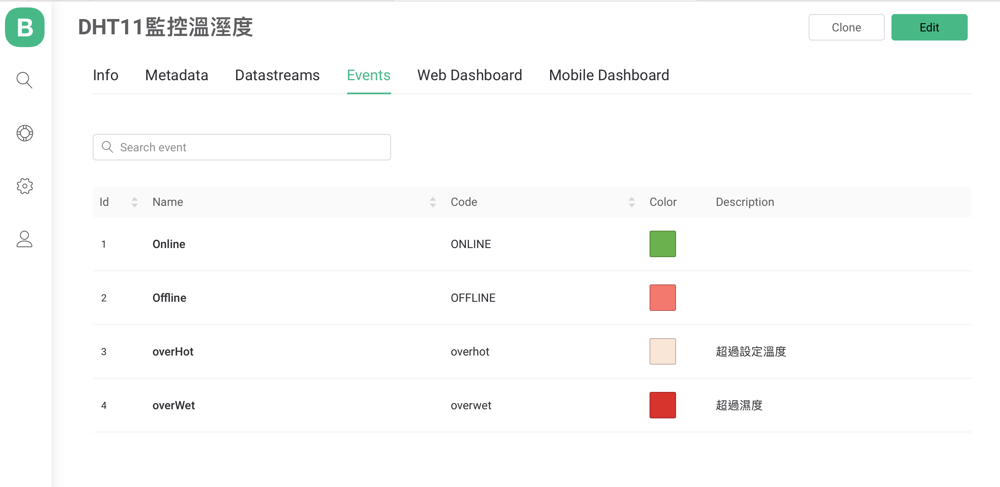
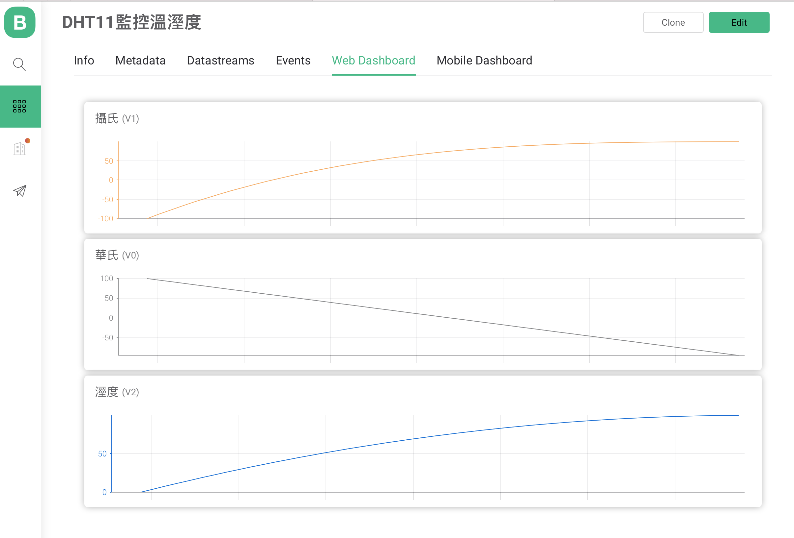
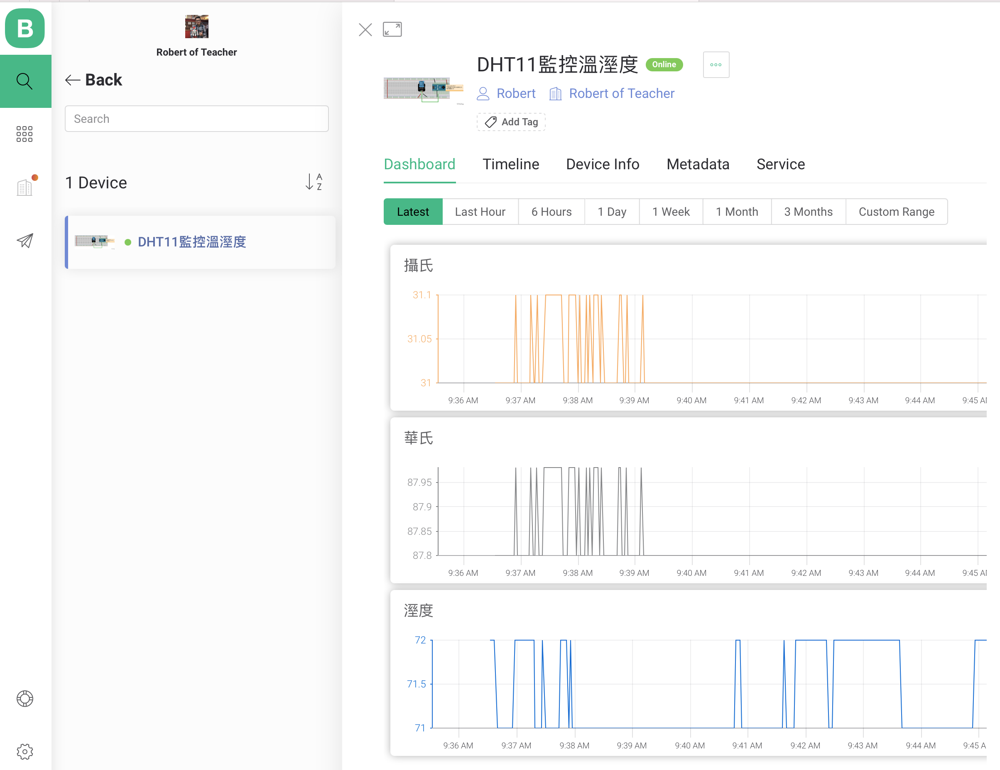

# LM35溫度感測
- 學習Blynk.Console的Event和Notification

## Blynk.Console Event 

[原廠說明](https://docs.blynk.io/en/getting-started/events-tutorial)

- 可以追蹤和記錄當裝置發生指定狀態

## Blynk.Console Notification

[原廠說明](https://docs.blynk.io/en/getting-started/notification-management)

- 當發生特別指定狀態時，可以及時發送Email, Push Notification, SMS


### - DHT11 至程式庫管理員下載DHT11 library




### 線路圖


### Blynk.Console Template設定

 - #### info


- ### Datastreams



- ### Events



- ### Events->Notification


- ### Web Dashboard




### 結果(網頁顯示圖表)



### 結果(手機顯示數據)


### 展示(圖表顯示)

[](https://youtu.be/cxEfopiZayY)


```C++
//主程式
#define BLYNK_PRINT Serial
#include "data.h"
#include <WiFi.h>
#include <WiFiClient.h>
#include <BlynkSimpleEsp32.h>
#define LIGHTS 36


/* Fill-in your Template ID (only if using Blynk.Cloud) */


// Your WiFi credentials.
// Set password to "" for open networks.
char auth[] = BLYNK_AUTH_TOKEN;
char ssid[] = ID;
char pass[] = PASS;

BlynkTimer timer;

void setup()
{
  // Debug console
  Serial.begin(9600);

  Blynk.begin(auth, ssid, pass);
  timer.setInterval(100, myTimerEvent); 
}

void loop()
{
  Blynk.run();
  timer.run();
}

void myTimerEvent() {
    int lightValue = analogRead(LIGHTS);
    byte percentValue = map(lightValue,70,3700,0,100);      
    Blynk.virtualWrite(V0,percentValue);   
    
}
```

```
//data.h
#define BLYNK_TEMPLATE_ID ""
#define BLYNK_DEVICE_NAME ""
#define BLYNK_AUTH_TOKEN ""
#define ID ""
#define PASS ""
```


