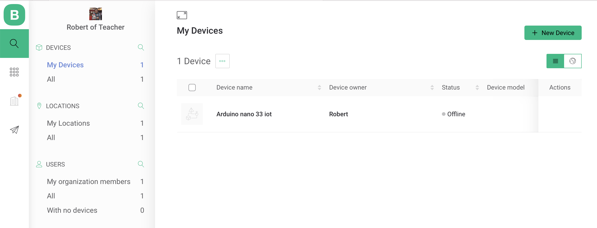

## Blynk_Console 網頁和手機
- 裝置的連線和設定全部在Blynk.Console
- 使用網頁遠端控制和監控裝置
- 管理裝置,使用者,位置,組織
- 使用手機遠端控制和監控裝置
- 遠端更新裝置

### 1. 登入https://Blynk.io

###  開發者模式
開發者是指可以存取console平台所有的功能,並設定使用者的功能。開發者就是設定硬體裝置，寫firmware程式。

- 可以在Blynk.Console建立和設定裝置樣版。
- 建立和調整Web介面
- 建立和調整手機介面
- 增加新的裝置到帳號內
- 發佈樣版到Blynk.Marketplace

#### 2. 啟動開發者模式

1. 至Blynk.Console
2. My Profile/User profile
3. 將Developer Mode 切換至ON 

#### 3. 先建立 Template

依序設定:
1. Templates -> NewTemplate
2. Info
3. Metadata
4. Datastreams //注意專案要用到的資料流
5. Events
6. Web Dashboard

#### 4. 增加 Device

透過Template建立Device
Search -> DEVICES -> NEW Device

###  5. 安裝手機版 Blynk App New (iOS 或 Android)

1. 登入Blynk帳號
2. 出現Device(在Blynk.Console內建立的Device)
3. 建立Device的介面

###  ioT支援的硬體:
- ESP32
- ESP8266
- Arduino MKR WiFi 1010
- NodeMCU
- Arduino (any modle)
- Raspberry PI

	[所有支援的硬體](https://docs.blynk.io/en/blynk.edgent/supported-boards)
	
###  [安裝Arduino Blynk Library](https://github.com/blynkkk/blynk-library)

### 4. Arduino編輯器,使用Blynk Library 內的Arduino_MKR-1010範例
檔案 -> 範例 -> Blynk -> Boards_WiFi -> Arduino_MKR-1010

