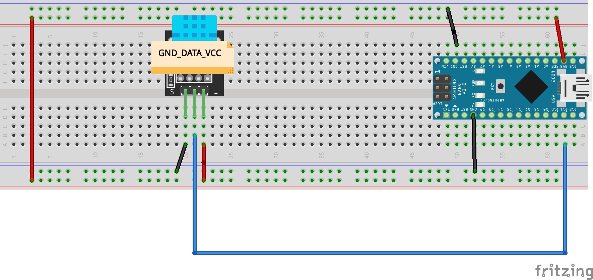
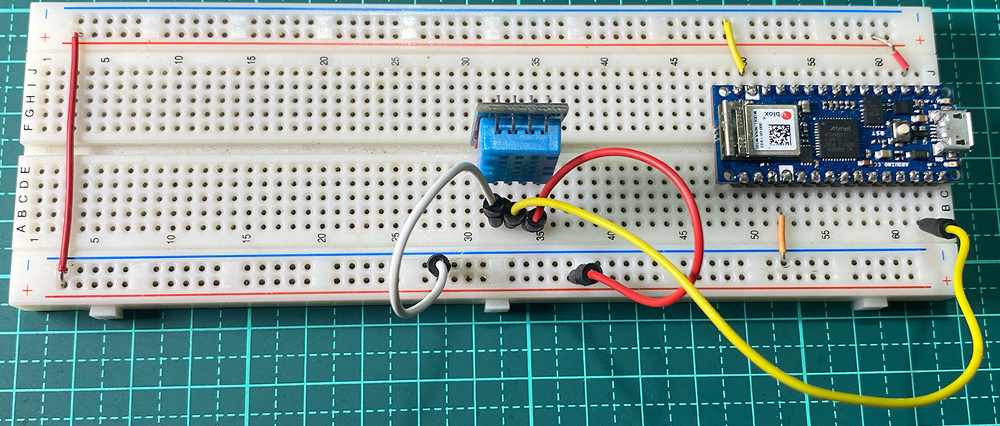
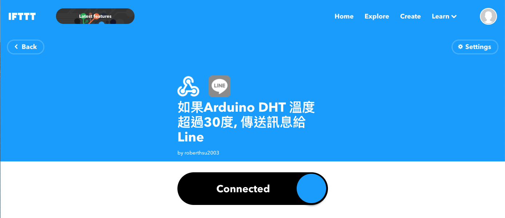

# 使用IFTTT讓Arduino發送溫溼度訊息給line群組
## 讓Arduino的DHT11發送訊息給WebHook,再由WebHook轉送給Line群組 
### 線路圖
[](led_control_bb.pdf)

### 實體線路圖


### 在IFTTT網站設立一個Applet



### Line溫濕度警告-測試群組


### 及時資料庫_溫濕度檢示影片
[](https://youtu.be/LHU0Ils3DUQ)


```C++
// 使用IFTTT
// 使用arduino nano 33 iot

/*
  連線iftttt,evenName:over30
  和line連線
*/
#include <SPI.h>
#include <WiFiNINA.h>
#include "data.h"
#include "DHT.h"

#define dhtData 11
DHT dht(dhtData, DHT11);
int status = WL_IDLE_STATUS;
char server[] = "maker.ifttt.com";
WiFiSSLClient client;

unsigned long getTime1 = micros();

void setup()
{
  Serial.begin(9600);
  delay(100);
  Serial.println();

  Serial.print("Connecting to Wi-Fi");
  int status = WL_IDLE_STATUS;
  while (status != WL_CONNECTED)
  {
    status = WiFi.begin(WIFI_SSID, WIFI_PASSWORD);
    Serial.print(".");
    delay(300);
  }
  Serial.println();
  Serial.print("Connected with IP: ");
  Serial.println(WiFi.localIP());
  Serial.println();

  //DHTinit
  dht.begin();

  //連線ifttt
  /*一開始就連線的測試
    if (client.connect(server, 443)) {
    Serial.println("connected to server");
    // Make a HTTP request:
    client.println("GET /trigger/over30/with/key/eDqcZfqY_i_BHCZVXCwb6aq7GLPKpdV4q1ePja35Mjq?value1=30&value2=40 HTTP/1.1");
    client.println("Host: maker.ifttt.com");
    client.println("Connection: close");
    client.println();
    }
  */
}


void loop()
{
  float h = dht.readHumidity();//讀取濕度
  float t = dht.readTemperature();//讀取攝氏溫度
  float f = dht.readTemperature(true);//讀取華氏溫度
  if (isnan(h) || isnan(t) || isnan(f)) {
    Serial.println("無法從DHT傳感器讀取！");
  }
  Serial.print("濕度: ");
  Serial.print(h);
  Serial.print("%\t");
  Serial.print("攝氏溫度: ");
  Serial.print(t);
  Serial.print("*C\t");
  Serial.print("華氏溫度: ");
  Serial.print(f);
  Serial.print("*F\n");

  delay(2000);
  //如果濕度超過90,發送line訊息
  unsigned long currentTime = micros();
  if (currentTime - getTime1 > 30000 && h > 80) {
    //連線ifttt
    if (client.connect(server, 443)) {
      Serial.println("connected to server");
      // Make a HTTP request:
      client.println("GET /trigger/" + String(EVENNAME) + "/with/key/" + String(KEY) + "?value1=" + String(t) + "&value2=" + String(f) + " HTTP/1.1");
      client.println("Host: maker.ifttt.com");
      client.println("Connection: close");
      client.println();
      
    }
    getTime1 = currentTime;

  }
}
```

```c++
// 使用IFTTT
// 使用esp32

/*
  連線iftttt,evenName:nighting
  和line連線
*/


#include <Arduino.h>

#include <WiFi.h>
#include <WiFiMulti.h>
#include <HTTPClient.h>
#include <WiFiClientSecure.h>
#include "data.h"

int status = WL_IDLE_STATUS;
WiFiMulti WiFiMulti;
void setup()
{
  Serial.begin(115200);
  Serial.println();
  Serial.println();
  Serial.println();
  WiFi.mode(WIFI_STA);
  WiFiMulti.addAP(WIFI_SSID, WIFI_PASSWORD);
  Serial.print("Waiting for WiFi to connect...");
  while ((WiFiMulti.run() != WL_CONNECTED)) {
    Serial.print(".");
  }
  Serial.println(" connected");

 
  
  
}


void loop()
{
  //連線ifttt
 WiFiClientSecure *client = new WiFiClientSecure;
  if(client) {
    //client -> setCACert(rootCACertificate);
    client -> setInsecure(); //不要檢查憑證的驗證

    {
      //建立程式區塊,確認所有https這個區塊結束後,https變數記憶體被釋放，完成後才可以delete client 
      HTTPClient https;
  
      Serial.print("[HTTPS] begin...\n");
      if (https.begin(*client, "https://maker.ifttt.com/trigger/" + String(EVENNAME) + "/with/key/" + String(KEY) + "?value1=30&value2=40&value3=50")) {  // HTTPS
        Serial.print("[HTTPS] GET...\n");
        // start connection and send HTTP header
        int httpCode = https.GET();
  
        // httpCode will be negative on error
        if (httpCode > 0) {
          // HTTP header has been send and Server response header has been handled
          Serial.printf("[HTTPS] GET... code: %d\n", httpCode);
  
          // file found at server
          if (httpCode == HTTP_CODE_OK || httpCode == HTTP_CODE_MOVED_PERMANENTLY) {
            String payload = https.getString();
            Serial.println(payload);
          }
        } else {
          Serial.printf("[HTTPS] GET... failed, error: %s\n", https.errorToString(httpCode).c_str());
        }
  
        https.end();
      } else {
        Serial.printf("[HTTPS] Unable to connect\n");
      }

      // End extra scoping block
    }
  
    delete client;
  } else {
    Serial.println("Unable to create client");
  }

  Serial.println();
  Serial.println("Waiting 10s before the next round...");
  delay(10000);
}

```