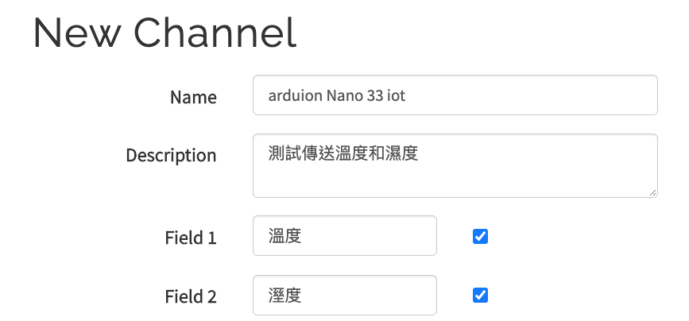
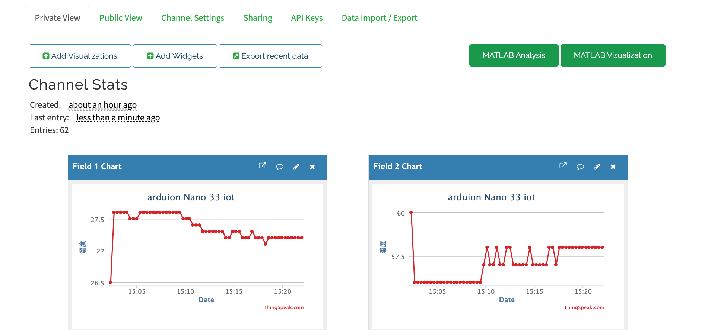

## 使用ThingSpeak web service
### [ThingSpeak Setup](https://community.thingspeak.com/tutorials/arduino/using-the-arduino-mkr1000-with-thingspeak/)

ThingSpeak 需要一個帳號和channel. 我們發送資料給channel,而ThingSpeak將會儲存資料. 每個channel有8個欄位包括位置欄位和狀態欄位.可以最快每15秒傳資料一次，但最佳的狀態是每一分鐘傳一次資料 

- 登入thingspeak – https://thingspeak.com/users/sign_up
- 建立一個channel
- 建立溫度和溼度欄位


- 完成設定後，取得ChannelID和APIKeys

### 線路圖
[](images/led_control_bb.pdf)

### 實體線路圖


### 程式碼
```

/*
  Web client

 This sketch connects to a website (http://www.google.com)
 using the WiFi module.

 This example is written for a network using WPA encryption. For
 WEP or WPA, change the Wifi.begin() call accordingly.

 This example is written for a network using WPA encryption. For
 WEP or WPA, change the Wifi.begin() call accordingly.

 Circuit:
 * Board with NINA module (Arduino MKR WiFi 1010, MKR VIDOR 4000 and UNO WiFi Rev.2)

 created 13 July 2010
 by dlf (Metodo2 srl)
 modified 31 May 2012
 by Tom Igoe
 */


#include <SPI.h>
#include <WiFiNINA.h>
#include "DHT.h"
#include "arduino_secrets.h" 

#define dhtPin 11
//apikey
String writeAPIKey = "QE6CNCN07BGSS722";
//DHT11設定
DHT dht(dhtPin, DHT11);

///////please enter your sensitive data in the Secret tab/arduino_secrets.h
char ssid[] = SECRET_SSID;        // your network SSID (name)
char pass[] = SECRET_PASS;    // your network password (use for WPA, or use as key for WEP)
int keyIndex = 0;            // your network key Index number (needed only for WEP)

int status = WL_IDLE_STATUS;
// if you don't want to use DNS (and reduce your sketch size)
// use the numeric IP instead of the name for the server:
//IPAddress server(74,125,232,128);  // numeric IP for Google (no DNS)
char server[] = "api.thingspeak.com";    // name address for Google (using DNS)

// Initialize the Ethernet client library
// with the IP address and port of the server
// that you want to connect to (port 80 is default for HTTP):
WiFiClient client;

unsigned long lastConnectionTime = 0; // track the last connection time
const unsigned long postingInterval = 20L * 1000L; // post data every 20 seconds

void setup() {
  //DHT11
  dht.begin();
  //Initialize serial and wait for port to open:
  Serial.begin(9600);
  while (!Serial) {
    ; // wait for serial port to connect. Needed for native USB port only
  }

  // check for the WiFi module:
  if (WiFi.status() == WL_NO_MODULE) {
    Serial.println("Communication with WiFi module failed!");
    // don't continue
    while (true);
  }

  String fv = WiFi.firmwareVersion();
  if (fv < WIFI_FIRMWARE_LATEST_VERSION) {
    Serial.println("Please upgrade the firmware");
  }

  // attempt to connect to Wifi network:
  while (status != WL_CONNECTED) {
    Serial.print("Attempting to connect to SSID: ");
    Serial.println(ssid);
    // Connect to WPA/WPA2 network. Change this line if using open or WEP network:
    status = WiFi.begin(ssid, pass);

    // wait 10 seconds for connection:
    delay(10000);
  }
  Serial.println("Connected to wifi");
  printWifiStatus();  
 
}

void loop() {
  if (millis() - lastConnectionTime > postingInterval) {
    httpRequest();
  }  
}

void httpRequest(){
  float h = dht.readHumidity();//讀取濕度
  float t = dht.readTemperature();//讀取攝氏溫度
  float f = dht.readTemperature(true);//讀取華氏溫度
  if (isnan(h) || isnan(t) || isnan(f)) {
    Serial.println("無法從DHT傳感器讀取！");
    return;
  }
  Serial.print("濕度: ");
  Serial.print(h);
  Serial.print("%\t");
  Serial.print("攝氏溫度: ");
  Serial.print(t);
  Serial.print("*C\t");
  Serial.print("華氏溫度: ");
  Serial.print(f);
  Serial.print("*F\n");

  String data = String("field1=" + String(t, DEC) + "&field2=" + String(h, DEC));
  client.stop();

  Serial.println("\nStarting connection to server...");
  // POST data to ThingSpeak
  if (client.connect(server, 80)) {
    client.println("POST /update HTTP/1.1");
    client.println("Host: api.thingspeak.com");
    client.println("Connection: close");
    client.println("User-Agent: ArduinoWiFi/1.1");
    client.println("X-THINGSPEAKAPIKEY: " + writeAPIKey);
    client.println("Content-Type: application/x-www-form-urlencoded");
    client.print("Content-Length: ");
    client.print(data.length());
    client.print("\n\n");
    client.print(data);
    
    Serial.println("\n已經傳資資料...");
    lastConnectionTime = millis();
  }
}

void printWifiStatus() {
  // print the SSID of the network you're attached to:
  Serial.print("SSID: ");
  Serial.println(WiFi.SSID());

  // print your board's IP address:
  IPAddress ip = WiFi.localIP();
  Serial.print("IP Address: ");
  Serial.println(ip);

  // print the received signal strength:
  long rssi = WiFi.RSSI();
  Serial.print("signal strength (RSSI):");
  Serial.print(rssi);
  Serial.println(" dBm");
}

```

### 至ThingSpeak Channel看結果


### 自訂MATLAB Visualization

在channel 內自訂一個MATLAB Visualizations
- 按下new
- 選擇“Custom (no starter code)"
- 按下建立

```
readChannelID = 93156;
fieldID1 = 1;

readAPIKey = 'MCI6XM81ZFOY8UCE';

%% Read Data %%
[data, time] = thingSpeakRead(readChannelID, 'Field', fieldID1, 'NumPoints', 10, 'ReadKey', readAPIKey);

%% Visualize Data %%
plot(time, data);
```


- 按下Run and Save
- 取得公開的網址 - https://thingspeak.com/apps/matlab_visualizations/373131


