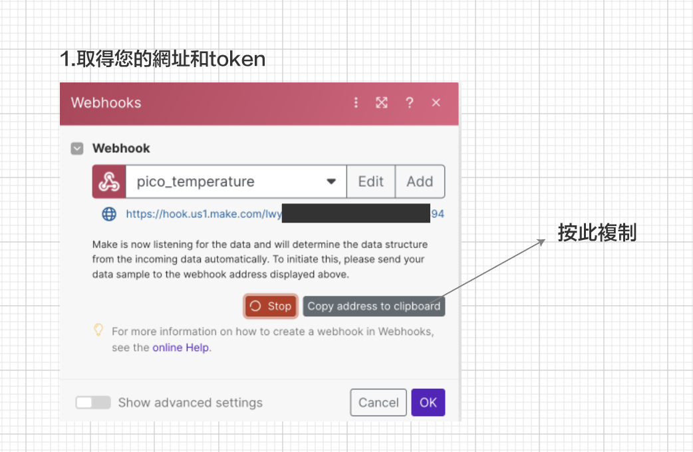
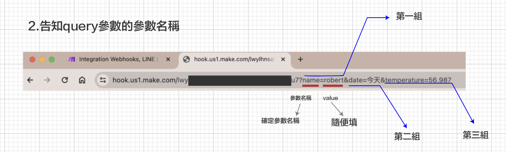
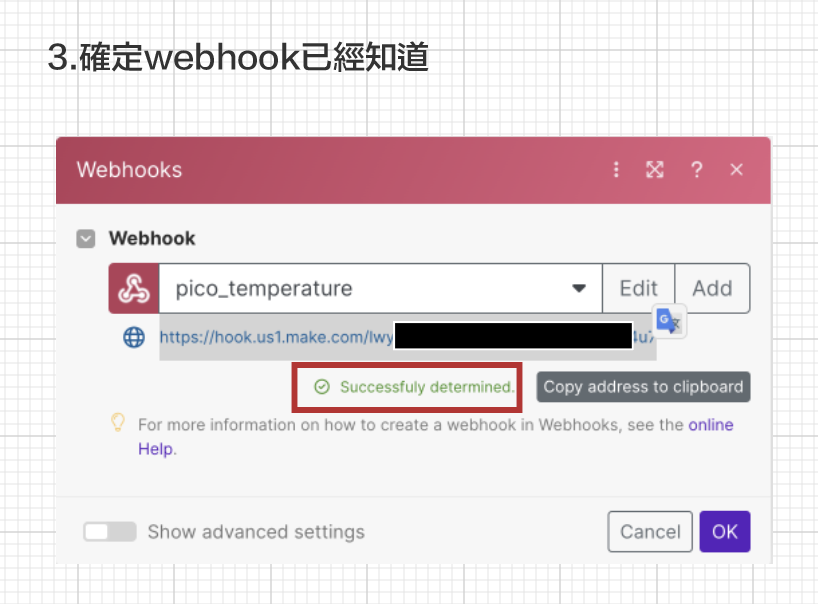
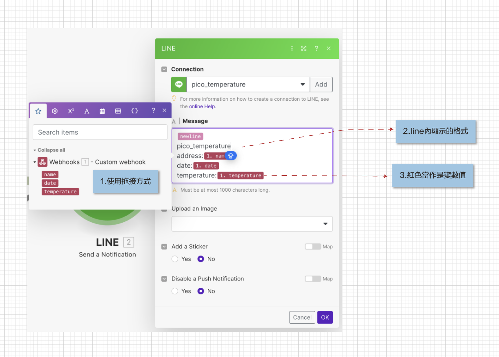

## 連線make.com

### 新的專案稱為Scenarios

### webhook設定要注意的地方
#### 1. 取得您的網址和token

 
 
#### 2. 告知query參數的參數名稱



#### 3. 確定webhook已經知道




### line內容顯示格式設定




### 範例1
- 使用get
- 無法使用post,會出錯,server 回應400
- 只傳送一次


```

import time
import network
import urequests as requests

ssid = '自已手機'
password = '自已手機'

wlan = network.WLAN(network.STA_IF)
wlan.active(True)
wlan.connect(ssid, password)

#等待連線或失敗
#status=0,1,2正在連線
#status=3連線成功
#<1,>=3失敗的連線

max_wait = 10
send = True

while max_wait > 0:
    status = wlan.status()
    if status < 0 or status >= 3:
        break
    max_wait -= 1
    print("等待連線")
    time.sleep(1)

#處理錯誤
if wlan.status() != 3:
    raise RuntimeError('連線失敗')
else:
    print('連線成功')
    status = wlan.ifconfig()
    print(f'ip={status[0]}')

# urequests官方網址
# https://makeblock-micropython-api.readthedocs.io/en/latest/public_library/Third-party-libraries/urequests.html

while True:
    #取得sensor的資料  
    url = 'https://hook.us1.make.com/自已的token?name=我家雞場&date=今天&temperature=24.368'
    
    #使用try/except傳送資料
    
    if(send):
        send = False
        print("送出資料")
        try:
            response = requests.request('GET',url)
        except:
            print(f"無法連線({wlan.status()})")
            if wlan.status() < 0 or wlan.status() > 3:
                print("嘗試重新連線")
                wlan.disconnect()
                wlan.connect(ssid, password)
                if wlan.status() == 3:
                    print("連線成功")
                else:
                    print("連線失敗")
        else:
            print("server接收") #但要檢查status_code,是否回應成功
            if response.status_code == 200:
                print("成功傳送,status_code==200")
            else:
                print("server回應有問題")
                print(f'status_code:{response.status_code}')
        finally:
            response.close()
            
    
        
        
    time.sleep(10)

 ```  
 
--- 

### 範例2
 
- 使用tools module
- 只傳送一次

### make_module

```
from tools import connect,reconnect
import time
import urequests as requests

send:bool = True

# urequests官方網址
# https://makeblock-micropython-api.readthedocs.io/en/latest/public_library/Third-party-libraries/urequests.html

connect()


while True:
    #取得sensor的資料  
    url = 'https://hook.us1.make.com/自已的token?name=我家雞場&date=今天&temperature=24.368'
    #使用try/except傳送資料
    
    if(send):
        send = False                
        try:  
            print("送出資料")
            response = requests.request('GET',url)
        except:
            #如果出錯response是不會產生的
            reconnect()
        else:
            print("server接收") #但要檢查status_code,是否回應成功
            if response.status_code == 200:
                print("成功傳送,status_code==200")
            else:
                print("server回應有問題")
                print(f'status_code:{response.status_code}')
            response.close()        
        
    time.sleep(10)
 
```    


### toos.py

```
import network
import time
import rp2
from machine import WDT

rp2.country('TW')

ssid = '自已的帳號'
password = '自已的密碼'

#ssid = 'Robert_iPhone'
#password = '0926656000'

#ssid = 'robertHome'
#password = '0926656000'

wlan = network.WLAN(network.STA_IF)
wlan.active(True)
wlan.connect(ssid, password)
wlan.config(pm = 0xa11140)

def connect():  

    #等待連線或失敗
    #status=0,1,2正在連線
    #status=3連線成功
    #<1,>=3失敗的連線
    max_wait = 10    

    while max_wait > 0:
        status = wlan.status()
        if status < 0 or status >= 3:
            break
        max_wait -= 1
        print("等待連線")
        time.sleep(1)

    #處理錯誤
    if wlan.status() != 3:
        print('連線失敗,重新開機')
        raise RuntimeError('連線失敗')
        #wdt = WDT(timeout=2000)
        #wdt.feed()
    else:
        print('連線成功')
        status = wlan.ifconfig()
        print(f'ip={status[0]}') 
        
        
def reconnect():
    if wlan.status() == 3: #還在連線,只是傳送的server無回應
        print(f"無法連線({wlan.status()})")
        return
    else:
        print("嘗試重新連線")
        wlan.disconnect()
        wlan.connect(ssid, password)
        connect()          
```


