## 周邊零件
0. ### 主要零件1個
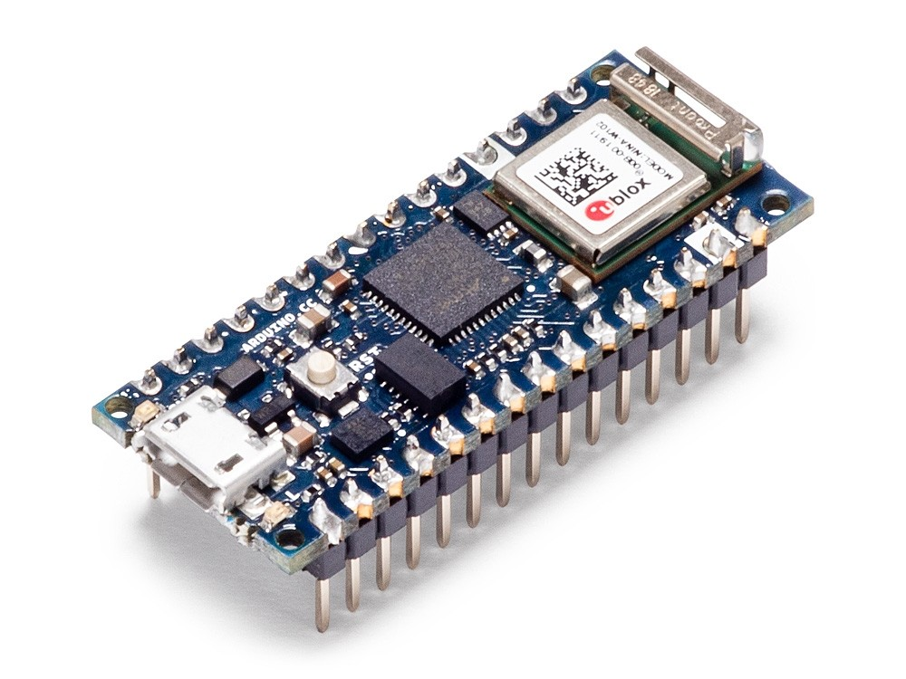

1. ### 麵包板1個
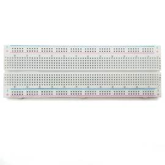

2. ### 40P 杜邦線 公-母 10CM 

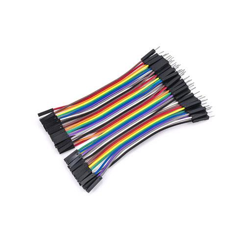

3. ### 40P 杜邦線 公-公 10CM

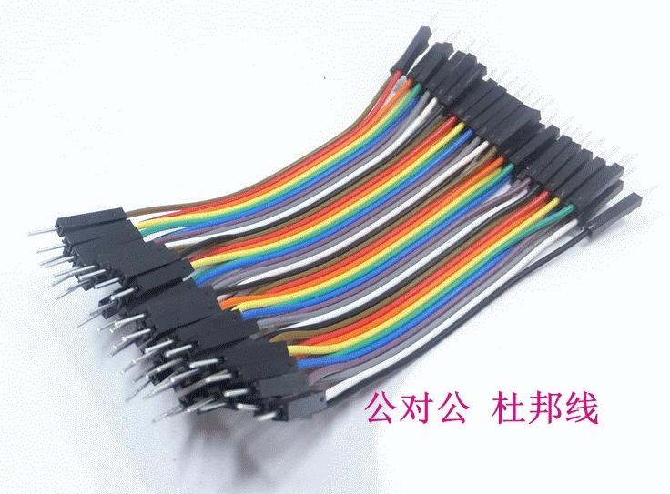

4. ### 40P 杜邦線 母-母 10CM

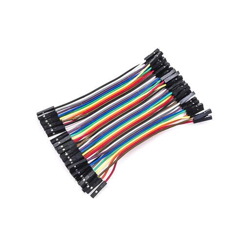 

5. ### 按壓開關 12X12 4PIN 3個

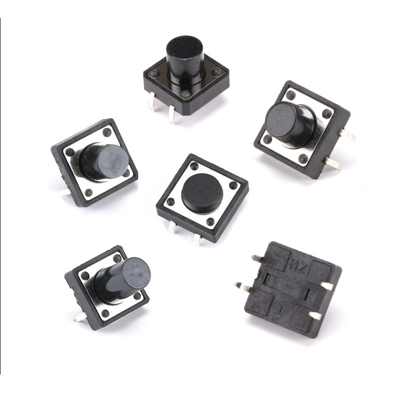

6. ### 電阻 1/4W 220歐姆  10個

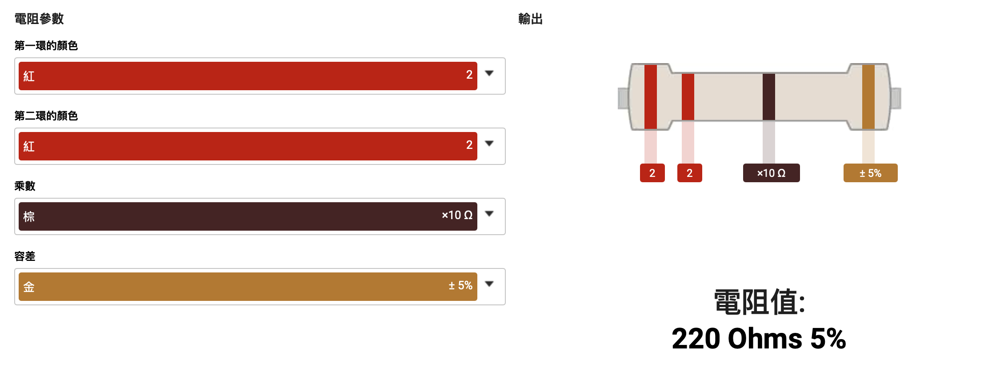

7. ### 電阻 1/4W 10K歐姆 5個

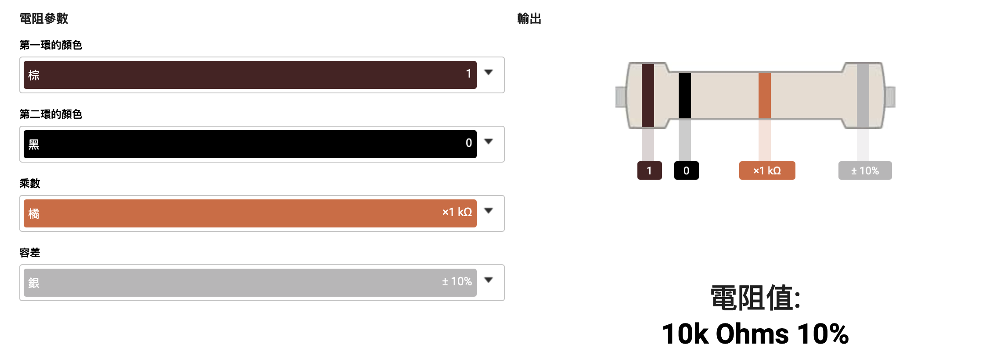

8. ### 電磁式有源蜂鳴器 3V 3.3V 1個

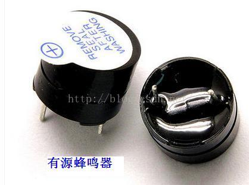

9. ### 可變電阻 VR16mm 10K 3個

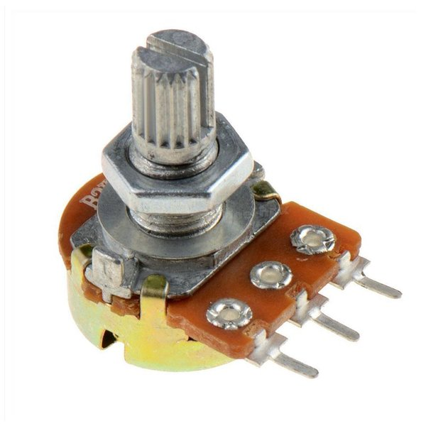

10. ### LCD1602液晶顯示IIC/I2C介面 1個

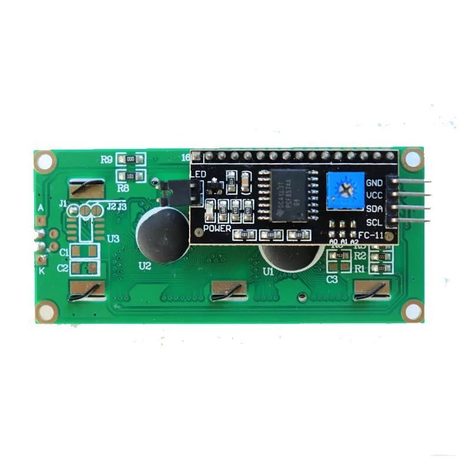

11. ### 光敏電阻 5mm 1個

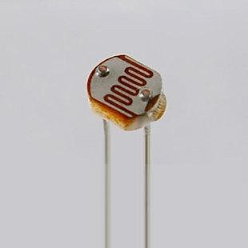

12. ### DHT11 溫度,濕度,酷熱度(支援3.3V) 1個
 
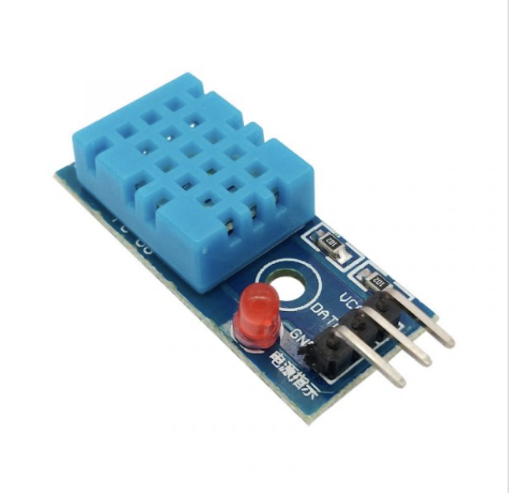

13. LED 5mm 紅 5個
14. LED 5mm 綠 5個
15. LED 5mm 黃 5個

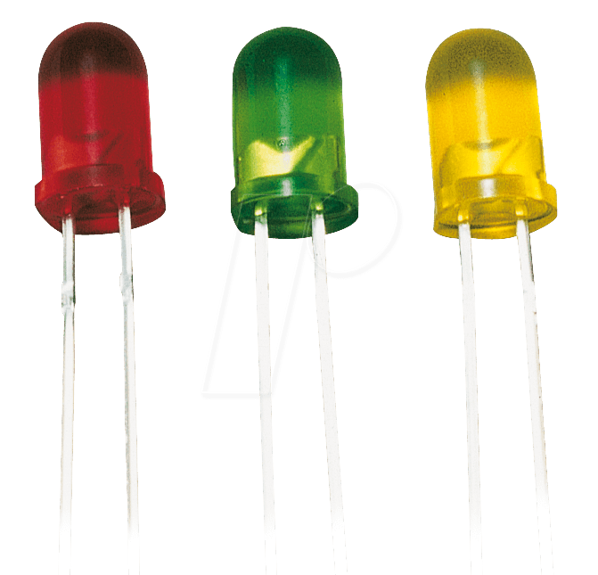

16. IC 74HC595 1個

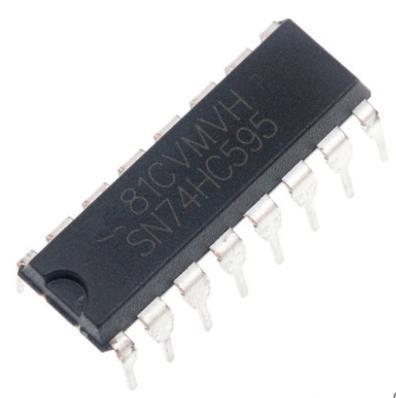

17. 5mm RGB 3色 共陰 (4pin) 1個

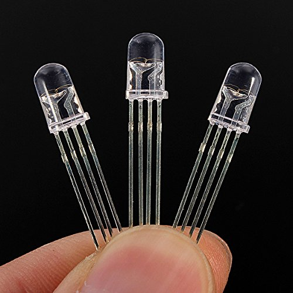

18. 7段顯示器 0.56" 共陰 1個

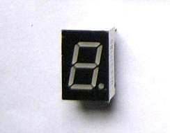

19. 超音波 HC-SR04 1個

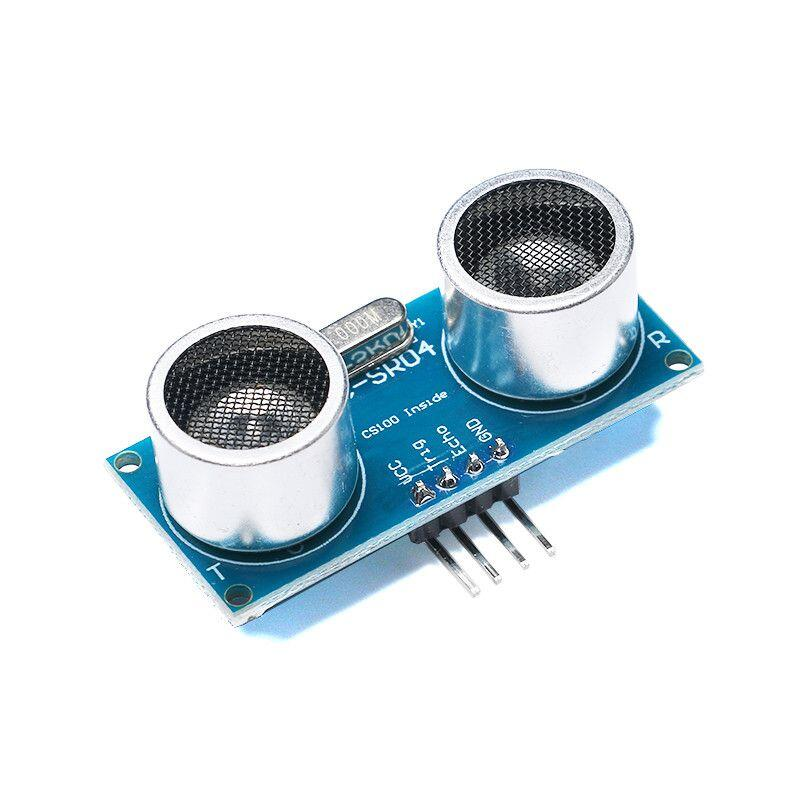

20. MFRC522 RFID(購買要pin腳已經焊好) 1個

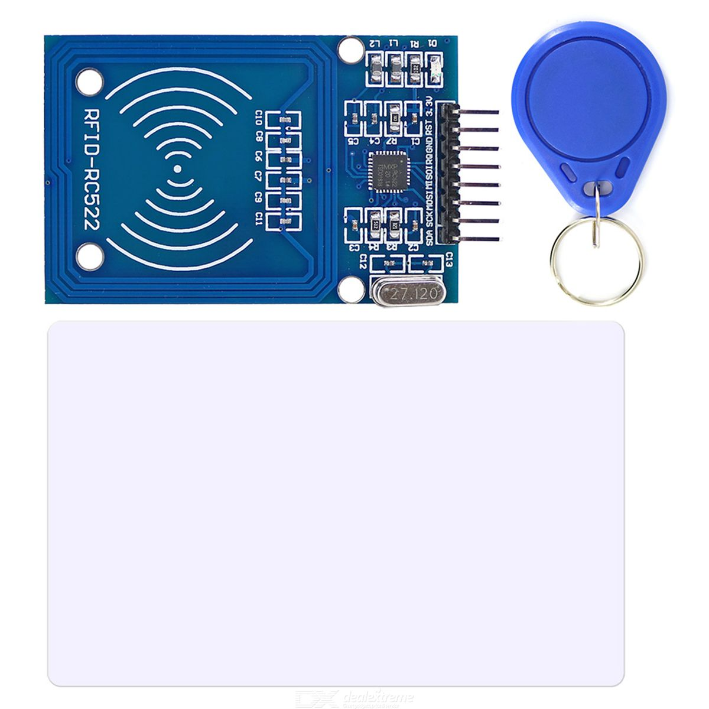

21. 迷你磁簧開關 1個

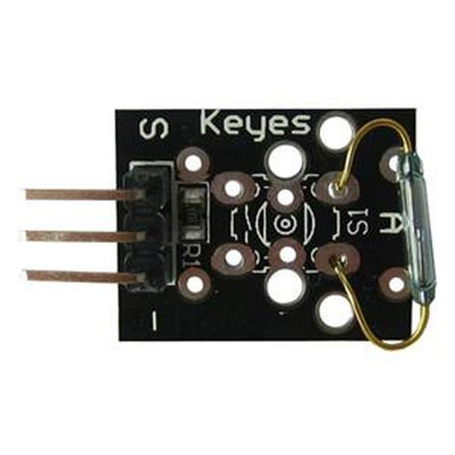
