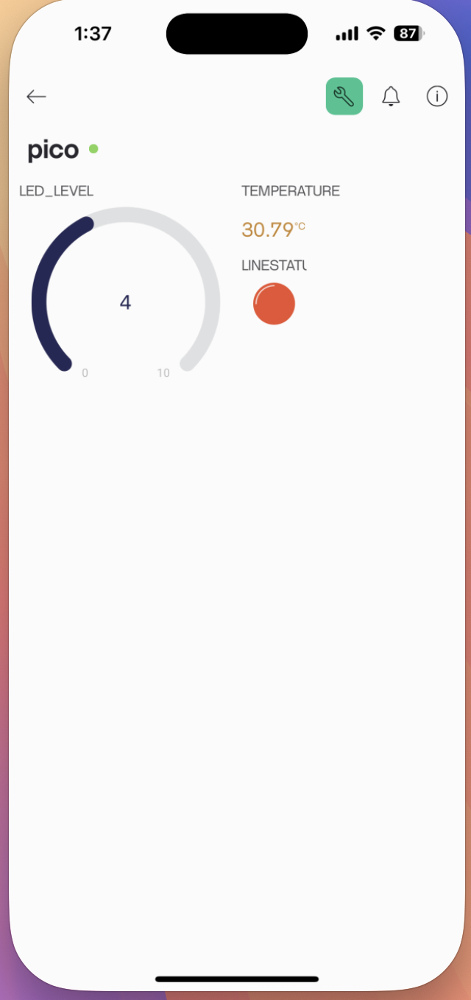

# 本地區網Bloker
**光敏電阻_led_可變電阻_溫度**


## 1. 專案架構


## 2. 線路圖


## 3. 程式碼

### 3.1 第1階段-硬體測試連結階段
- **main.py**

```micropython
from machine import Timer,ADC,Pin,PWM,RTC
def do_thing(t):
    '''
    處理溫度和光線
    '''
    reading = adc.read_u16() * conversion_factor
    temperature = 27 - (reading - 0.706)/0.001721
    print(f'溫度:{temperature}')
    light_value = adc_light.read_u16()
    print(f'光線:{light_value}')
    
    
def do_thing1(t):
    '''
    處理可變電阻
    '''
    adc1 = ADC(Pin(26))
    duty = adc1.read_u16()
    pwm.duty_u16(duty)    
    print(f'可變電阻:{round(duty/65535*10)}')
    
def main():
    t1 = Timer(period=1000, mode=Timer.PERIODIC, callback=do_thing)
    t2 = Timer(period=500, mode=Timer.PERIODIC, callback=do_thing1)
    
if __name__ == "__main__":
    #pico_連結電腦時的寫法,要用connect
    try:
        tools.connect()
    except RuntimeError as e:
        print(f"{{e}")
    else:
        #sensor setup
        adc = ADC(4) #內建溫度感測器
        adc_light = ADC(Pin(28)) #光線感測器
        pwm = PWM(Pin(15),freq=50) #可變電阻
        conversion_factor = 3.3 / (65535) #電壓轉換率    
        main()
```

### 3.2 第2階段-硬體測試成功並增加網路功能

### **tools.py**

```micropython
import network
import urequests as requests
import time
import rp2
from machine import WDT

rp2.country('TW') #設定我們的wifi的地區是台灣(可以不設)
'''
ssid = 'A590301'
password = 'A590301AA'
'''
ssid = 'robertHome'
password = '0926656000'

wlan = network.WLAN(network.STA_IF)
wlan.active(True)
wlan.connect(ssid, password)
wlan.config(pm = 0xa11140) #預設是省電模式,可以設為非省電模式

def connect():  
    #等待連線或失敗
    #status=0,1,2正在連線
    #status=3連線成功
    #<1,>=3失敗的連線
    max_wait = 10    

    while max_wait > 0:
        status = wlan.status()
        if status < 0 or status >= 3:
            break
        max_wait -= 1
        print("等待連線")
        time.sleep(1)

    #處理錯誤
    if wlan.status() != 3:
        print('連線失敗,重新開機')
        raise RuntimeError('連線失敗') #開發階段,出現錯誤,中斷執行
        #wdt = WDT(timeout=2000) #無連接電腦時,重新開機(成品時,請使用這個)
        #wdt.feed()
    else:
        print('連線成功')
        status = wlan.ifconfig()
        print(f'ip={status[0]}') 
        
        
def reconnect():
    if wlan.status() == 3: #還在連線,只是傳送的server無回應
        print(f"執行reconnect,連線正常({wlan.status()})")
        return
    else:
        print("嘗試重新連線")
        wlan.disconnect()
        wlan.connect(ssid, password)
        connect() #再連線一次
```


**main.py**

```micropython
from machine import Timer,ADC,Pin,PWM,RTC
import tools

def do_thing(t):
    '''
    處理溫度和光線
    '''
    reading = adc.read_u16() * conversion_factor
    temperature = 27 - (reading - 0.706)/0.001721
    print(f'溫度:{temperature}')
    light_value = adc_light.read_u16()
    print(f'光線:{light_value}')
    
    
def do_thing1(t):
    '''
    處理可變電阻
    '''
    adc1 = ADC(Pin(26))
    duty = adc1.read_u16()
    pwm.duty_u16(duty)    
    print(f'可變電阻:{round(duty/65535*10)}')


def main():
    t1 = Timer(period=1000, mode=Timer.PERIODIC, callback=do_thing)
    t2 = Timer(period=500, mode=Timer.PERIODIC, callback=do_thing1)

if __name__ == "__main__":
    #pico_連結電腦時的寫法,要用connect
    try:
        tools.connect()
    except RuntimeError as e:
        print(f"{{e}")
    else:
        #sensor setup
        adc = ADC(4) #內建溫度感測器
        adc_light = ADC(Pin(28)) #光線感測器
        pwm = PWM(Pin(15),freq=50) #可變電阻
        conversion_factor = 3.3 / (65535) #電壓轉換率    
        main()
```

### 3.3 第3階段-硬體,網路,MQTT
- pico連線教室的MQTT-Server(raspberry)
- 電腦儲存檔案

**pico程式碼(主程式)**

```
#! usr/bin/micropython

'''
led->gpio15
光敏電阻 -> gpio28
可變電阻 -> gpio26
內建溫度sensor -> adc最後1pin,共5pin
'''

from machine import Timer,ADC,Pin,PWM,RTC
import binascii
from umqtt.simple import MQTTClient
import tools


def do_thing(t):
    '''
    :param t:Timer的實體
    負責偵測溫度和光線
    每2秒執行1次
    '''
    conversion_factor = 3.3 / (65535)
    reading = adc.read_u16() * conversion_factor
    temperature = round(27 - (reading - 0.706)/0.001721,2) 
    print(f'溫度:{temperature}')
    mqtt.publish('SA-01/TEMPERATURE', f'{temperature}')
    adc_value = adc_light.read_u16()
    print(f'光線:{adc_value}')
    line_state = 0 if adc_value < 3500 else 1
    print(f'光線:{line_state}')
    mqtt.publish('SA-01/LINE_LEVEL', f'{line_state}')
    
    
def do_thing1(t):
    '''
    :param t:Timer的實體
    負責可變電阻和改變led的亮度
    '''    
    
    duty = adc1.read_u16()
    pwm.duty_u16(duty)
    light_level = round(duty/65535*10)
    print(f'可變電阻:{light_level}')
    mqtt.publish('SA-01/LED_LEVEL', f'{light_level}')
    

def main():
    pass
        

if __name__ == '__main__':
    adc = ADC(4) #內建溫度
    adc1 = ADC(Pin(26)) #可變電阻
    adc_light = ADC(Pin(28)) #光敏電阻
    pwm = PWM(Pin(15),freq=50) #pwm led
    #連線internet
    try:
        tools.connect()
    except RuntimeError as e:
        print(e)
    except Exception:
        print('不知明的錯誤')
    else:
        #MQTT
        SERVER = "192.168.0.252"
        CLIENT_ID = binascii.hexlify(machine.unique_id())
        mqtt = MQTTClient(CLIENT_ID, SERVER,user='pi',password='raspberry')
        mqtt.connect()
        t1 = Timer(period=2000, mode=Timer.PERIODIC, callback=do_thing)
        t2 = Timer(period=500, mode=Timer.PERIODIC, callback=do_thing1)   
    
    main()

```

**pico程式碼(tools.py-module)**

```
import network
import urequests as requests
import time
import rp2
from machine import WDT

rp2.country('TW') #設定我們的wifi的地區是台灣(可以不設)

ssid = 'A590301'
password = 'A590301AA'

'''
ssid = 'robertHome'
password = '0926656000'
'''

wlan = network.WLAN(network.STA_IF)
wlan.active(True)
wlan.connect(ssid, password)
wlan.config(pm = 0xa11140) #預設是省電模式,可以設為非省電模式

def connect():  
    #等待連線或失敗
    #status=0,1,2正在連線
    #status=3連線成功
    #<1,>=3失敗的連線
    max_wait = 10    

    while max_wait > 0:
        status = wlan.status()
        if status < 0 or status >= 3:
            break
        max_wait -= 1
        print("等待連線")
        time.sleep(1)

    #處理錯誤
    if wlan.status() != 3:
        print('連線失敗,重新開機')
        raise RuntimeError('連線失敗') #開發階段,出現錯誤,中斷執行
        #wdt = WDT(timeout=2000) #無連接電腦時,重新開機(成品時,請使用這個)
        #wdt.feed()
    else:
        print('連線成功')
        status = wlan.ifconfig()
        print(f'ip={status[0]}') 
        
        
def reconnect():
    if wlan.status() == 3: #還在連線,只是傳送的server無回應
        print(f"執行reconnect,連線正常({wlan.status()})")
        return
    else:
        print("嘗試重新連線")
        wlan.disconnect()
        wlan.connect(ssid, password)
        connect() #再連線一次
```


**本機電腦**
- 連線教室MQTT-Server(Raspberry pi)
- 儲存csv檔

```
import paho.mqtt.client as mqtt
from datetime import datetime
import os,csv

def record(topic:str,value:int | float | str):
    '''
    #檢查是否有data資料夾,沒有就建立data資料夾
    #取得今天日期,如果沒有今天日期.csv,就建立一個全新的今天日期.csv
    #將參數r的資料,儲存進入csv檔案內
    #parameters topic:str -> 這是訂閱的topic
    #parameters value:int -> 這是訂閱的value
    '''
    root_dir = os.getcwd()
    data_dir = os.path.join(root_dir, 'data')
    if not os.path.isdir(data_dir):    
            os.mkdir('data')
    
    today = datetime.today()
    current_str = today.strftime("%Y-%m-%d %H:%M:%S")
    date = today.strftime("%Y-%m-%d")
    filename = date + ".csv"
    #get_file_abspath
    full_path = os.path.join(data_dir,filename)
    if not os.path.exists(full_path):
        #沒有這個檔,建立檔案
        print('沒有這個檔')
        with open(full_path,mode='w',encoding='utf-8',newline='') as file:
            file.write('時間,設備,值\n')
    
    with open(full_path, mode='a', newline='', encoding='utf-8') as file:
        writer = csv.writer(file)
        writer.writerow([current_str,topic,value])


def on_connect(client, userdata, flags, reason_code, properties):
    #連線bloker成功時,只會執行一次
    client.subscribe("SA-01/#")

def on_message(client, userdata, msg):
    global led_origin_value
    global temperature_origin_value
    global line_origin_status

    topic = msg.topic
    value = msg.payload.decode()
    if topic == 'SA-01/LED_LEVEL':
        led_value = int(value)
        if led_value != led_origin_value:
            led_origin_value = led_value
            record(topic,led_value)
    
    if topic == 'SA-01/TEMPERATURE':
        temperature_value = float(value)
        if temperature_origin_value != temperature_value:           
           temperature_origin_value = temperature_value
           record(topic,temperature_value)
    
    if topic == 'SA-01/LINE_LEVEL':        
        line_status = int(value)
        if line_origin_status != line_status:           
           line_origin_status = line_status
           record(topic,line_status)
        
def main():
    client = mqtt.Client(callback_api_version=mqtt.CallbackAPIVersion.VERSION2)
    # 設定用戶名和密碼
    username = "pi"  # 替換為您的用戶名
    password = "raspberry"  # 替換為您的密碼
    client.username_pw_set(username, password)
    client.on_connect = on_connect
    client.on_message = on_message 
    client.connect("192.168.0.252", 1883, 60)
    client.loop_forever()


if __name__ == "__main__":
    led_origin_value = 0
    temperature_origin_value = 0.0
    line_origin_status = None 
    main()
```

### 3.4 第4階段-硬體,網路,教室MQTT,Blynk MQTT

**架構圖**


**結果**





**pico-主程式**

```
#! usr/bin/micropython

'''
led->gpio15
光敏電阻 -> gpio28
可變電阻 -> gpio26
內建溫度sensor -> adc最後1pin,共5pin
'''

from machine import Timer,ADC,Pin,PWM,RTC
import binascii
from umqtt.simple import MQTTClient
import tools,config


def do_thing(t):
    '''
    :param t:Timer的實體
    負責偵測溫度和光線
    每2秒執行1次
    '''
    conversion_factor = 3.3 / (65535)
    reading = adc.read_u16() * conversion_factor
    temperature = round(27 - (reading - 0.706)/0.001721,2) 
    print(f'溫度:{temperature}')
    mqtt.publish('SA-01/TEMPERATURE', f'{temperature}')
    blynk_mqtt.publish('ds/temperature',f'{temperature}')
    adc_value = adc_light.read_u16()
    print(f'光線:{adc_value}')
    line_state = 0 if adc_value < 3500 else 1
    print(f'光線:{line_state}')
    mqtt.publish('SA-01/LINE_LEVEL', f'{line_state}')
    blynk_mqtt.publish('ds/line_status',f'{line_state}')
    
    
def do_thing1(t):
    '''
    :param t:Timer的實體
    負責可變電阻和改變led的亮度
    '''    
    
    duty = adc1.read_u16()
    pwm.duty_u16(duty)
    light_level = round(duty/65535*10)
    print(f'可變電阻:{light_level}')
    mqtt.publish('SA-01/LED_LEVEL', f'{light_level}')
    blynk_mqtt.publish('ds/led_level',f'{light_level}')
    

def main():
    global blynk_mqtt
    print(config.BLYNK_MQTT_BROKER)
    print(config.BLYNK_TEMPLATE_ID)
    print(config.BLYNK_AUTH_TOKEN)
    blynk_mqtt = MQTTClient(config.BLYNK_TEMPLATE_ID, config.BLYNK_MQTT_BROKER,user='device',password=config.BLYNK_AUTH_TOKEN,keepalive=60)
    blynk_mqtt.connect()
    
        

if __name__ == '__main__':
    adc = ADC(4) #內建溫度
    adc1 = ADC(Pin(26)) #可變電阻
    adc_light = ADC(Pin(28)) #光敏電阻
    pwm = PWM(Pin(15),freq=50) #pwm led
    #連線internet
    try:
        tools.connect()
    except RuntimeError as e:
        print(e)
    except Exception:
        print('不知明的錯誤')
    else:
        #MQTT
        SERVER = "192.168.0.252"
        CLIENT_ID = binascii.hexlify(machine.unique_id())
        mqtt = MQTTClient(CLIENT_ID, SERVER,user='pi',password='raspberry')
        mqtt.connect()
        t1 = Timer(period=2000, mode=Timer.PERIODIC, callback=do_thing)
        t2 = Timer(period=500, mode=Timer.PERIODIC, callback=do_thing1)
    blynk_mqtt = None    
    main()
```

*pico config.py**

```

# Fill in information from Blynk Device Info here.
BLYNK_TEMPLATE_ID   = ""
BLYNK_TEMPLATE_NAME = ""
BLYNK_AUTH_TOKEN    = ""

# Change the default Blynk server. Applicable for users with a white label plan.
BLYNK_MQTT_BROKER   = "blynk.cloud"
```


**pico tools.py**

```
import network
import urequests as requests
import time
import rp2
from machine import WDT

rp2.country('TW') #設定我們的wifi的地區是台灣(可以不設)

ssid = 'A590301'
password = 'A590301AA'

'''
ssid = 'robertHome'
password = '0926656000'
'''

wlan = network.WLAN(network.STA_IF)
wlan.active(True)
wlan.connect(ssid, password)
wlan.config(pm = 0xa11140) #預設是省電模式,可以設為非省電模式

def connect():  
    #等待連線或失敗
    #status=0,1,2正在連線
    #status=3連線成功
    #<1,>=3失敗的連線
    max_wait = 10    

    while max_wait > 0:
        status = wlan.status()
        if status < 0 or status >= 3:
            break
        max_wait -= 1
        print("等待連線")
        time.sleep(1)

    #處理錯誤
    if wlan.status() != 3:
        print('連線失敗,重新開機')
        #raise RuntimeError('連線失敗') #開發階段,出現錯誤,中斷執行
        wdt = WDT(timeout=2000) #無連接電腦時,重新開機(成品時,請使用這個)
        wdt.feed()
    else:
        print('連線成功')
        status = wlan.ifconfig()
        print(f'ip={status[0]}') 
        
        
def reconnect():
    if wlan.status() == 3: #還在連線,只是傳送的server無回應
        print(f"執行reconnect,連線正常({wlan.status()})")
        return
    else:
        print("嘗試重新連線")
        wlan.disconnect()
        wlan.connect(ssid, password)
        connect() #再連線一次
```

**教室電腦**

```
import paho.mqtt.client as mqtt
from datetime import datetime
import os,csv

def record(topic:str,value:int | float | str):
    '''
    #檢查是否有data資料夾,沒有就建立data資料夾
    #取得今天日期,如果沒有今天日期.csv,就建立一個全新的今天日期.csv
    #將參數r的資料,儲存進入csv檔案內
    #parameters topic:str -> 這是訂閱的topic
    #parameters value:int -> 這是訂閱的value
    '''
    root_dir = os.getcwd()
    data_dir = os.path.join(root_dir, 'data')
    if not os.path.isdir(data_dir):    
            os.mkdir('data')
    
    today = datetime.today()
    current_str = today.strftime("%Y-%m-%d %H:%M:%S")
    date = today.strftime("%Y-%m-%d")
    filename = date + ".csv"
    #get_file_abspath
    full_path = os.path.join(data_dir,filename)
    if not os.path.exists(full_path):
        #沒有這個檔,建立檔案
        print('沒有這個檔')
        with open(full_path,mode='w',encoding='utf-8',newline='') as file:
            file.write('時間,設備,值\n')
    
    with open(full_path, mode='a', newline='', encoding='utf-8') as file:
        writer = csv.writer(file)
        writer.writerow([current_str,topic,value])


def on_connect(client, userdata, flags, reason_code, properties):
    #連線bloker成功時,只會執行一次
    client.subscribe("SA-01/#")

def on_message(client, userdata, msg):
    global led_origin_value
    global temperature_origin_value
    global line_origin_status

    topic = msg.topic
    value = msg.payload.decode()
    if topic == 'SA-01/LED_LEVEL':
        led_value = int(value)
        if led_value != led_origin_value:
            led_origin_value = led_value
            record(topic,led_value)
    
    if topic == 'SA-01/TEMPERATURE':
        temperature_value = float(value)
        if temperature_origin_value != temperature_value:           
           temperature_origin_value = temperature_value
           record(topic,temperature_value)
    
    if topic == 'SA-01/LINE_LEVEL':        
        line_status = int(value)
        if line_origin_status != line_status:           
           line_origin_status = line_status
           record(topic,line_status)
        
def main():
    client = mqtt.Client(callback_api_version=mqtt.CallbackAPIVersion.VERSION2)
    # 設定用戶名和密碼
    username = "pi"  # 替換為您的用戶名
    password = "raspberry"  # 替換為您的密碼
    client.username_pw_set(username, password)
    client.on_connect = on_connect
    client.on_message = on_message 
    client.connect("192.168.0.252", 1883, 60)
    client.loop_forever()


if __name__ == "__main__":
    led_origin_value = 0
    temperature_origin_value = 0.0
    line_origin_status = None 
    main()
```


